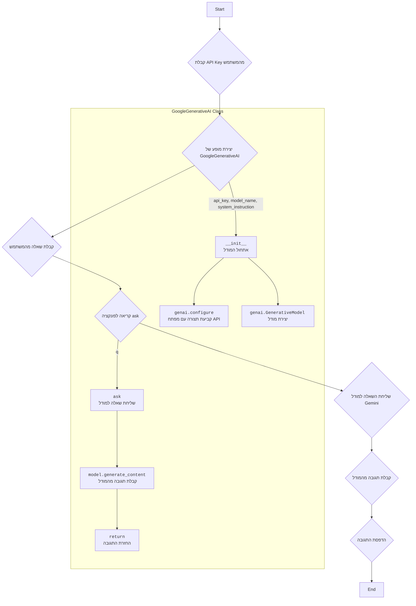

## ניתוח קוד: ask.py

### 1. <algorithm>

**תרשים זרימה צעד-אחר-צעד:**

1.  **התחלה:** התוכנית מתחילה.
    
2.  **ייבוא ספריות:** ייבוא הספרייה `google.generativeai` בשם `genai` לשימוש ב-Gemini API.
    
    *   **דוגמה:** `import google.generativeai as genai`
    
3.  **הגדרת מחלקה:** הגדרת המחלקה `GoogleGenerativeAI` לטיפול באינטראקציה עם מודלי Gemini.
    
    *   **דוגמה:**
        ```python
        class GoogleGenerativeAI:
        	def __init__(self, api_key, system_instruction, model_name):
        		...
        	def ask(self, q):
        		...
        ```
    
4.  **אתחול המחלקה `GoogleGenerativeAI`:**
    * קבלת `api_key`, `system_instruction` ו- `model_name`.
    * הגדרת `self.api_key`, `self.model_name`.
    * קביעת תצורה של הספרייה `genai` באמצעות מפתח ה-API.
    * יצירת מופע של המודל `genai.GenerativeModel` עם `model_name` ו- `system_instruction`.
       *   **דוגמה:** `self.model = genai.GenerativeModel(model_name=self.model_name, system_instruction=system_instruction)`
5.  **קבלת מפתח API:**
    
    *   התוכנית מבקשת מהמשתמש להזין את מפתח ה-API של Gemini.
    *   **דוגמה:** `API_KEY = input("API ключ от \`gemini\`")`
    
6.  **יצירת מופע של המחלקה `GoogleGenerativeAI`:**
    
    *   יצירת מופע של המחלקה `GoogleGenerativeAI` באמצעות מפתח ה-API שסופק.
    *   **דוגמה:** `model = GoogleGenerativeAI(api_key = API_KEY)`
    
7.  **קבלת שאלה מהמשתמש:**
    
    *   התוכנית מבקשת מהמשתמש להזין שאלה.
    *   **דוגמה:** `q = input("Вопрос: ")`
    
8.  **שליחת השאלה למודל:**
    
    *   קריאה לפונקציה `ask` של המופע של המחלקה `GoogleGenerativeAI` עם השאלה שסופקה.
    *   **דוגמה:** `response = model.ask(q)`
    
9.  **קבלת תגובה מהמודל:**
    
    *   בתוך הפונקציה `ask` השאלה נשלחת ל-Gemini.
    *   התגובה של המודל מוחזרת. אם מתרחשת שגיאה, מוחזרת הודעת שגיאה.
    *   **דוגמה:** `response = self.model.generate_content(q)`
    
10. **הדפסת התגובה:**
    
    *   התגובה של המודל מודפסת למסוף.
    *   **דוגמה:** `print(response)`
    
11. **סיום:** התוכנית מסתיימת.
    

**זרימת נתונים:**

*   `API_KEY` -> `GoogleGenerativeAI.__init__` -> `genai.configure`
*   `system_instruction` -> `GoogleGenerativeAI.__init__` -> `genai.GenerativeModel`
*   `model_name` -> `GoogleGenerativeAI.__init__` -> `genai.GenerativeModel`
*   `q` -> `GoogleGenerativeAI.ask` -> `self.model.generate_content`
*   `response.text` ->  `GoogleGenerativeAI.ask` -> הדפסה למסוף
    

### 2. <mermaid>



**ניתוח תלויות:**

הקוד תלוי בספריית `google.generativeai` (מיובא בשם `genai`). ספרייה זו מספקת כלים לתקשורת עם מודלי הבינה המלאכותית של גוגל, כגון Gemini.

### 3. <explanation>

**ייבואים (Imports):**

*   `import google.generativeai as genai`: ייבוא הספרייה `google.generativeai` בשם `genai`. ספרייה זו מאפשרת תקשורת עם מודלי ה-Gemini של גוגל. היא לא קשורה ישירות לספריות אחרות ב-`src.`, מכיוון שהיא ספרייה חיצונית.

**מחלקות (Classes):**

*   `class GoogleGenerativeAI`:
    *   **תפקיד:** עוטפת את הפונקציונליות של מודל Gemini ומספקת ממשק פשוט לתקשורת איתו.
    *   **מאפיינים:**
        *   `MODELS`: רשימה של מודלים אפשריים של Gemini (לא בשימוש ישיר כרגע).
        *   `api_key`: מפתח ה-API לגישה ל-Gemini.
        *   `model_name`: שם המודל Gemini שבו יש להשתמש.
        *   `model`: מופע של `genai.GenerativeModel`.
    *   **שיטות:**
        *   `__init__(self, api_key, system_instruction, model_name)`: מאתחלת את המחלקה, קובעת את התצורה של `genai` עם מפתח ה-API ומייצרת מופע של המודל.
        *   `ask(self, q)`: שולחת שאלה למודל Gemini ומחזירה את התגובה או הודעת שגיאה.
    *   **אינטראקציה:** המחלקה משתמשת ב-`genai` לצורך קריאה למודל הבינה המלאכותית. היא עובדת באופן עצמאי מול ה-API של גוגל ואינה תלויה בחלקים אחרים בפרויקט.
    

**פונקציות (Functions):**

*   `GoogleGenerativeAI.__init__(self, api_key, system_instruction, model_name)`:
    *   **פרמטרים:**
        *   `api_key` (str): מפתח ה-API ל-Gemini.
        *   `system_instruction` (str): הוראה למודל (פרומפט סיסטם).
        *   `model_name` (str): שם מודל Gemini לשימוש. ברירת מחדל:  `gemini-2.0-flash-exp`.
    *   **ערך מוחזר:** אין (None).
    *   **מטרה:** מאתחלת את המופע של המחלקה, קובעת את תצורת `genai` עם מפתח ה-API ומייצרת מופע של המודל.
    *   **דוגמא:** `model = GoogleGenerativeAI(api_key = "your_api_key", system_instruction="You are a helpful AI", model_name='gemini-2-13b')`
    
*   `GoogleGenerativeAI.ask(self, q)`:
    *   **פרמטרים:**
        *   `q` (str): השאלה לשליחה ל-Gemini.
    *   **ערך מוחזר:**
        *   str: התגובה של המודל או הודעת שגיאה.
    *   **מטרה:** שולחת שאלה למודל Gemini ומחזירה את התשובה או הודעת שגיאה במקרה של שגיאה.
    *   **דוגמא:** `response = model.ask("What is the meaning of life?")`

**משתנים (Variables):**

*   `API_KEY`:
    *   **סוג:** str
    *   **שימוש:** מאחסן את מפתח ה-API של Gemini שהמשתמש מספק.
*   `model`:
    *   **סוג:** GoogleGenerativeAI
    *   **שימוש:**  מופע של המחלקה `GoogleGenerativeAI`.
*   `q`:
    *   **סוג:** str
    *   **שימוש:** מאחסן את השאלה שהמשתמש מספק.
*   `response`:
    *   **סוג:** str
    *   **שימוש:** מאחסן את התגובה שמתקבלת מהמודל.

**בעיות אפשריות ותחומים לשיפור:**

*   **טיפול בשגיאות:** הקוד כולל טיפול בשגיאות בסיסי, אך ניתן לשפר את הטיפול בשגיאות על ידי רישום לוג או טיפול מפורט יותר בסוגים שונים של שגיאות.
*   **הגדרות מודל:** ניתן להוסיף אפשרויות נוספות לקביעת תצורה של המודל, כמו הגדרות טמפרטורה וכו'.
*   **אימות מפתח API:** הקוד אינו מאמת את תקינות מפתח ה-API. ניתן להוסיף בדיקה לאימות המפתח.

**שרשרת קשרים עם חלקים אחרים בפרויקט:**

*   אין תלות ישירה בקוד אחר בפרויקט מלבד ייבוא ספריית `google.generativeai`.
*   קוד זה הוא בלתי תלוי וניתן להשתמש בו באופן עצמאי כמודול לגישה למודל Gemini.

בנוסף, הקוד כולל שורה של בקשת קלט מהמשתמש לקבלת מפתח ה-API באופן ישיר. בדרך כלל, מפתחות API לא צריכים להיות מוזנים ישירות על ידי המשתמש, אלא מוגדרים באמצעות משתנה סביבה או בדרך אחרת.