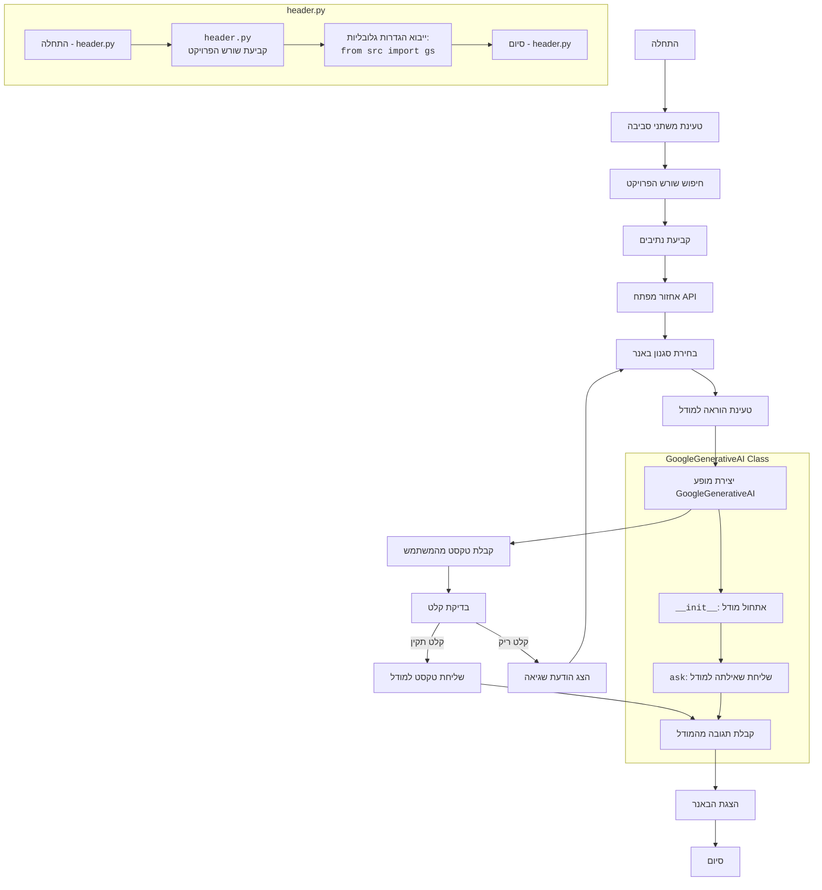

## <algorithm>

הקוד מיישם תוכנית ליצירת באנרים טקסטואליים באמצעות מודל Google Generative AI. להלן תיאור שלבי הפעולה:

1.  **התחלה**:
    *   התוכנית מתחילה בטעינת ספריות נדרשות ובטעינת משתני סביבה מקובץ `.env`.
    *   דוגמה: `load_dotenv()` טוען את `API_KEY` מקובץ `.env`.
2.  **איתור שורש הפרויקט**:
    *   מאתר באופן אוטומטי את שורש הפרויקט על ידי חיפוש אחר קבצי מרקר כמו `pyproject.toml`, `requirements.txt` או `.git`.
    *   דוגמה: מחפש תיקיה שמכילה אחד מקבצים אלה וקובע אותה כשרוש הפרויקט.
3.  **קביעת נתיבים**:
    *   מגדיר נתיב יחסי לתיקייה המכילה את ההוראות (instruction)  ובונה נתיב אבסולוטי באמצעות שורש הפרויקט.
    *   דוגמה: `relative_path` הוא `Path('GAMES', 'AI', 'BANNER_AI')` ו-`base_path` הוא הנתיב האבסולוטי אליו.
4.  **אחזור מפתח API**:
    *   מנסה לקרוא את מפתח ה-API של Google Generative AI מתוך משתני הסביבה.
    *   דוגמה: `os.getenv('API_KEY')` מנסה לקרוא את המפתח מתוך משתנה הסביבה `API_KEY`.
    *   אם לא נמצא, מבקש מהמשתמש להזין את המפתח, ומעדכן אותו בקובץ `.env`.
    *   דוגמה: אם המשתמש לא הזין מפתח,  הוא יתבקש להזין אותו ו-`set_key('.env', 'API_KEY', API_KEY)` ישמור אותו.
5.  **בחירת סגנון הבאנר**:
    *   מציג למשתמש תפריט לבחירת סגנון הבאנר (באמצעות כוכבית, טילדה או סולמית).
    *   דוגמה: התפריט מציג "1. סמל '*' " , "2. סמל '~'" , "3. סמל '#'".
    *   קולט את בחירת המשתמש.
6.  **טעינת ההוראה למודל**:
    *   טוען את ההוראה המתאימה לסגנון שנבחר מתוך קובץ טקסט. אם הבחירה שגויה, טוען ברירת מחדל.
    *   דוגמה: אם המשתמש בחר `1`, ההוראה תקרא מתוך `system_instruction_asterisk.md`.
7.  **יצירת מופע של המחלקה `GoogleGenerativeAI`**:
    *   יוצר מופע של המחלקה `GoogleGenerativeAI` ומעביר את מפתח ה-API ואת ההוראה כפרמטרים.
    *   דוגמה: `model: GoogleGenerativeAI = GoogleGenerativeAI(api_key=API_KEY, system_instruction=system_instruction)`.
8.  **קבלת טקסט מהמשתמש**:
    *   מבקש מהמשתמש להזין את הטקסט שיופיע בבאנר.
    *   דוגמה: `user_text: str = input('הכנס טקסט לבאנר: ')`.
9.  **שליחת הבקשה למודל וקבלת תשובה**:
    *   אם הטקסט לא ריק, שולח את הטקסט למודל באמצעות המתודה `ask` של המופע של המחלקה `GoogleGenerativeAI`.
    *   דוגמה: `response = model.ask(user_text)`.
10. **הצגת הבאנר**:
     *   מדפיס את התגובה מהמודל, המכילה את הבאנר המעוצב.
     *   דוגמה: `print(response)`.
11. **סיום**:
    *   התוכנית מסיימת את פעולתה.
    *   דוגמה: התוכנית מסיימת לאחר הצגת הבאנר.

## <mermaid>

## <explanation>

### **ייבואים (Imports)**:

*   **`import google.generativeai as genai`**: מייבא את הספרייה `google.generativeai` לגישה לשירותי Google Generative AI, ומכנה אותה `genai` לשימוש קל יותר. ספריה זו מאפשרת אינטראקציה עם מודלים של AI כמו Gemini.
*   **`import re`**: מייבאת את ספריית הביטויים הרגולריים של Python, אבל לא נעשה בה שימוש ישיר בקוד זה. היא עשויה לשמש לצורך עיבוד או מניפולציה של טקסט בעתיד.
*   **`from pathlib import Path`**: מייבאת את המחלקה `Path` מהספרייה `pathlib`, שמאפשרת עבודה עם נתיבי קבצים ומערכת קבצים בצורה יותר אובייקט-אוריינטית ופשוטה.
*   **`from header import __root__`**: מייבאת את המשתנה `__root__` מהמודול `header.py`, אשר מכיל את הנתיב המוחלט לשורש הפרויקט. `header.py` תפקידו לקבוע ולייצא את שורש הפרויקט.
*   **`from dotenv import load_dotenv, set_key`**: מייבאת את הפונקציות `load_dotenv` ו-`set_key` מהספרייה `dotenv`, אשר מאפשרות טעינה ושינוי של משתני סביבה מקובץ `.env`.
*   **`import os`**: מייבאת את ספריית `os`, המאפשרת אינטראקציה עם מערכת ההפעלה, כולל גישה למשתני סביבה.

### **מחלקות (Classes)**:

*   **`class GoogleGenerativeAI`**:
    *   **תפקיד**: מחלקה זו אחראית ליצירת אינטראקציה עם מודל Gemini של Google Generative AI. היא עוטפת את כל הפונקציונליות הנדרשת לשימוש במודל.
    *   **מאפיינים (Attributes)**:
        *   **`MODELS`**: רשימה של מודלים שניתן להשתמש בהם, כגון `'gemini-1.5-flash-8b'`, `'gemini-2-13b'`, `'gemini-3-20b'`.
        *   **`api_key`**: מפתח API המשמש לאימות מול שירות Google Generative AI.
        *   **`model_name`**: שם המודל הספציפי שבו יש להשתמש.
        *   **`model`**: מופע של המודל הספציפי מהספריה `google.generativeai`.
    *   **שיטות (Methods)**:
        *   **`__init__(self, api_key: str, system_instruction: str, model_name: str = 'gemini-2.0-flash-exp')`**:
            *   **תפקיד**: בונה (constructor) המאתחל את המופע של המחלקה.
            *   **פרמטרים**:
                *   `api_key`: מפתח ה-API.
                *   `system_instruction`: הוראות למודל.
                *   `model_name`: שם המודל (אופציונלי).
            *   **פעולה**: מאתחל את המודל עם מפתח ה-API וההוראה וגם קובע את שם המודל.
        *   **`ask(self, q: str) -> str`**:
            *   **תפקיד**: שולח שאילתה למודל ומחזיר את התגובה.
            *   **פרמטרים**:
                *   `q`: השאילתה לשליחה למודל.
            *   **פעולה**: שולח את השאילתה באמצעות `generate_content`, מחזיר את התגובה מהמודל או הודעת שגיאה במקרה של כישלון.

### **פונקציות (Functions)**:

*   **`load_dotenv()`**:
    *   **תפקיד**: טוענת משתני סביבה מקובץ `.env`.
    *   **פרמטרים**: אין
    *   **ערך מוחזר**: אין
    *   **דוגמה**: `load_dotenv()` קוראת את קובץ `.env` ומגדירה את המשתנים בתוכו כמשתני סביבה.
*   **`set_key(dotenv_path: str, key: str, value: str)`**:
    *   **תפקיד**: שומרת משתנה סביבה בקובץ `.env`.
    *   **פרמטרים**:
        *   `dotenv_path`: הנתיב לקובץ `.env`.
        *   `key`: שם המשתנה.
        *   `value`: הערך של המשתנה.
    *   **ערך מוחזר**: אין
    *   **דוגמה**: `set_key('.env', 'API_KEY', 'your_api_key')` מעדכן את הערך של `API_KEY` בתוך קובץ `.env`.

### **משתנים (Variables)**:

*   **`__root__`**: משתנה גלובלי שמייובא מ `header.py`. מכיל את הנתיב המוחלט לשורש הפרויקט.
*   **`relative_path`**: משתנה מסוג `Path` שמכיל את הנתיב היחסי לתיקיית המשחקים,  `'GAMES', 'AI', 'BANNER_AI'`.
*   **`base_path`**: משתנה מסוג `Path` שמכיל את הנתיב האבסולוטי לתיקיית המשחקים, שמתקבלת מחיבור של `__root__` ו- `relative_path`.
*   **`API_KEY`**: משתנה שמכיל את מפתח ה-API של Google Generative AI. המשתנה מקבל ערך מתוך משתנה סביבה או מהקלט של המשתמש.
*   **`instructions`**: מילון המכיל את שמות הקבצים עם ההוראות למודל, כאשר המפתחות הם מספרי בחירה, והערכים הם שמות הקבצים ללא הסיומת.
*   **`choice`**: משתנה המכיל את בחירת המשתמש לסגנון הבאנר (1, 2, או 3).
*   **`system_instruction`**: משתנה שמכיל את ההוראה למודל, שנקראת מתוך קובץ בהתאם לבחירת המשתמש.
*   **`model`**: משתנה שמכיל את המופע של המחלקה `GoogleGenerativeAI`.
*   **`user_text`**: משתנה שמכיל את הטקסט שהמשתמש הכניס, ויופיע בבאנר.
*   **`response`**: משתנה שמכיל את התגובה מהמודל, כולל הבאנר המעוצב.

### **בעיות אפשריות ותחומים לשיפור**:

*   **שגיאות קלט**: חסר טיפול מורכב יותר בשגיאות קלט מהמשתמש, כמו קלט שאינו מספר. כרגע, קלט לא נכון רק גורם לבחירה בהוראת ברירת מחדל.
*   **טיפול בשגיאות**: טיפול השגיאות במתודה `ask` של המחלקה `GoogleGenerativeAI` הוא בסיסי, ויכול לכלול טיפול יותר ספציפי בסוגי שגיאות שונים.
*   **ארגון קוד**: הקוד יכול להיות מורכב יותר עם יותר פונקציות שונות לשיפור הארגון וקריאות.
*   **תלות בנתיבים אבסולוטיים**: למרות השימוש ב `__root__`, עדיף להימנע משימוש בנתיבים אבסולוטיים בתוך הקוד, ולבחור במנגנונים מותאמים יותר לסביבות פיתוח שונות.

### **קשרים עם חלקים אחרים בפרויקט**:

*   הקוד תלוי ב `header.py` בכדי למצוא את שורש הפרויקט.
*   הקוד תלוי בתיקיה `instructions` המכילה קבצים עם הוראות למודל.
*   הקוד תלוי בספריית `google.generativeai` לשימוש בשירותי Google Generative AI.
*   הקוד משתמש ב `.env` כדי לטעון מפתח API, מה שמצביע על תלות בקובץ ספציפי בתצורה.