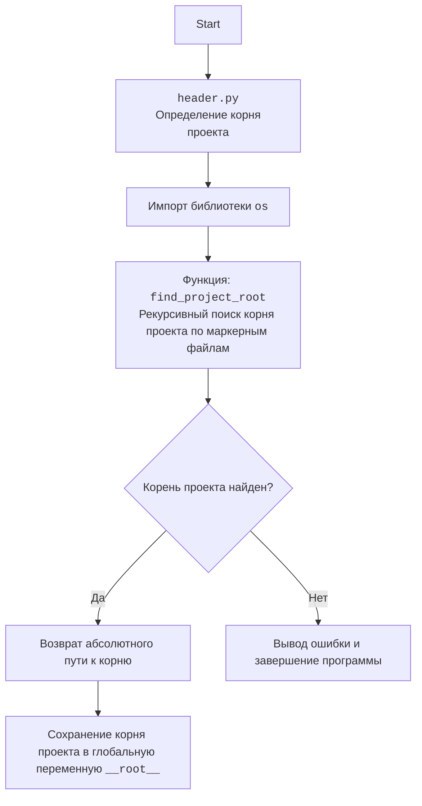

## <algorithm>

1. **Начало**: Программа запускается как самостоятельный скрипт.

2. **Импорт библиотек**: Импортируются необходимые библиотеки, такие как `google.generativeai` для работы с Gemini, `pathlib.Path` для работы с путями к файлам, `os` для доступа к переменным окружения, `dotenv` для работы с файлом `.env`, `header` для определения корня проекта.
   - Пример:
     ```python
     import google.generativeai as genai
     from pathlib import Path
     from header import __root__
     import os
     ```

3. **Загрузка переменных окружения**: Загружаются переменные окружения из файла `.env` с помощью `load_dotenv()`.
   - Пример:
     ```python
      load_dotenv()
     ```

4. **Определение путей**: Вычисляется абсолютный путь к директории с инструкциями (`base_path`).
   - Пример:
     ```python
     relative_path: Path = Path('GAMES', 'AI', 'BANNER_AI')
     base_path: Path = __root__ / relative_path
     ```

5. **Получение API ключа**: Проверяется, установлен ли API ключ в переменных окружения. Если нет, то ключ запрашивается у пользователя, и сохраняется в файл `.env`.
   - Пример:
     ```python
     API_KEY: str = os.getenv('API_KEY')
     if not API_KEY:
       API_KEY = input('API ключ не найден. Введите API ключ от `gemini`: ')
       set_key('.env', 'API_KEY', API_KEY)
     ```

6. **Создание словаря инструкций**: Словарь `instructions` связывает номера выбора с именами файлов инструкций.
   - Пример:
     ```python
     instructions: dict = {
         '1': 'system_instruction_asterisk',
         '2': 'system_instruction_tilde',
         '3': 'system_instruction_hash',
     }
     ```

7. **Вывод приветствия**: Вывод приветственного сообщения для пользователя.
   - Пример:
     ```python
      print('Добро пожаловать в игру Banner!')
      print('Введите текст, и я создам для вас текстовый баннер.')
     ```

8. **Цикл выбора стиля баннера**: Цикл, позволяющий пользователю выбрать стиль оформления баннера (символы `*`, `~`, `#`).
   - Пример:
     ```python
     while True:
         print('Выберите стиль оформления баннера:')
         print('1. Символ \'\\\'*\\\'\'')
         print('2. Символ \'\\\'~\\\'\'')
         print('3. Символ \'\\\'#\\\'\'')
         choice = input('Введите номер стиля (1, 2 или 3): ')
         ```
9. **Чтение инструкции**: Выбранная инструкция (системный промпт) считывается из соответствующего файла.
    - Пример:
      ```python
      if choice in ('1', '2', '3'):
          system_instruction: str = Path(base_path, 'instructions', f'{instructions[choice]}.md').read_text(encoding='UTF-8')
      else:
          system_instruction: str = Path(base_path, 'instructions', 'system_instruction_asterisk.md').read_text(encoding='UTF-8')
      ```
10. **Создание экземпляра `GoogleGenerativeAI`**: Создается объект класса `GoogleGenerativeAI`, передавая API ключ и выбранную инструкцию.
    - Пример:
      ```python
      model: GoogleGenerativeAI = GoogleGenerativeAI(api_key=API_KEY, system_instruction=system_instruction)
      ```

11. **Запрос текста у пользователя**: Пользователь вводит текст для создания баннера.
    - Пример:
      ```python
      user_text: str = input('Введите текст для баннера: ')
      ```
12. **Проверка текста и отправка запроса**: Если текст не пустой, текст отправляется модели Gemini через метод `ask` и выводится ответ. Если текст пустой, выводится сообщение об ошибке.
    - Пример:
      ```python
      if user_text.strip() == '':
          print('Вы не ввели текст. Попробуйте снова.')
      else:
          response = model.ask(user_text)
          print('\nВаш баннер готов:')
          print(response)
      ```
13. **Конец**: Программа завершается.

## <mermaid>

```mermaid
flowchart TD
    Start[Начало] --> ImportLibraries[Импорт библиотек: google.generativeai, pathlib, os, dotenv, header];
    ImportLibraries --> LoadEnv[Загрузка переменных окружения из .env];
    LoadEnv --> DefinePaths[Определение абсолютного пути к директории инструкций (base_path)];
    DefinePaths --> GetApiKey[Получение API ключа (из env или ввода пользователя)];
    GetApiKey --> CreateInstructionDict[Создание словаря инструкций];
    CreateInstructionDict --> PrintWelcome[Вывод приветствия пользователя];
    PrintWelcome --> StyleChoiceLoop[Цикл выбора стиля баннера];
    StyleChoiceLoop --> ReadInstructionFile{Выбран корректный стиль?};
    ReadInstructionFile -- Да --> ReadCorrectInstruction[Чтение инструкции из файла];
    ReadInstructionFile -- Нет --> ReadDefaultInstruction[Чтение инструкции по умолчанию];
     ReadCorrectInstruction --> CreateModelInstance[Создание экземпляра класса GoogleGenerativeAI];
    ReadDefaultInstruction --> CreateModelInstance
    CreateModelInstance --> GetUserText[Запрос текста у пользователя];
     GetUserText --> CheckUserText{Текст введен?};
    CheckUserText -- Нет --> ErrorMessage[Сообщение об ошибке: "Вы не ввели текст"];
   CheckUserText -- Да --> SendToModel[Отправка текста в модель Gemini (метод ask)];
  SendMessageToModel --> PrintBanner[Вывод сгенерированного баннера];
  ErrorMessage --> StyleChoiceLoop
  PrintBanner --> End[Конец];
```



## <explanation>

**1. Импорты (Imports):**

- `import google.generativeai as genai`: Импортирует библиотеку `google-generativeai` для взаимодействия с API Google Generative AI. Позволяет отправлять запросы к моделям Gemini.
    - Связь: Непосредственно взаимодействует с моделями ИИ.
- `import re`: Импортирует библиотеку для работы с регулярными выражениями. В текущем коде не используется, но может быть полезна для будущей обработки текста.
    - Связь: Непосредственной связи в этом коде нет.
- `from pathlib import Path`: Импортирует класс `Path` из библиотеки `pathlib`. Позволяет удобно работать с путями к файлам и директориям.
    - Связь: Используется для построения путей к файлам с инструкциями.
- `from header import __root__`: Импортирует переменную `__root__` из модуля `header.py`. `__root__` содержит абсолютный путь к корню проекта.
    - Связь: Позволяет коду работать с путями к файлам независимо от текущей рабочей директории.
- `from dotenv import load_dotenv, set_key`: Импортирует функции `load_dotenv` и `set_key` из библиотеки `dotenv` для работы с переменными окружения.
    - Связь: `load_dotenv` загружает переменные окружения из файла `.env`, `set_key` сохраняет API ключ в файл `.env`.
- `import os`: Импортирует библиотеку `os` для доступа к переменным окружения.
    - Связь: Используется для получения API ключа из переменных окружения.

**2. Классы (Classes):**

- `class GoogleGenerativeAI`: Класс для взаимодействия с моделью Google Generative AI.
  - **Атрибуты:**
    - `MODELS`: Список доступных моделей Gemini.
  - **Метод `__init__`:**
    - `api_key`: API ключ для доступа к Google Generative AI.
    - `system_instruction`: Инструкция для модели (системный промпт), например, стиль оформления текста.
    - `model_name`: Название модели (по умолчанию `'gemini-2.0-flash-exp'`).
    - Инициализирует модель Gemini с использованием библиотеки `google.generativeai`.
  - **Метод `ask`:**
    - `q`: Текст запроса, отправляемый модели.
    - Отправляет запрос в модель Gemini и возвращает текстовый ответ.
    - Обрабатывает ошибки и возвращает сообщение об ошибке в случае неудачи.

**3. Функции (Functions):**

- `load_dotenv()`: Загружает переменные окружения из файла `.env` если он существует.
  - Параметры: Нет
  - Возвращает: Нет
  - Цель: Обеспечивает доступ к переменным окружения, не храня их явно в коде.
  - Пример использования: `load_dotenv()`.
- `set_key(dotenv_path, key, value)`: Сохраняет переменную окружения в файл `.env`.
  - Параметры:
    - `dotenv_path`: Путь к файлу `.env`.
    - `key`: Имя переменной окружения.
    - `value`: Значение переменной окружения.
  - Возвращает: Нет
  - Цель: Позволяет сохранить API ключ пользователя в файле `.env`.
  - Пример: `set_key('.env', 'API_KEY', 'your_api_key')`.

**4. Переменные (Variables):**

- `__root__`: Абсолютный путь к корню проекта (импортируется из `header.py`).
    - Тип: `pathlib.Path`
    - Использование: Используется для построения путей к файлам инструкций.
- `relative_path`: Относительный путь к директории с инструкциями внутри проекта.
    - Тип: `pathlib.Path`
    - Использование: Используется для определения директории с инструкциями.
- `base_path`: Абсолютный путь к директории с инструкциями.
    - Тип: `pathlib.Path`
    - Использование: Используется для доступа к файлам с инструкциями.
- `API_KEY`: API ключ для доступа к Google Generative AI.
    - Тип: `str`
    - Использование: Используется для инициализации модели Gemini.
- `instructions`: Словарь, связывающий номер выбора стиля баннера с именами файлов инструкций.
    - Тип: `dict`
    - Использование: Используется для загрузки соответствующей инструкции.
- `choice`: Выбор пользователя стиля баннера.
    - Тип: `str`
    - שימוש: קלט מהמשתמש של בחירת סגנון הכרזה.
- `system_instruction`: תוכן של קובץ ההוראות.
    - Тип: `str`
    - Использование: Используется как системный промпт для модели Gemini.
- `model`: Экземпляр класса `GoogleGenerativeAI`.
    - Тип: `GoogleGenerativeAI`
    - Использование: Используется для генерации баннеров.
- `user_text`: טקסט שהמשתמש הזין כדי ליצור כרזה.
    - Тип: `str`
    - Использование:  הוא הקלט שנשלח למודל Gemini.
- `response`: התגובה של מודל Gemini.
    - Тип: `str`
    - Использование:  הפלט של הפונקציה `ask`.

**5. בעיות אפשריות ותחומים לשיפור:**

- **טיפול בשגיאות:** אפשר ליישם טיפול מפורט יותר בשגיאות, כמו שגיאות ספציפיות של `google.generativeai`.
- **תצורת המודל:** ניתן לאפשר למשתמש לבחור מודל Gemini מסויים מתוך `MODELS`.
- **קלט משתמש:** כדאי להוסיף אימות נוסף לקלט המשתמש, למשל לוודא שהטקסט אינו ארוך מדי.
- **קריאת קבצים:** ניתן להוסיף טיפול בשגיאות קריאת הקבצים של ההוראות.

**6. קשרים עם חלקים אחרים בפרויקט:**

- `header.py`: מספק את המשתנה `__root__` המכיל את נתיב השורש של הפרויקט, ומאפשר ניהול נתיבים גמיש.
- קבצי ההוראות: כל אחד מקבצי ההוראות (למשל `system_instruction_asterisk.md`) מכיל הנחיות ספציפיות למודל Gemini לגבי סגנון הפלט.
- `.env`: קובץ זה מכיל את ה-API key ובכך מאפשר לתוכנה לגשת ל-Google Generative AI.
- **תלות חיצונית:** תלויה ב-API של גוגל ג'נרטיב AI, ודורשת API key תקין.

ניתוח זה מספק הבנה מקיפה של הקוד, כולל האלגוריתם, המבנה, הפונקציונליות והקשרים עם חלקים אחרים בפרויקט.