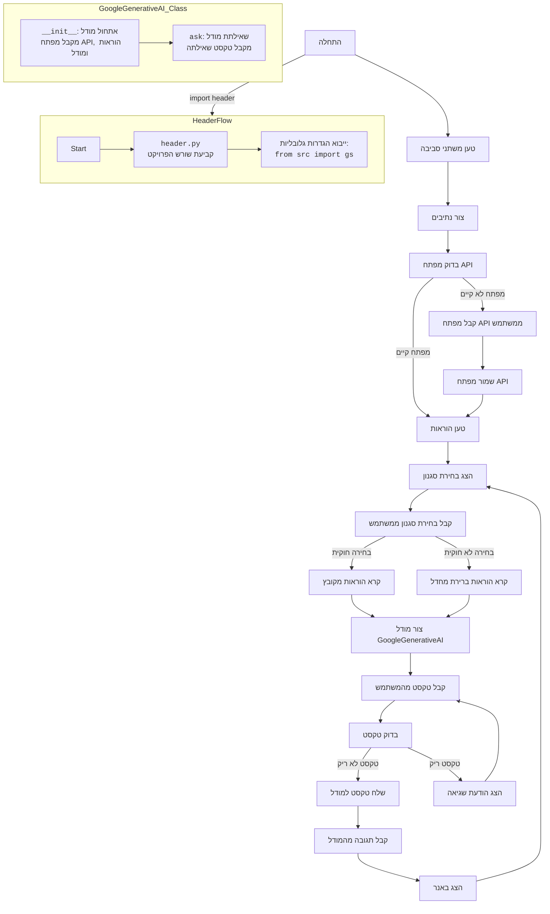

## <algorithm>

1.  **הגדרת משתנים וייבוא ספריות:**
    *   ייבוא ספריות נחוצות (os, re, json, pathlib, dotenv, google.generativeai) וגם את המשתנה `__root__` מקובץ `header.py`.
    *   טעינת משתני הסביבה מקובץ `.env`.
2.  **הגדרת מחלקה `GoogleGenerativeAI`:**
    *   **`__init__`**:
        *   מקבלת מפתח API, הוראות למודל ושם מודל (ברירת מחדל: `'gemini-2.0-flash-exp'`).
        *   שומרת את מפתח ה-API ואת שם המודל.
        *   מגדירה את המפתח API עבור `genai`.
        *   מאחלת את המודל באמצעות `genai.GenerativeModel` עם הוראות המערכת.
        *   דוגמה: `model = GoogleGenerativeAI(api_key="your_api_key", system_instruction="Act as a banner creator", model_name="gemini-2-13b")`
    *   **`ask`**:
        *   מקבלת טקסט קלט (`q`).
        *   מנסה לייצר תשובה מהמודל באמצעות `model.generate_content(q)`.
        *   אם התהליך מצליח, מחזירה את הטקסט של התשובה.
        *   אם מתרחשת שגיאה, מחזירה הודעת שגיאה.
        *   דוגמה: `response = model.ask("Hello, World!")`
3.  **הגדרת משתנים מרכזיים**:
    *   הגדרת נתיב יחסי לספריית המשחק `relative_path = Path('GAMES', 'AI', 'BANNER_AI')`.
    *   הגדרת נתיב מוחלט לספריית המשחק `base_path = __root__ / relative_path`.
4.  **טעינת מפתח API**:
    *   טעינת מפתח API מהסביבה `API_KEY = os.getenv('API_KEY')`
    *   אם המפתח לא נמצא, המשתמש מתבקש להזין אותו, והמפתח נשמר בקובץ `.env` באמצעות `set_key`.
5.  **הגדרת הוראות (system_instruction)**:
    *   הגדרת מילון `instructions` שממפה בחירה של משתמש להוראות ספציפיות (`'1'`: `'system_instruction_asterisk'`, `'2'`: `'system_instruction_tilde'`, `'3'`: `'system_instruction_hash'`)
6.  **לולאה ראשית של המשחק:**
    *   המשתמש מתבקש לבחור סגנון עיצוב באנר (כוכבית, טילדה או סולמית).
    *   אם הבחירה תקינה, נקראת ההוראה המתאימה מקובץ `.md` באמצעות `Path(base_path, 'instructions', f'{instructions[choice]}.md').read_text(encoding='UTF-8')`.
    *   אחרת, נעשה שימוש בהוראת ברירת המחדל של כוכבית.
    *   נוצר אובייקט `GoogleGenerativeAI` עם המפתח וההוראות המתאימים.
    *   המשתמש מתבקש להזין טקסט לבאנר.
    *   אם הטקסט אינו ריק:
        *   טקסט נשלח למודל באמצעות `model.ask(user_text)`.
        *   התשובה מהמודל מוצגת למשתמש.
        *   דוגמה: המשתמש בוחר סגנון 1, מזין "hello", והמודל מחזיר באנר מעוצב באמצעות כוכביות.
    *   אם הטקסט ריק, מוצגת הודעה למשתמש.

## <mermaid>

**הסבר התלויות:**

*   **os**: משמש לאינטראקציה עם מערכת ההפעלה, במקרה זה לקריאת משתני סביבה.
*   **re**: משמש לביצוע פעולות על בסיס ביטויים רגולריים (למרות שבקוד לא נעשה בו שימוש ישיר).
*   **json**: משמש לעבודה עם נתוני JSON (לא נעשה שימוש ישיר, אך ייתכן שיהיה שימושי בעתיד).
*   **pathlib.Path**: מספק דרך יעילה לעבוד עם נתיבי קבצים.
*   **dotenv.load_dotenv**: טוען משתני סביבה מקובץ `.env`.
*  **dotenv.set_key**: מאפשר להגדיר ולשמור משתני סביבה בקובץ `.env`.
*  **google.generativeai as genai**: הספריה שאחראית על האינטראקציה עם מודל Gemini.
*   **header import `__root__`**: משמש לקביעת הנתיב האבסולוטי של הפרויקט.

## <explanation>

**ייבואים (Imports):**

*   `import os`: משמש לקריאת משתני הסביבה, במיוחד את מפתח ה-API.
*   `import re`: משמש עבור ביטויים רגולריים (לא בשימוש ישיר בקוד הזה).
*    `import json`: משמש לטיפול בנתוני JSON. (לא בשימוש ישיר בקוד הזה)
*   `from pathlib import Path`: מאפשר עבודה עם נתיבי קבצים בצורה נוחה ואובייקטית.
*   `from dotenv import load_dotenv, set_key`: מאפשר טעינה ושמירה של משתני סביבה מקובץ `.env`.
*   `import google.generativeai as genai`: הספרייה העיקרית לעבודה עם מודל השפה Gemini.
*   `from header import __root__`: ייבוא משתנה `__root__` מקובץ `header.py`, שמכיל את הנתיב המוחלט לשורש הפרויקט. זה מאפשר להתייחס לקבצים אחרים בפרויקט באופן קבוע ללא תלות במיקום הקובץ הנוכחי.

**מחלקות (Classes):**

*   `GoogleGenerativeAI`:
    *   **תפקיד**: עוטפת את הפעולות עם מודל Gemini ומאפשרת אינטראקציה קלה יותר.
    *   **מאפיינים**:
        *   `api_key`: מפתח API עבור גישה ל-Gemini.
        *   `model_name`: שם מודל Gemini שבו יש להשתמש.
        *   `model`: אובייקט של `genai.GenerativeModel`, שאחראי על פעולות המודל.
        *   `MODELS`: רשימת שמות מודלים של Gemini.
    *   **שיטות**:
        *   `__init__(self, api_key: str, system_instruction: str, model_name: str = 'gemini-2.0-flash-exp')`: מאתחלת את האובייקט, מגדירה את ה-API key ויוצרת את המודל.
        *   `ask(self, q: str) -> str`: שולחת שאילתה למודל ומחזירה את התגובה.
    *   **אינטראקציה**: האובייקט נוצר בקוד הראשי עם מפתח API והוראות ספציפיות, והשיטה `ask` משמשת כדי לשלוח שאילתות למודל.

**פונקציות (Functions):**

*   `__init__(self, api_key: str, system_instruction: str, model_name: str = 'gemini-2.0-flash-exp')`:
    *   **פרמטרים**:
        *   `api_key` (str): מפתח API עבור Gemini.
        *   `system_instruction` (str): הוראות למודל (system prompt).
        *   `model_name` (str): שם המודל של Gemini.
    *   **ערך מוחזר**: אין.
    *   **מטרה**: אתחול האובייקט של המודל עם מפתח API והוראות.
    *   **דוגמה**: `model = GoogleGenerativeAI(api_key="your_api_key", system_instruction="Act as a banner creator", model_name="gemini-2-13b")`
*  `ask(self, q: str) -> str`:
    *   **פרמטרים**:
        *   `q` (str): טקסט שאילתה למודל.
    *   **ערך מוחזר**:
        *   (str): טקסט תגובה מהמודל או הודעת שגיאה.
    *  **מטרה**: שליחת שאילתה למודל Gemini וקבלת התגובה.
    *  **דוגמה**: `response = model.ask("Hello, World!")`

**משתנים (Variables):**

*   `relative_path` (Path): נתיב יחסי לספריית המשחק.
*   `base_path` (Path): נתיב מוחלט לספריית המשחק.
*   `API_KEY` (str): מפתח API של Gemini שנטען מהסביבה או מהמשתמש.
*  `instructions` (dict): מילון הממפה בחירות סגנון של משתמש להוראות קבצים.
*   `choice` (str): בחירת הסגנון של המשתמש.
*   `system_instruction` (str): תוכן ההוראות הטעון מקובץ `.md`.
*   `model` (GoogleGenerativeAI): אובייקט של המחלקה `GoogleGenerativeAI`.
*  `user_text` (str): טקסט שהוזן על ידי המשתמש ליצירת הבאנר.
*   `response` (str): התגובה שקיבלו ממודל Gemini.

**בעיות אפשריות או תחומים לשיפור:**

*   **טיפול בשגיאות:** טיפול השגיאות בהתחברות ל-Gemini עשוי להיות כללי מדי, רצוי להוסיף טיפול יותר ספציפי לבעיות רשת או שגיאות API.
*   **סוגי קבצים:** הקוד תומך בהוראות מקבצי `.md`, אך ניתן להרחיב את התמיכה לסוגי קבצים אחרים (לדוגמה `.txt`).
*   **בחירת מודל:** שם ברירת המחדל של המודל `'gemini-2.0-flash-exp'` מוגדר קשיח, כדאי לאפשר למשתמש לבחור מודל או לאפשר שינוי דרך משתנה סביבה.
*  **הפרדה בין קוד לוגיקה לבין קוד תצוגה:** ייתכן שהקוד יהיה יותר קריא וניתן לתחזוקה אם לוגיקת המשחק תהיה מופרדת מהתצוגה למשתמש (console print)
*   **אימות קלט:** אין אימות נוסף לקלט שהמשתמש מזין (מלבד בדיקה אם ריק), כדאי להוסיף אימות קלט כדי למנוע בעיות.

**שרשרת קשרים עם חלקים אחרים בפרויקט:**

*   **`header.py`**: מגדיר את הנתיב הבסיסי של הפרויקט (`__root__`). הקובץ משמש כדי למצוא את ספריית `GAMES` באופן מוחלט ולכן מאפשר לקוד לרוץ מכל מקום במערכת.
*   **`.env`**: מכיל משתני סביבה כמו מפתח ה-API של Gemini.
*   **קבצי ה-Markdown בהוראות (`instructions`)**: הקבצים מכילים את ההוראות למודל, שונות בהתאם לבחירת סגנון הבאנר.

בנוסף, הקוד יוצר קשר עם הספריה החיצונית `google.generativeai` לצורך אינטראקציה עם מודל השפה.