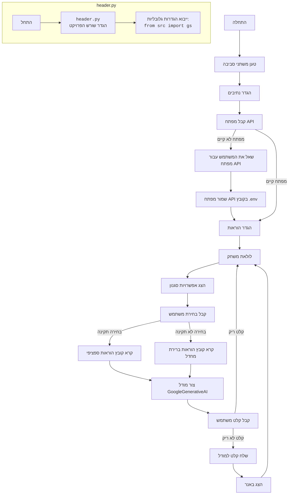

## <algorithm>

1. **הגדרת נתיבים**:
   - יצירת נתיב יחסי לתיקיית המשחק `GAMES/AI/BANNER_AI`.
     *דוגמה:* `relative_path = Path('GAMES', 'AI', 'BANNER_AI')`
   - חישוב הנתיב המוחלט לתיקייה על ידי שילוב הנתיב היחסי עם נתיב השורש של הפרויקט (`__root__`).
     *דוגמה:* `base_path = __root__ / relative_path`

2. **טעינת מפתח API**:
   - טעינת מפתח ה-API של ג'מיני ממשתני הסביבה.
     *דוגמה:* `API_KEY = os.getenv('API_KEY')`
   - אם לא נמצא מפתח, בקשת מפתח מהמשתמש ושמירתו בקובץ `.env`.
     *דוגמה:*
       - אם לא נמצא מפתח: `API_KEY = input('API ключ не найден. Введите API ключ от `gemini`: ')`
       - שמירה בקובץ `.env`: `set_key('.env', 'API_KEY', API_KEY)`

3. **הגדרת הוראות**:
   - הגדרת מילון הממפה בחירות משתמש להוראות מערכת מקבצי Markdown.
     *דוגמה:* `instructions = {'1': 'system_instruction_asterisk', '2': 'system_instruction_tilde', '3': 'system_instruction_hash'}`

4. **לולאת משחק ראשית**:
   - הצגת הודעת פתיחה למשתמש.
     *דוגמה:* `print('Добро пожаловать в игру Banner!')`
   - לולאה אינסופית המאפשרת למשתמש ליצור באנרים שוב ושוב.
     *דוגמה:* `while True:`

5. **בחירת סגנון באנר**:
   - הצגת אפשרויות בחירה למשתמש (1, 2 או 3) לבחירת סגנון.
     *דוגמה:* `print('1. Символ \'*\'')`
   - קבלת קלט המשתמש.
     *דוגמה:* `choice = input('Введите номер стиля (1, 2 или 3): ')`
   - קריאת הוראות המערכת מקובץ Markdown בהתבסס על בחירת המשתמש. אם הבחירה לא תקינה, משתמשים בהוראות ברירת המחדל.
      *דוגמה:* `system_instruction = Path(base_path, 'instructions', f'{instructions[choice]}.md').read_text(encoding='UTF-8')`

6. **יצירת מודל AI**:
    - יצירת מופע של המחלקה `GoogleGenerativeAI` עם מפתח ה-API והוראות המערכת שנבחרו.
      *דוגמה:* `model = GoogleGenerativeAI(api_key=API_KEY, system_instruction=system_instruction)`

7. **קבלת טקסט מהמשתמש**:
    - בקשה מהמשתמש להזין טקסט לבאנר.
      *דוגמה:* `user_text = input('Введите текст для баннера: ')`
    - בדיקה אם הטקסט שהוזן ריק. אם כן, חוזרים ללולאה הראשית.
      *דוגמה:* `if user_text.strip() == '': print('Вы не ввели текст. Попробуйте снова.')`

8. **יצירת באנר והצגתו**:
    - העברת הטקסט למודל ה-AI וקבלת תשובה (הבאנר).
      *דוגמה:* `response = model.ask(user_text)`
    - הצגת הבאנר שנוצר למשתמש.
      *דוגמה:* `print(response)`

## <mermaid>

## <explanation>

### ייבואים (Imports)

*   `os`: מודול זה משמש לביצוע פעולות הקשורות למערכת ההפעלה, כאן כדי לקרוא משתני סביבה.
*   `re`: מודול לביצוע פעולות עם ביטויים רגולריים (לא נעשה בו שימוש בקוד הנוכחי, אך ייתכן שייעשה בו שימוש בהרחבות עתידיות).
*   `json`: מודול לקידוד ופענוח נתוני JSON (לא נעשה בו שימוש בקוד הנוכחי, אך ייתכן שייעשה בו שימוש בהרחבות עתידיות).
*   `pathlib`: משמש לטיפול בנתיבי קבצים וספריות בצורה נוחה ועצמאית ממערכת ההפעלה.
*   `dotenv`: המודול מאפשר לטעון משתני סביבה מקובץ `.env`.
    *   `load_dotenv`: טוען משתני סביבה מקובץ `.env`.
    *   `set_key`: מאפשר לשנות או ליצור מפתח חדש בקובץ `.env`.
*   `google.generativeai`: מודול זה מספק את הפונקציונליות ליצירת מודלים של ג'מיני.
*   `header`: מייבא את משתנה `__root__` אשר מכיל את הנתיב המוחלט לשורש הפרויקט.

### מחלקות (Classes)

*   **`GoogleGenerativeAI`**:
    *   **תפקיד**: המחלקה אחראית על האינטראקציה עם מודלי Google Generative AI.
    *   **מאפיינים**:
        *   `api_key`: מפתח ה-API המשמש לאימות מול שירותי ג'מיני.
        *   `model_name`: שם המודל שבו יש להשתמש (ברירת המחדל היא `gemini-2.0-flash-exp`).
        *   `model`: מופע של מודל Generative AI.
    *   **שיטות**:
        *   `__init__(self, api_key: str, system_instruction: str, model_name: str = 'gemini-2.0-flash-exp')`: מאתחל את המודל, מקבל מפתח API והוראות מערכת, ומגדיר את מודל ג'מיני.
        *   `ask(self, q: str) -> str`: שולח שאילתה למודל ומחזיר את התשובה כטקסט. מטפל בשגיאות שעלולות להתרחש במהלך בקשת המודל.

### פונקציות (Functions)

אין פונקציות גלובליות מוגדרות בקוד זה מלבד השיטות בתוך המחלקה `GoogleGenerativeAI`.

### משתנים (Variables)

*   `relative_path`: משתנה מסוג `Path` המייצג את הנתיב היחסי לתיקיית המשחק.
*   `base_path`: משתנה מסוג `Path` המייצג את הנתיב המוחלט לתיקיית המשחק.
*   `API_KEY`: משתנה מסוג `str` המכיל את מפתח ה-API של ג'מיני.
*   `instructions`: מילון הממפה בחירות משתמש להוראות מערכת ספציפיות.
*   `choice`: קלט משתמש המייצג את בחירת סגנון הבאנר.
*   `system_instruction`: טקסט הוראות המערכת שנבחר על ידי המשתמש או ברירת מחדל.
*   `model`: מופע של המחלקה `GoogleGenerativeAI` המייצג את מודל השפה.
*   `user_text`: טקסט שהמשתמש מכניס עבור הבאנר.
*   `response`: התגובה שחוזרת ממודל הAI, הבאנר המעוצב.

### בעיות אפשריות ותחומים לשיפור

1.  **טיפול בשגיאות**: הטיפול בשגיאות הוא בסיסי. אפשר להוסיף לוגיקה לטיפול בשגיאות ספציפיות כמו שגיאות חיבור או מפתח API שגוי.
2.  **קוד קריא יותר**: הקוד הופך להיות קריא יותר אם מחלקים את הלולאה הראשית לפונקציות נפרדות, כגון `get_user_choice`, `load_instruction`, `create_banner`.
3.  **הגדרות תצורה**: נכון לעכשיו, ההוראות לסגנונות הבאנרים השונים מקודדות בהארד קוד. אפשר להעביר את ההגדרות לקובץ חיצוני כדי שיהיה קל יותר להוסיף או לשנות הגדרות.

### שרשרת קשרים עם חלקים אחרים בפרויקט

*   **`header.py`**: הקובץ הזה מגדיר את הנתיב המוחלט לפרויקט ומשמש לצורך יצירת נתיבים לקבצי משאבים, כמו קבצי ההוראות בתוך הספריה `instructions`.

בסה"כ, הקוד מספק דרך בסיסית ליצירת באנרים טקסטואליים באמצעות מודל AI של ג'מיני. ישנם תחומים רבים לשיפור, במיוחד בכל מה שקשור לטיפול בשגיאות, קריאות הקוד וגמישות.