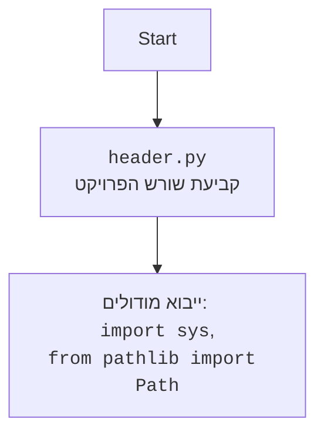

## <algorithm>

1. **התחלה**: הפונקציה `set_project_root` מופעלת עם רשימה של קבצי מרקר (`marker_files`) המציינים את שורש הפרויקט. כברירת מחדל, הערך הוא `('__root__', 'pyproject.toml', 'requirements.txt', '.git')`.
   - לדוגמה: `set_project_root(('__root__',))`

2. **אתחול נתיב נוכחי**: הנתיב הנוכחי של הקובץ מוגדר למשתנה `current_path`.
   - לדוגמה: אם הקובץ נמצא ב-`hypotez/src/endpoints/ai_games/101_basic_computer_games/ru/GAMES/AI/BANNER_AI/header.py`, אז `current_path` יהיה `hypotez/src/endpoints/ai_games/101_basic_computer_games/ru/GAMES/AI/BANNER_AI`.

3. **אתחול שורש**: הנתיב הנוכחי מאותחל כשורש (`__root__`).
   - לדוגמה: `__root__` יהיה `hypotez/src/endpoints/ai_games/101_basic_computer_games/ru/GAMES/AI/BANNER_AI`.

4. **מעבר בין תיקיות אב**: לולאה רצה על התיקיות האב של הנתיב הנוכחי, כולל התיקייה הנוכחית עצמה.
   - לדוגמה: הלולאה תעבור על `hypotez/src/endpoints/ai_games/101_basic_computer_games/ru/GAMES/AI/BANNER_AI`, לאחר מכן `hypotez/src/endpoints/ai_games/101_basic_computer_games/ru/GAMES/AI`, אחר כך `hypotez/src/endpoints/ai_games/101_basic_computer_games/ru/GAMES`, וכן הלאה, עד שורש הדיסק.

5. **בדיקת קיום קבצי מרקר**: עבור כל תיקיית אב, בודקים אם אחד מקבצי המרקר קיימים בתוך התיקייה.
    - לדוגמה: בודקים אם קובץ בשם `__root__` קיים בתיקייה הנוכחית או בתיקייה אחת למעלה.

6. **עדכון שורש**: אם אחד מקבצי המרקר נמצא, התיקייה האב הנוכחית מוגדרת כשורש (`__root__`), והלולאה נעצרת.
    - לדוגמה: אם הקובץ `__root__` נמצא בתיקייה `hypotez`, אז `__root__` יוגדר כ-`hypotez`.

7. **הוספת נתיב שורש ל-sys.path**: אם השורש לא קיים בתוך ה- `sys.path` (רשימת הנתיבים בהם פייתון מחפש מודולים), הנתיב של השורש מוכנס בתחילת הרשימה, כדי שניתן יהיה לייבא מודולים מהפרויקט.

8. **החזרת שורש**: הפונקציה מחזירה את הנתיב של שורש הפרויקט (`__root__`).

9. **קביעת שורש הפרויקט**: מפעילים את הפונקציה `set_project_root` עם קובץ מרקר `('__root__')` כדי למצוא את שורש הפרויקט ומגדירים את המשתנה `__root__`.

## <mermaid>

```mermaid
flowchart TD
    A[התחלה: set_project_root(marker_files)] --> B{קבלת נתיב נוכחי של הקובץ};
    B --> C[אתחול __root__ לנתיב הנוכחי];
    C --> D{מעבר על תיקיות אב};
    D -- לכל תיקייה אב --> E{בדיקה: האם קובץ מרקר קיים?};
    E -- כן --> F[עדכון __root__ לתיקייה אב];
    F --> G[יציאה מלולאת תיקיות אב];
    E -- לא --> D;
    D -- כל התיקיות עברו --> H{האם __root__ ב-sys.path?};
    H -- לא --> I[הוספת __root__ ל-sys.path];
    I --> J[החזרת __root__];
    H -- כן --> J;
    J --> K[סיום: __root__ הוא שורש הפרויקט];

    subgraph set_project_root
        A
        B
        C
        D
        E
        F
        G
        H
        I
        J
    end

    K --> L[קביעת שורש הפרויקט: __root__ = set_project_root(('__root__'))];
    
    
```



## <explanation>

**ייבואים (Imports)**:

-   `import sys`: מודול `sys` מספק פונקציות ומשתנים שמשמשים לגישה למערכת זמן הריצה של פייתון (Python runtime environment), כולל אפשרויות למניפולציה של משתנה הנתיבים `sys.path`. מודול זה חיוני כאן כדי להוסיף את שורש הפרויקט לתוך רשימת הנתיבים, ובכך לאפשר ייבוא מודולים מתוך הפרויקט.
-  `from pathlib import Path`: המודול `Path` מ-`pathlib` משמש לייצוג נתיבי קבצים בצורה אוניברסלית יותר. הוא מספק דרך נוחה יותר לטפל בנתיבים של מערכת הקבצים (יצירה, בדיקה, מניפולציה).

**פונקציות (Functions)**:

-   `set_project_root(marker_files:tuple) -> Path`:
    -   **פרמטרים**:
        -   `marker_files`: טאפל של שמות קבצים או תיקיות המשמשים לזיהוי שורש הפרויקט. ברירת המחדל היא `('__root__', 'pyproject.toml', 'requirements.txt', '.git')`.
    -   **ערך מוחזר**:
        -   `Path`: אובייקט `Path` המייצג את שורש הפרויקט.
    -   **מטרה**: הפונקציה מטרתה למצוא את שורש הפרויקט על ידי עלייה בהיררכיית התיקיות עד שקובץ מרקר נמצא. לאחר מכן הפונקציה מוסיפה את שורש הפרויקט לרשימת הנתיבים של פייתון `sys.path`, כדי לאפשר ייבוא קל של מודולים אחרים מהפרויקט.

        - **דוגמאות לשימוש**:
          ```python
          # השימוש הרגיל בפרויקט
          __root__ = set_project_root(('__root__',))

          # שימוש עם קבצי מרקר שונים
          __root__ = set_project_root(('my_marker.txt',))

          ```

**משתנים (Variables)**:

-   `__root__`: משתנה מסוג `Path` אשר מייצג את שורש הפרויקט. הוא מוגדר לאחר קריאה לפונקציה `set_project_root`.
    -   דוגמאות: `__root__` יכול להיות, לדוגמה, `"/home/user/myproject"`

-   `current_path`: משתנה מסוג `Path` אשר מייצג את הנתיב הנוכחי של הקובץ שבו מוגדרת הפונקציה `set_project_root`.

-  `marker_files`: טאפל של שמות קבצים או תיקיות המשמשים לזיהוי שורש הפרויקט.

**בעיות אפשריות ותחומים לשיפור**:

-  **קביעת שורש**: הקוד הנוכחי משתמש במספר קבצים אפשריים כדי לקבוע את שורש הפרויקט. זה אולי לא אידיאלי במקרים מורכבים שבהם הקבצים האלה קיימים גם בתיקיות משנה. ניתן לשקול שימוש במנגנון יותר חזק לקביעת שורש, אולי על ידי הגדרת משתנה סביבה או ארגומנט בשורת הפקודה.
-   **תלות**: הפונקציה מסתמכת על קיום קבצים ספציפיים (`__root__`, `pyproject.toml`, `requirements.txt`, `.git`) כדי למצוא את שורש הפרויקט. אם הקבצים האלה אינם קיימים, הקוד עלול לא למצוא את השורש הנכון.
-   **יעילות**: ניתן לשפר את יעילות הקוד על ידי שימוש בפונקציה `next()` במקום הלולאה עם תנאי `break`, כדי לסיים את הלולאה ברגע שהקובץ נמצא.
-  **שגיאות**: הקוד אינו מטפל במקרים שבהם קובץ לא נמצא או שאין לו הרשאות גישה. מומלץ להוסיף טיפול בשגיאות כדי למנוע קריסה של התוכנית.

**שרשרת קשרים עם חלקים אחרים בפרויקט**:
- הקובץ `header.py` מתוכנן להיות מיובא על ידי מודולים אחרים בפרויקט על מנת לקבוע את הנתיב לשורש הפרויקט, מה שמאפשר להם לייבא מודולים אחרים מהפרויקט בצורה נכונה.
- הקובץ משתמש ב `sys` ו `Path` שהם מודולים סטנדרטיים בפייתון ואינו תלוי בחלקים אחרים בפרויקט.