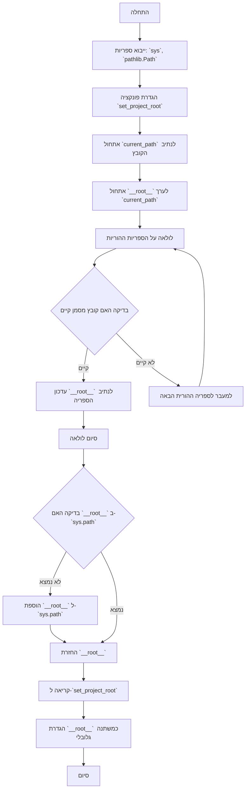
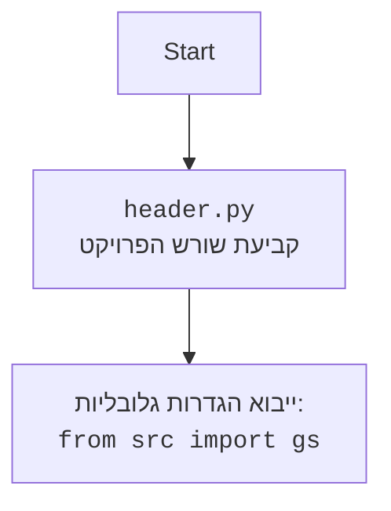

## <algorithm>
1. **התחלה:**
   - התוכנית מתחילה בהגדרת שורת ה-shebang (`#!`) שמציינת את המפרש של Python שיש להשתמש בו.
   - מודול `header` מתחיל בפעולה.
   
2. **ייבוא ספריות:**
   - ייבוא מודול `sys`: משמש לגישה לפרמטרים ופונקציות ספציפיות למערכת.
   - ייבוא המחלקה `Path` מתוך `pathlib`: מאפשר עבודה עם נתיבי קבצים בצורה נוחה יותר.
   
3. **הגדרת פונקציה `set_project_root`:**
   - **קלט:** מקבלת טאפל `marker_files` שמכיל שמות קבצים או ספריות לזיהוי שורש הפרויקט (ברירת מחדל: `('__root__', 'pyproject.toml', 'requirements.txt', '.git')`).
   - **אתחול:**
      - משתנה `current_path` מאותחל לנתיב של הספריה בה נמצא הקובץ הנוכחי (`header.py`). לדוגמה, אם הקובץ נמצא ב- `/home/user/project/src/endpoints/ai_games/101_basic_computer_games/ru/GAMES/AI/BANNER_AI`, הערך של `current_path` יהיה `/home/user/project/src/endpoints/ai_games/101_basic_computer_games/ru/GAMES/AI/BANNER_AI`.
      - משתנה `__root__` מאותחל כעת לערך של `current_path`.
   - **חיפוש שורש:**
     - המערכת עוברת על כל הספריות ההוריות (כולל הספריה הנוכחית) של `current_path`.
     - עבור כל ספריה, היא בודקת אם אחד מהקבצים בטאפל `marker_files` קיים באותה ספריה.
     - אם נמצא קובץ מסמן, המשתנה `__root__` מתעדכן לנתיב הספריה שבה נמצא הקובץ, והלולאה נשברת.
     - לדוגמה, אם קובץ `__root__` נמצא בספרייה `/home/user/project`, אז `__root__` יהיה `/home/user/project`.
   - **עדכון נתיב מערכת:**
     - בודקת אם `__root__` לא נמצא כבר בנתיבי החיפוש של המערכת (`sys.path`).
     - אם לא, מוסיפה את נתיב `__root__` בתחילת `sys.path`.
   - **פלט:** מחזירה את `__root__` (נתיב שורש הפרויקט).

4. **קריאה לפונקציה `set_project_root`:**
   - הפונקציה `set_project_root` נקראת עם `('__root__')` כקובץ מסמן. התוצאה מאוחסנת במשתנה גלובלי בשם `__root__`.
   - לאחר ביצוע, `__root__` יהיה נתיב שורש הפרויקט. לדוגמה: `/home/user/project`.

5. **סיום:**
   - המשתנה `__root__` מוגדר כמשתנה גלובלי המכיל את הנתיב של שורש הפרויקט.

## <mermaid>



## <explanation>
**ייבואים (Imports):**
- `import sys`: מודול זה מספק גישה למשתנים ופונקציות ספציפיות למערכת, כולל היכולת לשנות את נתיב חיפוש המודולים (sys.path). במקרה זה, נעשה בו שימוש כדי להוסיף את נתיב שורש הפרויקט ל-`sys.path` כדי לאפשר ייבוא מודולים מהפרויקט באופן כללי.
- `from pathlib import Path`: המחלקה `Path` מספקת דרך נוחה לעבודה עם נתיבי קבצים וספריות. היא משמשת כאן לטיפול בנתיבים בצורה קריאה יותר, במקום להשתמש במחרוזות פשוטות.

**פונקציות (Functions):**
- `set_project_root(marker_files: tuple = ('__root__', 'pyproject.toml', 'requirements.txt', '.git')) -> Path`:
    - **פרמטרים:**
        - `marker_files`: טאפל של שמות קבצים או ספריות המשמשים לזיהוי שורש הפרויקט. ברירת המחדל כוללת את `__root__`, `pyproject.toml`, `requirements.txt` ו-`.git`.
    - **ערך מוחזר:** מחזירה אובייקט `Path` שמייצג את נתיב שורש הפרויקט.
    - **מטרה:** פונקציה זו מוצאת את שורש הפרויקט על ידי עלייה בספריות עד שנמצא אחד הקבצים או הספריות המסומנים. היא נועדה לאפשר לאתר את שורש הפרויקט מכל מקום שבו הקוד מורץ בתוך הפרויקט, כדי שניתן יהיה לייבא מודולים מהפרויקט באופן אחיד.
    - **דוגמה:** אם מבצעים את הפונקציה מתוך קובץ שנמצא בספרייה `/home/user/project/src/endpoints/ai_games/101_basic_computer_games/ru/GAMES/AI/BANNER_AI` והקובץ `__root__` נמצא בספרייה `/home/user/project`, הפונקציה תחזיר את האובייקט `Path("/home/user/project")`.

**משתנים (Variables):**
- `__root__: Path`: משתנה גלובלי המוגדר בראש הקובץ ומכיל את נתיב שורש הפרויקט כאובייקט `Path`.
- `current_path: Path`: משתנה מקומי בפונקציה `set_project_root` שמכיל את הנתיב של הספריה בה נמצא הקובץ `header.py` בזמן ריצה.
- `marker_files`: משתנה המייצג טאפל של מחרוזות שהפונקציה `set_project_root` מקבלת כארגומנט.

**בעיות אפשריות ותחומים לשיפור:**
- **גמישות בבחירת קבצי מסמן:** ניתן להרחיב את אפשרויות קבצי המסמן כדי לתמוך במגוון רחב יותר של פרויקטים.
- **טיפול במקרי קצה:** הפונקציה יכולה להיות משופרת כדי לטפל במקרים שבהם לא נמצא קובץ מסמן, ולספק פתרון ברירת מחדל הגיוני או להעלות שגיאה ברורה.

**שרשרת קשרים עם חלקים אחרים בפרויקט:**
- קובץ זה (`header.py`) מיועד לספק הגדרה גלובלית של נתיב שורש הפרויקט (`__root__`). מודולים אחרים בפרויקט יכולים לייבא את `__root__` מקובץ זה כדי לגשת למודולים אחרים בפרויקט בצורה אחידה, בלי תלות במיקום הקובץ הנוכחי.

**דוגמה לשימוש:**
אחרי שקובץ זה מורץ, כל קובץ אחר בפרויקט יכול לייבא את המשתנה הגלובלי `__root__` כך:
```python
from pathlib import Path
from src.endpoints.ai_games.101_basic_computer_games.ru.GAMES.AI.BANNER_AI.header import __root__

# __root__ עכשיו מכיל את נתיב שורש הפרויקט כPath
# ניתן להשתמש בו כדי לבנות נתיבים לקבצים אחרים
data_file_path = __root__ / "data" / "data.txt"
print(data_file_path)
```
```python