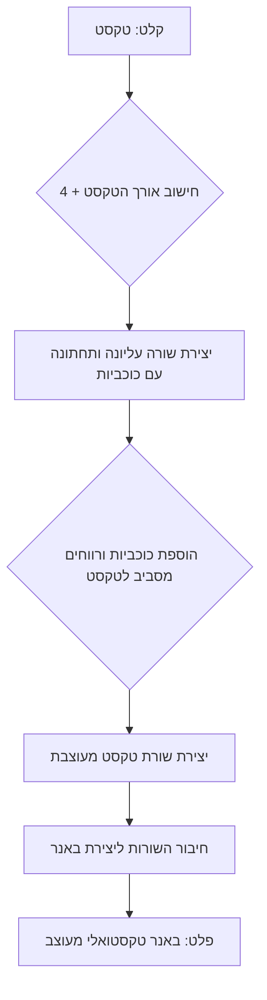

## ניתוח קוד

### 1. <algorithm>

הקוד שסופק הוא לא קוד תכנות, אלא הנחיות למערכת ליצירת באנרים טקסטואליים. ניתן לראות בכך אלגוריתם בסיסי, כאשר הוא מתאר את השלבים ליצירת הבאנר.

*   **קלט:** טקסט כלשהו.
    *   דוגמה: "שלום עולם"
*   **יצירת שורה עליונה ותחתונה:**
    *   חשב את אורך הטקסט + 4 (2 כוכביות מכל צד + רווחים)
    *   צור מחרוזת של כוכביות באורך המחושב.
    *   דוגמה: הטקסט "שלום עולם" באורך 8, אז המחרוזת תהיה "************" (אורך 12)
*   **יצירת שורת טקסט:**
    *   הוסף כוכבית, רווח, את הטקסט, רווח וכוכבית.
    *   דוגמה: "* שלום עולם *"
*   **יצירת באנר:**
    *   חבר את השורה העליונה, שורת הטקסט, השורה התחתונה.
    *   דוגמה:
        ```
        ************
        * שלום עולם *
        ************
        ```
*   **פלט:** באנר טקסטואלי מעוצב.

### 2. <mermaid>



### 3. <explanation>

**הסברים מפורטים:**

*   **ייבואים (Imports):** הקוד הנוכחי אינו כולל ייבוא כלשהו. מדובר בהנחיות, ולא בקוד מבוצע.
*   **מחלקות (Classes):** לא קיימות מחלקות בקוד זה.
*   **פונקציות (Functions):** לא קיימות פונקציות בקוד זה.
*   **משתנים (Variables):**
    *   `טקסט`: משתנה מסוג מחרוזת המכיל את הטקסט שיוצג בבאנר.
    *   `אורך_הטקסט`: משתנה מספרי המכיל את אורך הטקסט.
    *   `שורה_עליונה_תחתונה`: מחרוזת המכילה שורה של כוכביות.
    *   `שורת_טקסט`: מחרוזת המכילה את הטקסט מוקף בכוכביות ורווחים.
    *   `באנר`: מחרוזת המכילה את כל הבאנר הטקסטואלי המעוצב.
*   **בעיות אפשריות או תחומים לשיפור:**
    *   הקוד הנוכחי הוא הנחיות, ולא קוד בפועל. כדי להפוך אותו לקוד עובד, יהיה צורך ליישם אותו בשפת תכנות כלשהי.
    *   הקוד אינו מטפל במקרים מיוחדים, כגון טקסטים ריקים או טקסטים עם שורות חדשות.
    *   ניתן להוסיף אפשרויות נוספות לעיצוב הבאנר, כגון בחירה של סמל שונה מכוכבית, או סגנון ריווח שונה.

**שרשרת קשרים עם חלקים אחרים בפרויקט:**

הקוד הנוכחי (כאשר הוא מיושם) יהווה חלק ממערכת ליצירת באנרים טקסטואליים. הוא יכול להיות מופעל ע"י קוד אחר שמעביר לו את הטקסט הרצוי, ולקבל את הבאנר המעוצב כפלט.

לדוגמה, אם הפרויקט בנוי על בסיס מערכת ליצירת משחקי טקסט, הקוד הזה יכול לשמש ליצירת כותרות, הודעות או אלמנטים אחרים.