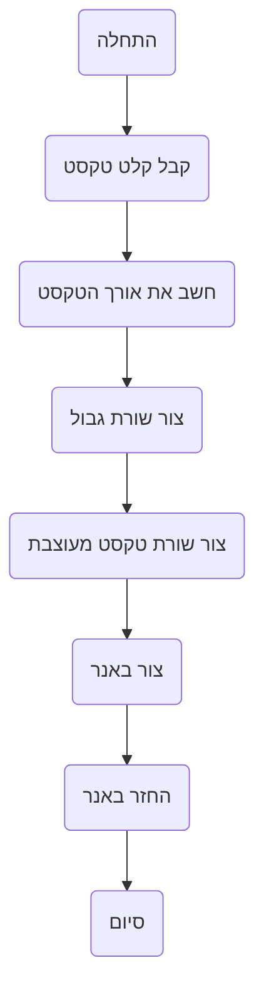

## <algorithm>

1. **קבלת קלט טקסט**: הפונקציה מקבלת מחרוזת טקסט כקלט.
   - דוגמה: `text = "שלום עולם"`

2. **חישוב אורך הטקסט**: הפונקציה מחשבת את אורך מחרוזת הטקסט.
   - דוגמה: `text_length = len(text)` כאשר `text = "שלום עולם"`, אז `text_length = 10`

3. **יצירת שורת גבול**: הפונקציה יוצרת שורת גבול של `#` באורך הטקסט ועוד 4 תווים (2 תווים מכל צד).
    - דוגמה: אם `text_length = 10`, שורת הגבול תהיה `"############"`

4. **יצירת שורת טקסט מעוצבת**: הפונקציה יוצרת שורת טקסט המוקפת ב `#` משני הצדדים.
    - דוגמה: אם `text = "שלום עולם"`, שורת הטקסט המעוצבת תהיה `"# שלום עולם #"`

5. **יצירת באנר**: הפונקציה יוצרת את הבאנר על ידי שילוב שורת הגבול, שורת הטקסט המעוצבת ושוב שורת הגבול.
   - דוגמה: 
   ```
    "############\n" + 
    "# שלום עולם #\n" +
    "############"
   ```

6. **החזרת הבאנר**: הפונקציה מחזירה את הבאנר כפלט.

## <mermaid>


## <explanation>

**ייבואים (Imports):**

אין ייבואים בקוד הזה.

**מחלקות (Classes):**

אין מחלקות בקוד הזה.

**פונקציות (Functions):**

הקוד הזה לא מגדיר פונקציות. הקוד הוא פשוט אוסף של הוראות טקסטואליות בשפה טבעית.
ההוראות מתארות כיצד ליצור באנר טקסטואלי באמצעות סימן הסולמית (#). 
ההוראות מסבירות את הפורמט הרצוי של הבאנר: שורות גבול של סולמיות למעלה ולמטה, וטקסט מוקף בסולמיות.
 
**משתנים (Variables):**

אין משתנים בקוד הזה.

**בעיות אפשריות או תחומים לשיפור:**

1. **אבסטרקציה:** הקוד הזה אינו קוד אמיתי שניתן להריץ. הוא רק אוסף של הוראות. כדי שיהיה אפשר להשתמש בו, צריך לכתוב פונקציה בתוכנית מחשב שעושה את הפעולות שמתוארות כאן.
2. **התאמה אישית:** הקוד הזה יוצר באנר פשוט מאוד. אפשר להוסיף לו אפשרויות התאמה אישית, למשל:
    - אפשרות לבחור תו אחר במקום `#`
    - אפשרות לשנות את עובי הגבול
    - אפשרות להוסיף ריווח בין הטקסט לגבול
    - אפשרות לשלב מספר שורות טקסט
3. **בדיקות קלט:** הקוד לא מטפל בקלט ריק או בקלט שאינו מחרוזת.
4. **תחזוקה:** הקוד קריא וקל להבנה, אך אין לו מבנה של קוד.

**שרשרת קשרים עם חלקים אחרים בפרויקט:**

הקוד הזה הוא חלק מהמערכת של משחקי AI, במיוחד יצירת באנר טקסט. יכול להיות שישתמשו בו כחלק מאינטראקציה עם המשתמש, או בהצגה של תוצאות של משחק. הקוד הזה יכול להיקשר ל:
  - פונקציות קלט/פלט המקבלות טקסט מהמשתמש או מתוכנות אחרות.
  - פונקציות עיבוד טקסט אחרות, אם יהיו
  - פונקציות תצוגה, שמדפיסות את הבאנר שנוצר למסך או שומרות אותו לקובץ.