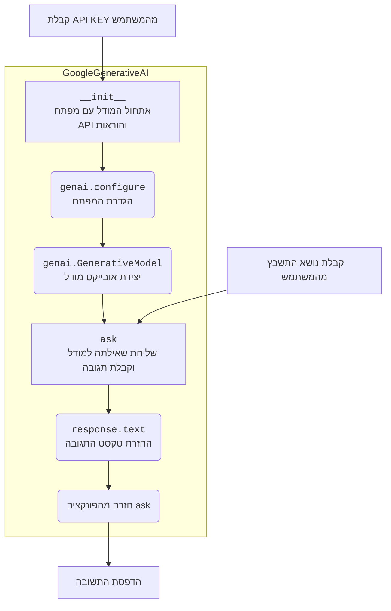

## <algorithm>

1.  **הגדרת תפקיד המודל:** המודל מוגדר כ"מחולל תשבצים". זה קובע את מטרתו העיקרית - ליצור תשבצים לפי נושא נתון.
    *   דוגמה: "אתה מחולל תשבצים".

2.  **הגדרת פורמט התגובה:** המודל מקבל הנחיות מדויקות לגבי האופן בו עליו להציג את התשבץ ואת רשימת המילים.
    *   **תשבץ:** מוצג כטבלה בפורמט ASCII עם סימנים כמו `+`, `-`, `|` ורווחים. תאים מלאים מסומנים עם `#`. מילים ממוספרות.
    *   דוגמה:
        ```
        +---+---+---+---+---+---+---+
        | 1 |   |   |   |   |   |   |
        +---+---+---+---+---+---+---+
        ```
    *   **רשימת מילים:** כל מילה ממוספרת ומוצגת יחד עם ההגדרה שלה.
    *   דוגמה: `1.  מילה - הגדרה`.

3.  **תהליך יצירת התשבץ:** המודל צריך לבצע מספר שלבים ליצירת תשבץ תקין.
    *   **צורת רשת:** להשתמש בטפסים מלבניים פשוטים בגודל מינימלי של 5x5.
        *   דוגמה: רשת של 5x5 או יותר.
    *   **בחירת מילים:** בחירת מילים הרלוונטיות לנושא הנתון.
        *   דוגמה: אם הנושא הוא "ספורט", מילים כמו "כדורגל", "כדורסל", וכו'.
    *   **הצלבות מילים:** המילים צריכות להצטלב ליצירת תשבץ קלאסי.
        *   דוגמה: מילים אופקיות ו אנכיות משתלבות זו בזו.
    *   **מספר מינימלי של מילים:** בתשבץ צריך להיות לפחות 5 מילים.
    *   **כיוון מילים:** השתמש גם במילים אופקיות וגם אנכיות.
    *   דוגמה: שימוש בשילוב של מילים אופקיות ואנכיות.

4.  **דוגמה לתגובה:** מוצגת דוגמה לתשבץ, מילים והגדרות בפורמט הנכון כדי שהמודל יבין את הפורמט הרצוי.

5.  **הוראות לבקשה:** המודל צריך ליצור תשבץ לפי הנושא הנתון בבקשה ולהציג אותו בפורמט שצוין.
    *   דוגמה: אם הבקשה היא "טבע", ליצור תשבץ עם מילים כמו "עץ", "נהר", "הר".

6.  **שפה:** המודל צריך להגיב בשפה של הבקשה.

7.  **שימוש בקוד:**
    *   **קבלת מפתח API:** המשתמש נדרש לספק מפתח API של Gemini.
    *   **יצירת אובייקט GoogleGenerativeAI:** נוצר אובייקט של המחלקה `GoogleGenerativeAI` עם מפתח ה-API והוראות המערכת.
    *   **קבלת נושא מהמשתמש:** המשתמש מתבקש להזין נושא לתשבץ.
    *   **בקשת התשובה:** המודל קורא לפונקציה `ask` עם הנושא, ומקבל את התשובה.
    *   **הדפסת התשובה:** התשובה המוחזרת מודפסת.

## <mermaid>



## <explanation>

*   **ייבואים (Imports)**:
    *   `import google.generativeai as genai`: מייבא את הספרייה `google.generativeai` ונותן לה את הכינוי `genai`. ספרייה זו מאפשרת גישה למודלים של גוגל, כמו Gemini. זה חלק חשוב באינטגרציה עם Google API.

*   **מחלקות (Classes)**:
    *   `GoogleGenerativeAI`: מחלקה זו מגדירה אובייקט שמשתמש במודל Gemini כדי ליצור תשובות על פי הוראות נתונות.
        *   **מאפיינים:**
            *   `api_key`: מפתח API של Gemini המשמש לאימות.
            *   `model_name`: שם המודל Gemini בו משתמשים.
            *   `model`: אובייקט של מודל Gemini.
        *   **שיטות:**
            *   `__init__(self, api_key: str, system_instruction: str = '', model_name: str = 'gemini-2.0-flash-exp')`: בנאי המחלקה. הוא מאתחל את מפתח ה-API, שם המודל ומגדיר את המודל Gemini עם הוראות המערכת.
            *   `ask(self, q: str) -> str`: פונקציה השולחת שאילתה למודל Gemini ומחזירה את התגובה כטקסט. הפונקציה מטפלת בשגיאות ומחזירה הודעת שגיאה אם מתרחשת שגיאה כלשהי.
        *   **אינטראקציה:**
            *   האובייקט של המחלקה מוגדר עם מפתח API והוראות מערכת, ולאחר מכן נעשה שימוש בשיטת `ask()` כדי לתקשר עם מודל AI.

*   **פונקציות (Functions)**:
    *   `__init__`: מאתחלת את המודל, מגדירה את המפתח, מודל ואת ההנחיות של המערכת.
        *   פרמטרים:
            *   `api_key` (str): מפתח ה-API של ג'מיני.
            *   `system_instruction` (str): הנחיות המערכת למודל.
            *   `model_name` (str): שם המודל.
        *   ערך מוחזר: אין.
        *   שימוש: לאתחול המודל לפני השימוש.
    *   `ask`: שולחת שאילתה למודל AI.
        *   פרמטרים:
            *   `q` (str): השאילתה.
        *   ערך מוחזר:
            *   (str): טקסט התגובה מהמודל או הודעת שגיאה.
        *   שימוש: לשליחת בקשות למודל AI וקבלת תשובות.

*   **משתנים (Variables)**:
    *   `API_KEY` (str): מפתח ה-API של Gemini, מקבל קלט מהמשתמש.
    *   `system_instruction` (str): מחרוזת המכילה את ההוראות למודל.
    *   `model`: אובייקט של המחלקה `GoogleGenerativeAI` המשמש לתקשורת עם מודל Gemini.
    *   `q` (str): מחרוזת המכילה את נושא התשבץ, מקבל קלט מהמשתמש.
    *    `response` (str): מחרוזת המכילה את תשובת המודל.

*   **בעיות אפשריות ושיפורים:**
    *   **טיפול בשגיאות:** המודל מטפל בשגיאות בסיסיות, אך ניתן להרחיב את טיפול השגיאות לתרחישים מורכבים יותר.
    *   **בחירת מודל:** המשתמש יכול לבחור מודל ספציפי.
    *   **גמישות:** ניתן להרחיב את הפונקציונליות כדי להתאים לסוגים שונים של משחקי מילים או פורמטים אחרים.
    *   **אימות קלט:** לא נעשה אימות קלט, יש להוסיף אימות על הקלט של המשתמש, כמו בדיקה שהנושא לא ריק.
    *   **פורמט:** ניתן להוסיף תמיכה בפורמטים נוספים של תשבצים.
    *   **יצירת תשבץ:** ניתן לייעל את אלגוריתם יצירת התשבץ כך שיהיו פחות מילים שלא משתלבות בתשבץ.
*   **שרשרת קשרים עם חלקים אחרים בפרויקט:**
    *   הקוד משתמש בספרייה `google.generativeai` לתקשורת עם מודל Gemini.
    *   הקוד תלוי בקלט המשתמש לקבלת מפתח ה-API ונושא התשבץ.