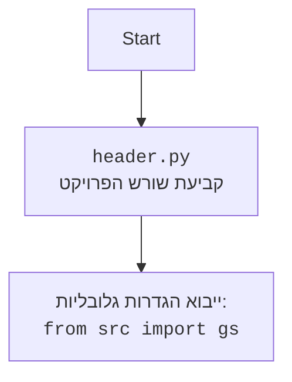

## <algorithm>

1. **קבלת קלט (קלט מהמשתמש):**
   - המשתמש מזין את מפתח ה-API של Gemini.
   - המשתמש מזין את נושא התשבץ.
   *   דוגמה:
        ```
        API ключ от `gemini`:(מפתח API)
        Тема кроссворда: Спорт
        ```
2. **יצירת מודל GoogleGenerativeAI:**
   - מופעלת המחלקה `GoogleGenerativeAI`.
   - המחלקה מקבלת את מפתח ה-API ואת ההוראות (`system_instruction`) כמחרוזת.
   - מוגדר מודל `Gemini` באמצעות `google.generativeai`.
     *   דוגמה:
        ```python
           model = GoogleGenerativeAI(api_key = API_KEY, system_instruction=system_instruction)
        ```
3. **יצירת תגובה:**
   - מופעלת הפונקציה `ask()` עם נושא התשבץ.
   - הפונקציה שולחת את הנושא למודל `Gemini` ומקבלת תגובה.
   *   דוגמה:
        ```python
           response = model.ask(q)
        ```
4. **החזרת התגובה:**
   - הפונקציה `ask()` מחזירה את התגובה (מחרוזת עם התשבץ ורשימת המילים) מהמודל.
   *   דוגמה:
        ```python
            return response.text
        ```
5. **הצגת התגובה:**
   - התגובה (התשבץ) מודפסת לקונסולה.
   *   דוגמה:
        ```python
           print(response)
        ```

## <mermaid>

```mermaid
flowchart TD
    Start(התחלה) --> InputAPI(קבלת מפתח API מהמשתמש);
    InputAPI --> InputTopic(קבלת נושא התשבץ מהמשתמש);
    InputTopic --> CreateModel(יצירת מודל GoogleGenerativeAI);
    CreateModel --> GenerateResponse(יצירת תגובה באמצעות מודל Gemini);
    GenerateResponse --> PrintResponse(הדפסת התגובה);
    PrintResponse --> End(סיום);

    style Start fill:#f9f,stroke:#333,stroke-width:2px
    style End fill:#f9f,stroke:#333,stroke-width:2px

    classDef blue fill:#f9f,stroke:#333,stroke-width:2px;
    class InputAPI, InputTopic blue;
```



## <explanation>

**ייבואים (Imports):**

*   `import google.generativeai as genai`: מייבא את ספריית `google.generativeai` ומכנה אותה `genai`. הספרייה הזו מאפשרת תקשורת עם מודל שפה גדול של גוגל כמו `Gemini`. היא חיונית לפעולות כמו יצירת טקסט על ידי המודל.

**מחלקות (Classes):**

*   `class GoogleGenerativeAI`:
    *   **תפקיד:** עוטפת את הפונקציונליות של מודל Gemini ונותנת ממשק פשוט יותר לשימוש.
    *   **מאפיינים:**
        *   `MODELS`: רשימה של שמות מודלים זמינים.
        *   `api_key`: מפתח API לגישה לשירות Gemini.
        *   `model_name`: שם המודל שבו יש להשתמש.
        *   `model`: אובייקט `genai.GenerativeModel`, שהוא מופע של המודל שפה הגדול של גוגל.
    *   **שיטות:**
        *   `__init__(self, api_key: str, system_instruction: str = '', model_name: str = 'gemini-2.0-flash-exp')`: בנאי המחלקה. מאתחל את מפתח ה-API, שם המודל, ומגדיר את המודל Gemini עם ההוראות.
        *   `ask(self, q: str) -> str`: מקבל שאילתה (נושא התשבץ) ושולח אותה למודל Gemini. מחזיר את התגובה (התשבץ) כמחרוזת.

**פונקציות (Functions):**

*   אין פונקציות עצמאיות. כל הפונקציונליות נמצאת בתוך המחלקה `GoogleGenerativeAI` או מועברת על ידי ספריות חיצוניות.

**משתנים (Variables):**

*   `API_KEY`: משתנה גלובלי שמקבל את מפתח ה-API מהמשתמש.
*   `system_instruction`: מחרוזת המכילה את ההוראות למודל Gemini.
*   `model`: אובייקט של המחלקה `GoogleGenerativeAI`, המייצג את מודל Gemini.
*   `q`: משתנה המקבל את נושא התשבץ מהמשתמש.
*   `response`: משתנה המאחסן את התגובה של המודל (התשבץ).

**בעיות אפשריות או תחומים לשיפור:**

*   **טיפול בשגיאות:** הקוד מטפל בשגיאות על ידי תפיסת חריגים ופשוט מחזיר הודעת שגיאה. אפשר לשפר זאת על ידי טיפול מפורט יותר בשגיאות ומתן משוב מועיל יותר למשתמש.
*   **אימות קלט:** הקוד לא מאמת את קלט המשתמש (מפתח API ונושא התשבץ). כדאי להוסיף אימותים כדי למנוע שגיאות עקב קלט לא תקין.
*   **קונפיגורציה של המודל:** המודל מוגדר באמצעות קבוע (`gemini-2.0-flash-exp`). צריך לאפשר למשתמש לבחור את המודל הרצוי.
*   **תצוגת התוצאה:** התוצאה מודפסת לקונסולה. כדאי לאפשר למשתמש לשמור את התוצאה או להציג אותה בצורה ידידותית יותר למשתמש.

**שרשרת קשרים עם חלקים אחרים בפרויקט:**

*   הקוד משתמש בספריית `google.generativeai` של גוגל, ולכן הוא תלוי בהתקנת הספריה וזמינות ה-API של גוגל.
*   ההוראות ( `system_instruction`) יכולות להימצא בקובץ חיצוני.
*   קיימת תלות בקלט המשתמש.
*   בנוסף, יש קשר עם `header.py` שאינו מופיע בקוד הנוכחי, אך הוא עשוי להגדיר משתנים גלובליים ו/או להגדיר את שורש הפרויקט.

בסך הכל, הקוד מספק פונקציונליות בסיסית ליצירת תשבצים באמצעות מודל Gemini, אך ניתן לשפר אותו במספר היבטים.