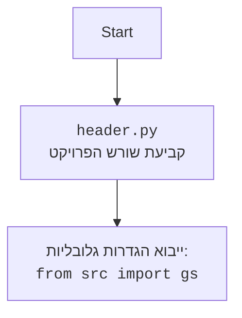

## ניתוח קוד: מלחין מנגינות AI

### 1. <algorithm>

**תרשים זרימה צעד-אחר-צעד:**

1.  **הגדרת סביבה:**
    *   ייבוא ספריות נחוצות: `os`, `magenta.music` (בתור `mm`), ו-`melody_rnn_sequence_generator` מ-`magenta.models.melody_rnn`.
    *   הגדרת ספריית פלט (`output_dir`) לשמירת קבצי MIDI שנוצרו.
        *   דוגמה: `output_dir` מוגדרת כ-'generated_music'
        *   יצירת התיקייה, אם היא לא קיימת.
2.  **אתחול מודל Melody RNN:**
    *   הגדרת שם המודל (`model_name`) כ-'attention_rnn'.
    *   אתחול מחולל רצפים של Melody RNN באמצעות `melody_rnn_sequence_generator.MelodyRnnSequenceGenerator`.
3.  **הגדרת פרמטרים:**
    *   הגדרת `temperature` (מדד לאקראיות) ל-1.0.
    *   הגדרת מספר יצירות מוזיקה (`num_music_pieces`) ל-3.
    *   הגדרת מספר צעדים ליצירה (`steps_per_music_piece`) ל-128.
4.  **קלט משתמש:**
    *   קבלת ז'אנר מועדף (`preferred_genre`) מהמשתמש (לדוגמה, "classical").
    *   קבלת טמפו מועדף (`preferred_tempo`) מהמשתמש (לדוגמה, 120).
5.  **הגדרת אקורדים ותבניות תופים:**
    *   הגדרת רצפי אקורדים (`chord_progressions`) לז'אנרים שונים (לדוגמה, "classical": `["C", "Am", "F", "G"]`).
    *   הגדרת תבנית תופים בסיסית (`drum_pattern`) באמצעות `mm.DrumTrack`.
6.  **לולאה ליצירת מוזיקה:**
    *   לולאה שחוזרת על עצמה `num_music_pieces` פעמים.
    *   **יצירת רצף מלודי:**
        *   שימוש ב-`melody_rnn.generate` ליצירת רצף מלודי אקראי באורך `steps_per_music_piece` ובטמפרטורה `temperature`.
            *   לדוגמה, נוצר רצף מלודי של 128 צעדים.
    *   **הוספת אקורדים לרצף המלודי:**
        *   בחירת רצף אקורדים מהמילון `chord_progressions` בהתבסס על הז'אנר המועדף (`preferred_genre`).
            *   לדוגמה, אם הז'אנר הוא "classical", האקורדים יהיו `["C", "Am", "F", "G"]`.
        *   יצירת רצף אקורדים (`chord_sequence`) באמצעות `mm.ChordSequence`.
        *   שרשור הרצף המלודי עם רצף האקורדים באמצעות `mm.sequences_lib.concatenate_sequences`.
    *   **הוספת תופים:**
        *   שרשור הרצף המלודי והאקורדים עם תבנית התופים באמצעות `mm.sequences_lib.concatenate_sequences`.
    *   **הגדרת טמפו:**
        *   הגדרת הטמפו לרצף המוזיקלי (`music_sequence`) בהתאם לטמפו המועדף מהמשתמש.
    *   **שמירת קובץ MIDI:**
        *   יצירת שם קובץ MIDI ייחודי (`midi_file`).
        *   שמירת רצף המוזיקה לקובץ MIDI באמצעות `mm.sequence_proto_to_midi_file`.
        *   הדפסת הודעה שהיצירה נשמרה.
7.  **סיום:**
    *   הדפסת הודעה "Music generation complete!".

### 2. <mermaid>

```mermaid
flowchart TD
    Start(Start) --> SetOutputDir[הגדרת ספריית פלט: <br><code>output_dir = 'generated_music'</code>];
    SetOutputDir --> MakeOutputDir[יצירת תיקייה: <br><code>os.makedirs(output_dir, exist_ok=True)</code>];
    MakeOutputDir --> InitializeModel[אתחול מודל Melody RNN:<br><code>melody_rnn = melody_rnn_sequence_generator.MelodyRnnSequenceGenerator(model_name='attention_rnn')</code>];
    InitializeModel --> SetParams[הגדרת פרמטרים:<br><code>temperature=1.0, num_music_pieces=3, steps_per_music_piece=128</code>];
    SetParams --> GetUserInput[קבלת קלט משתמש:<br><code>preferred_genre, preferred_tempo</code>];
    GetUserInput --> DefineChordProgressions[הגדרת רצפי אקורדים:<br><code>chord_progressions</code>];
    DefineChordProgressions --> DefineDrumPattern[הגדרת תבנית תופים:<br><code>drum_pattern = mm.DrumTrack(...)</code>];
    DefineDrumPattern --> LoopStart[לולאת יצירת מוזיקה:<br><code>for i in range(num_music_pieces)</code>];
    LoopStart --> GenerateMelody[יצירת רצף מלודי:<br><code>melody_sequence = melody_rnn.generate(...)</code>];
    GenerateMelody --> AddChords[הוספת אקורדים:<br><code>chord_sequence = mm.ChordSequence(chords)</code><br><code>melody_with_chords_sequence = mm.sequences_lib.concatenate_sequences(melody_sequence, chord_sequence)</code>];
     AddChords --> AddDrums[הוספת תופים:<br><code>music_sequence = mm.sequences_lib.concatenate_sequences(melody_with_chords_sequence, drum_pattern)</code>];
    AddDrums --> SetTempo[הגדרת טמפו:<br><code>music_sequence.tempos[0].qpm = preferred_tempo</code>];
    SetTempo --> SaveMIDI[שמירת קובץ MIDI:<br><code>mm.sequence_proto_to_midi_file(music_sequence, midi_file)</code>];
     SaveMIDI --> PrintMessage[הדפסת הודעה שהיצירה נשמרה];
    PrintMessage --> LoopEnd{האם הלולאה הסתיימה?};
    LoopEnd -- Yes --> MusicGenerationComplete[סיום: הדפסת הודעה "Music generation complete!"];
    LoopEnd -- No --> LoopStart;


    subgraph Magenta Library Imports
        mm[<code>magenta.music</code><br>ייצוג מוזיקה]
        magenta_rnn[<code>magenta.models.melody_rnn</code><br>מודל ליצירת מלודיות]
    end

    mm --> GenerateMelody
    mm --> AddChords
    mm --> AddDrums
    mm --> SetTempo
    mm --> SaveMIDI

    magenta_rnn --> GenerateMelody
```

**הסבר על התלויות:**

*   `os`: ספרייה של מערכת ההפעלה, המשתמשת לפעולות כמו יצירת תיקיות.
*   `magenta.music` (מיוצגת כ-`mm`): ספרייה של Magenta לעבודה עם מבני נתונים הקשורים למוזיקה (כגון רצפי מלודיות, אקורדים ותופים).
*   `magenta.models.melody_rnn`: ספרייה של Magenta המכילה מודלים ליצירת מלודיות באמצעות רשתות נוירונים חוזרות.

**תרשים זרימה עבור `header.py` (לא רלוונטי כאן, כי אין import header בקוד):**



### 3. <explanation>

**ייבואים (Imports):**

*   `os`:
    *   **מטרה**: מספקת פונקציות ליצירת אינטראקציה עם מערכת ההפעלה.
    *   **שימוש**: משמשת ליצירת תיקיית פלט באמצעות `os.makedirs(output_dir, exist_ok=True)`.
*   `magenta.music` (מיוצג כ-`mm`):
    *   **מטרה**: ספרייה של גוגל מגינטה לטיפול בייצוג מוזיקה.
    *   **שימוש**: מספקת מחלקות ופונקציות כמו `DrumTrack`, `ChordSequence`, `concatenate_sequences`, ו-`sequence_proto_to_midi_file` לעבודה עם רצפי מוזיקה, תופים ואקורדים.
    *   **קשר עם חבילות אחרות ב-src**: לא קיים קשר ישיר לקבצים אחרים בחבילה `src`, אך היא מבוססת על יכולות Magenta.
*   `magenta.models.melody_rnn.melody_rnn_sequence_generator`:
    *   **מטרה**: ספרייה של Magenta המכילה מודל RNN ליצירת מלודיות.
    *   **שימוש**: משמשת ליצירת רצפים מלודיים באמצעות `MelodyRnnSequenceGenerator` והפונקציה `generate()`.
    *   **קשר עם חבילות אחרות ב-src**: לא קיים קשר ישיר לקבצים אחרים בחבילה `src`, אך היא מבוססת על מודלים של Magenta.

**מחלקות (Classes):**

*   `MelodyRnnSequenceGenerator`:
    *   **מטרה**: מחלקה ליצירת רצפים מלודיים באמצעות מודל RNN.
    *   **מאפיינים**: מחזיקה את המודל והפרמטרים שלו.
    *   **שיטות**: השיטה החשובה ביותר היא `generate()`, היוצרת רצף מלודי.
    *   **אינטראקציה**: נוצרת על ידי הקוד ומספקת את הפונקציונליות ליצירת מנגינות.
*   `DrumTrack`:
    *   **מטרה**: מחלקה לייצוג תבנית תופים.
    *   **מאפיינים**: מחזיקה מידע על אירועי התופים.
    *   **שיטות**: משמשת ליצירת אובייקט שכולל תבנית תופים, והוא מועבר כפרמטר לפונקציה שמחברת את המלודיה עם תבנית התופים.
    *   **אינטראקציה**: נוצרת על ידי הקוד ומשמשת כחלק מהרצף המוזיקלי.
*   `ChordSequence`:
     *   **מטרה**: מחלקה לייצוג רצף אקורדים.
    *   **מאפיינים**: מחזיקה מידע על האקורדים.
    *   **שיטות**: משמשת ליצירת אובייקט שכולל את רצף האקורדים.
    *   **אינטראקציה**: נוצרת על ידי הקוד ומשמשת כחלק מהרצף המוזיקלי.

**פונקציות (Functions):**

*   `os.makedirs(output_dir, exist_ok=True)`:
    *   **פרמטרים**: `output_dir` (מחרוזת, שם התיקייה), `exist_ok=True` (בוליאני, אם להמשיך גם אם התיקייה כבר קיימת).
    *   **ערך מוחזר**: אין.
    *   **מטרה**: יוצרת תיקייה אם היא לא קיימת.
    *   **דוגמה**: `os.makedirs('generated_music', exist_ok=True)` תיצור תיקייה בשם 'generated_music' או תמשיך אם היא קיימת.
*   `melody_rnn.generate(temperature=temperature, steps=steps_per_music_piece, primer_sequence=None)`:
    *   **פרמטרים**: `temperature` (מספר ממשי, מדד לאקראיות), `steps` (מספר שלם, אורך הרצף), `primer_sequence` (רצף ראשוני, לא בשימוש כאן).
    *   **ערך מוחזר**: רצף מלודי.
    *   **מטרה**: יוצרת רצף מלודי חדש באמצעות מודל ה-RNN.
    *   **דוגמה**: יוצר רצף מלודי של 128 צעדים.
*   `mm.ChordSequence(chords)`:
      *   **פרמטרים**: `chords` (רשימה של מחרוזות, רשימת האקורדים).
    *   **ערך מוחזר**: רצף אקורדים.
    *   **מטרה**: יוצרת אובייקט שמייצג רצף של אקורדים.
    *   **דוגמה**: ממיר את רשימת האקורדים לרצף אקורדים.
*   `mm.sequences_lib.concatenate_sequences(seq1, seq2)`:
    *   **פרמטרים**: `seq1`, `seq2` (רצפי מוזיקה).
    *   **ערך מוחזר**: רצף מוזיקלי שמורכב מחיבור של רצפים אחרים.
    *   **מטרה**: מחברת שני רצפי מוזיקה לרצף אחד.
    *   **דוגמה**: מחברת רצף מלודי לרצף אקורדים או תופים.
*   `mm.sequence_proto_to_midi_file(music_sequence, midi_file)`:
    *   **פרמטרים**: `music_sequence` (רצף מוזיקלי), `midi_file` (מחרוזת, שם קובץ ה-MIDI).
    *   **ערך מוחזר**: אין.
    *   **מטרה**: שומרת רצף מוזיקלי לקובץ MIDI.
    *   **דוגמה**: שומרת את הרצף לקובץ בשם 'music_piece_1.mid'.

**משתנים (Variables):**

*   `output_dir` (מחרוזת): שם התיקייה לשמירת קבצי MIDI.
*   `model_name` (מחרוזת): שם מודל ה-RNN.
*   `melody_rnn`: אובייקט של `MelodyRnnSequenceGenerator`.
*   `temperature` (מספר ממשי): מדד לאקראיות ביצירת המוזיקה.
*   `num_music_pieces` (מספר שלם): מספר היצירות ליצירה.
*   `steps_per_music_piece` (מספר שלם): מספר הצעדים ליצירה.
*   `preferred_genre` (מחרוזת): הז'אנר המועדף מהמשתמש.
*   `preferred_tempo` (מספר שלם): הטמפו המועדף מהמשתמש.
*   `chord_progressions` (מילון): רצפי אקורדים לז'אנרים שונים.
*   `drum_pattern`: אובייקט של `mm.DrumTrack` שמייצג תבנית תופים.
*   `melody_sequence`: רצף מלודי שנוצר על ידי המודל.
*   `chord_sequence`: רצף אקורדים.
*   `melody_with_chords_sequence`: הרצף המלודי והאקורדים ביחד.
*   `music_sequence`: הרצף המוזיקלי הכולל, כולל מלודיה, אקורדים ותופים.
*   `midi_file`: שם קובץ ה-MIDI שבו תשמר היצירה.

**בעיות אפשריות או תחומים לשיפור:**

*   **איכות המלודיות**: ניתן לשפר את איכות המלודיות על ידי אימון המודל על נתוני מוזיקה נוספים.
*   **גיוון האקורדים**: רצפי האקורדים מוגדרים מראש, ניתן להוסיף גיוון על ידי שימוש באלגוריתמים ליצירת אקורדים.
*   **התאמה אישית**: הקוד לא מספק התאמה אישית של תבניות התופים.
*   **התאמה לז'אנרים שונים**: ייתכן שהמודל לא יתאים לכל ז'אנר מוזיקלי באופן אופטימלי.
*   **התאמה אישית**: לא ניתן לשלוט באופן מורכב יותר על תהליך יצירת המוזיקה.
*   **חוסר בטיפול בשגיאות**: הקוד לא מטפל בשגיאות קלט מהמשתמש, כמו קלט שאינו מספר לטמפו.

**שרשרת קשרים עם חלקים אחרים בפרויקט:**

*   **אין תלות ישירה בחלקים אחרים בפרויקט**: הקוד עומד בפני עצמו, אך הוא תלוי בספריות חיצוניות של Magenta.
*   **ניתן לשלב אותו**: ניתן לשלב את הקוד כחלק ממערכת גדולה יותר ליצירת מוזיקה, על ידי הפיכת חלק מהקוד לפונקציות עם ממשק מסודר.

**לסיכום**: הקוד מייצר מוזיקה על ידי שימוש במודל RNN, משלב אקורדים ותופים, ושומר את התוצאה כקובץ MIDI. ניתן להרחיב אותו על ידי הוספת תכונות נוספות ושיפור האיכות.