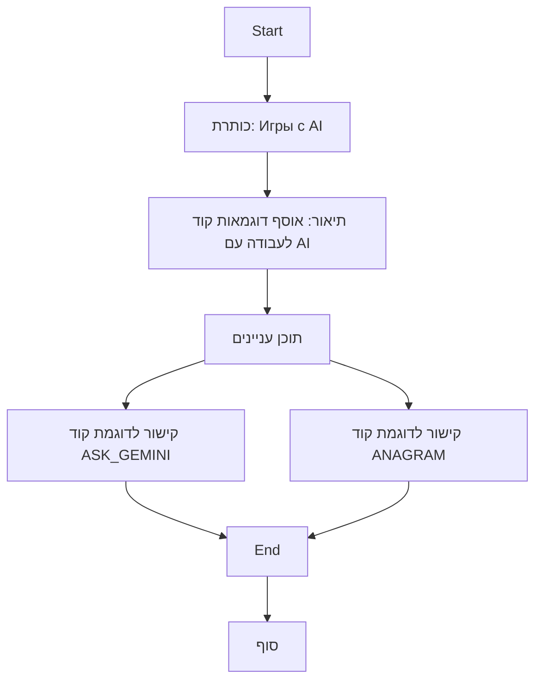

## ניתוח קוד:

### <algorithm>
הקוד שסופק הוא קובץ `README.MD`, שאינו מכיל קוד תכנותי להרצה. הוא משמש כקובץ תיעוד, מספק מבנה ותוכן של מודול "AI Games" המכיל דוגמאות קוד לפעילות עם מודלי בינה מלאכותית.

האלגוריתם של הקובץ הוא פשוט:

1. **הצגה של כותרת:** כותרת ראשית שמציגה את הנושא "Игры с AI" (משחקים עם AI).
2. **תיאור כללי:** פסקה קצרה המתארת את מטרת המודול - לאסוף דוגמאות פשוטות לעבודה עם מודלי בינה מלאכותית.
3. **תוכן עניינים:** רשימה של קישורים לקבצים אחרים בתוך המודול. כל קישור מוביל לדוגמה ספציפית של קוד AI.
   - לדוגמה, הקישור `[ASK_GEMINI](https://github.com/hypo69/101_python_computer_games_ru/blob/master/GAMES/AI/ASK_GEMINI)` מוביל לקוד בסיסי לשיחה עם מודל AI.
   - הקישור `[ANAGRAM](https://github.com/hypo69/101_python_computer_games_ru/blob/master/GAMES/AI/ANAGRAM)` מוביל לקוד בו מודל AI מציע אנגרמות על בסיס אותיות שהוזנו.

**זרימת נתונים:** אין זרימת נתונים בין פונקציות או מחלקות מכיוון שאין קוד ריצה. הנתונים הם טקסטואליים בלבד ומוצגים במסגרת ה-README. הקישורים מפנים לקבצים אחרים, אך הקובץ הזה עצמו לא מעבד נתונים.

### <mermaid>

אין תלויות מיובאות בקובץ זה, כי זהו קובץ markdown. התרשים מציג את מבנה הקובץ ותוכן הקישורים.

### <explanation>
**ייבואים (Imports):**
אין ייבואים בקובץ זה מכיוון שהוא קובץ `README.MD`, המשמש לתיעוד ולא להרצה.

**מחלקות (Classes):**
אין מחלקות בקובץ זה, מכיוון שהוא קובץ טקסטואלי לתיעוד.

**פונקציות (Functions):**
אין פונקציות בקובץ זה, מכיוון שהוא קובץ טקסטואלי לתיעוד.

**משתנים (Variables):**
אין משתנים בקובץ זה, מכיוון שהוא קובץ טקסטואלי לתיעוד.

**הסברים נוספים:**
* הקובץ משמש כמדריך למשתמשים או מפתחים שרוצים ללמוד על משחקי AI.
* הוא מספק סקירה כללית של הפרויקט ומפנה לקבצים רלוונטיים עם קוד.
* ניתן להוסיף תיאורים נוספים לקודים המצורפים בקישורים, ולפרט את אופן השימוש או האתגרים שהקודים פותרים.
* התוכן הוא מאוד בסיסי וקריא.
* הקישורים הם ישירים ואינם דורשים פעולה מורכבת כדי לגשת אליהם.

**שרשרת קשרים:**
הקובץ `README.MD` נמצא בתוך התיקייה `GAMES/AI`. הוא קשור ישירות לקבצים `ASK_GEMINI` ו-`ANAGRAM`, המוזכרים כדוגמאות קוד. יחד, הקבצים האלו יוצרים מודול שלם בפרויקט. הוא מציג את הקשרים בין הקבצים השונים במודול ומאפשר ניווט קל בין הדוגמאות.