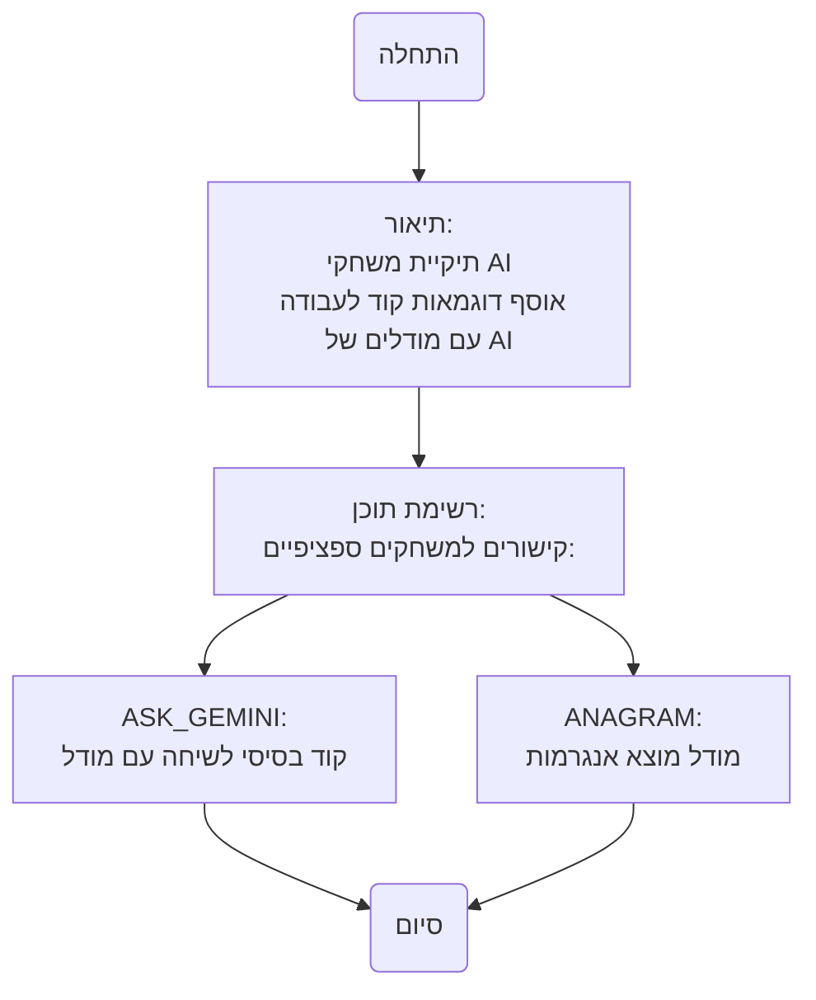

## ניתוח קוד: `README.MD`

### 1. <algorithm>

קובץ זה אינו מכיל קוד לביצוע, אלא משמש כקובץ README המספק מידע על תכולת תיקיית `AI` בתוך פרויקט משחקים. הוא מתאר את המטרה של תיקייה זו ומפרט את המשחקים השונים המבוססים על בינה מלאכותית הזמינים בה.

* **תחילת התיעוד:** הקובץ מתחיל בהכרזה על תיקיית "AI" ומהווה אוסף של דוגמאות קוד לפעולה עם מודלים של בינה מלאכותית.
* **רשימת תוכן:** הקובץ ממשיך עם רשימה של משחקים המבוססים על בינה מלאכותית. כל משחק מקושר לקובץ ה-`README.MD` שלו בתיקייה הספציפית שלו.
* **דוגמאות לכל בלוק לוגי:**

   - *הכרזה על תיקייה:* `# Игры с AI` - מציין שהקובץ נועד לתיעוד משחקים המבוססים על AI.
   - *תיאור:* `В этом модуле я собираю простые примеры кода для работы с моделями ии.` - מסביר את תפקיד התיקייה: איסוף דוגמאות פשוטות לעבודה עם מודלי AI.
   - *רשימת תוכן:*
      - `- [ASK_GEMINI](https://github.com/hypo69/101_python_computer_games_ru/blob/master/GAMES/AI/ASK_GEMINI). Элементарный код для болтовни с моделью` - קישור למשחק ה-ASK_GEMINI, המספק קוד בסיסי לשיחה עם מודל שפה.
      - `- [ANAGRAM](https://github.com/hypo69/101_python_computer_games_ru/blob/master/GAMES/AI/ANAGRAM). Модель подбирает анаграммы по введенным буквам` - קישור למשחק ה-ANAGRAM, בו מודל AI מציע אנגרמות בהתבסס על אותיות קלט.

* **זרימת נתונים:** קובץ זה אינו כולל זרימת נתונים בין פונקציות או שיטות, מכיוון שהוא מסמך טקסטואלי.

### 2. <mermaid>

* **ניתוח והסבר התלויות:**
    - אין תלויות ייבוא בקובץ `README.MD` מכיוון שזהו קובץ טקסט. תרשים הזרימה נועד להמחיש את המבנה והתוכן של המסמך עצמו.

### 3. <explanation>

*   **ייבואים (Imports)**:
    *   קובץ זה אינו מבצע ייבוא מכיוון שהוא קובץ מסוג `Markdown` ולא קוד Python.

*   **מחלקות (Classes)**:
    *   אין מחלקות בקובץ זה.

*   **פונקציות (Functions)**:
    *   אין פונקציות בקובץ זה.

*   **משתנים (Variables)**:
    *   אין משתנים בקובץ זה.

*   **הסברים מפורטים**:

    *   הקובץ `README.MD` משמש כדף אינדקס לתיקיית משחקי ה-AI. הוא מספק תיאור קצר של המטרה והתוכן של התיקייה ומכיל רשימה של משחקי AI הזמינים בה. כל משחק מופיע כקישור לקובץ ה-`README.MD` שלו, אשר מסביר כיצד להשתמש בקוד ובאיזה עקרון הוא עובד.
    *   דוגמאות לשימוש: הקובץ הזה משמש כדי להבין אילו משחקים מבוססי AI זמינים בתיקייה זו וכיצד לגשת אליהם. על ידי לחיצה על הקישורים, המשתמש יכול לקבל מידע נוסף על כל משחק ספציפי וכיצד להריץ אותו.

*   **בעיות אפשריות או תחומים לשיפור:**
    *   הקובץ הנוכחי הוא בסיסי וניתן להרחיב אותו על ידי הוספת תיאורים מפורטים יותר עבור כל משחק, קישורים לקוד המקור של כל משחק והסברים טכניים נוספים.
    *   ייתכן שיהיה כדאי להוסיף קטגוריות נוספות של משחקי AI אם וכאשר יהיו זמינים.
    *  ניתן גם להוסיף מידע על דרישות סביבת העבודה להרצת המשחקים.

*   **שרשרת קשרים עם חלקים אחרים בפרויקט:**
    *   קובץ זה מקושר לתיקיית המשחקים באמצעות הקישורים המופיעים בו, ומספק נקודת גישה למשחקי AI ספציפיים. כל משחק עצמו מקושר לקבצים אחרים (למשל, קבצי פייתון) בתוך תיקיות המשחק שלהם.

בסך הכל, קובץ זה מספק מבוא ומבנה לתיקיית משחקי הבינה המלאכותית ומאפשר למשתמשים לנווט בה בקלות.