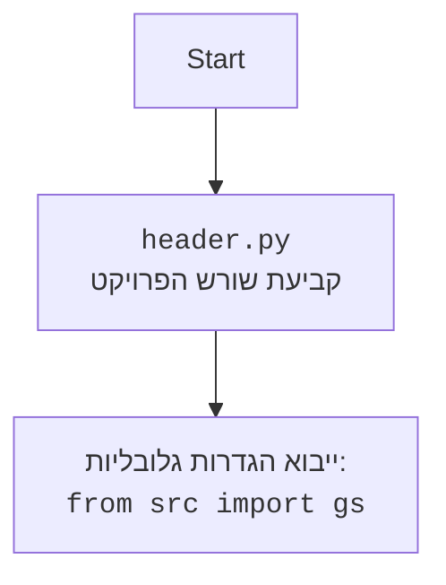

# ניתוח קוד: משחקי למידה אינטראקטיביים במתמטיקה

## 1. <algorithm>

**משחק "קלט-פלט"**

1.  **הגדרת כללי המשחק**:
    - המודל מקבל הוראות מערכת להיות מנוע משחק "קלט-פלט".
    - המודל מתחיל עם כללים פשוטים (חיבור/חיסור) ומתקדם למורכבים יותר (כפל, חילוק, שורש).
    - המודל יכול להשתמש בכלל מוגדר על ידי המשתמש.
    - המודל מספק את סוג הפעולה בסוף כל תשובה.
    *דוגמה*: "מכונה +3"
2.  **קבלת קלט**:
    - המשתמש מספק מספר כקלט.
    *דוגמה*: "קלט: 5"
3.  **עיבוד הקלט**:
    - המודל מעבד את הקלט בהתאם לכללי המשחק הקיימים.
    *דוגמה*: אם הכלל הוא +3, המספר 5 הופך ל-8.
4.  **הפקת פלט**:
    - המודל מספק את הפלט ואת הכלל ששימש בעיבוד.
    *דוגמה*: "פלט: 8, מכונה +3"
5.  **סיום או חזרה לשלב 2**.
    - המשתמש ממשיך לספק קלטים או לסיים את המשחק.

**משחק "מחשב 10-סנט"**

1.  **הגדרת כללי המשחק**:
    - המודל פועל כסימולטור של "מחשב 10-סנט".
    - המודל מייצג מספרים בינאריים באמצעות 4 "נורות" (0 - כבוי, 1 - דלוק).
    - הנורות מייצגות את הערכים 1, 2, 4 ו-8 מימין לשמאל.
    - המודל ממיר בין ייצוג עשרוני לבינארי ולהפך.
    - המודל מספק הסבר לכל פעולה.
    *דוגמה*: "נורות 1 ו-4 דלוקות, 1+4=5"
2.  **קבלת קלט**:
    - המשתמש מספק מספר עשרוני או ייצוג בינארי כקלט.
    *דוגמה*: "עשרוני: 5" או "נורות: 0101"
3.  **עיבוד הקלט**:
    - אם הקלט עשרוני, המודל ממיר אותו לייצוג בינארי.
    - אם הקלט בינארי, המודל ממיר אותו לייצוג עשרוני.
    *דוגמה*: המספר 5 הופך ל-0101. 1010 הופך ל-10.
4.  **הפקת פלט**:
    - המודל מספק את הפלט המומר ואת ההסבר.
    *דוגמה*: "בינארי: 0101, הסבר: נורות 1 ו-4 דלוקות, 1+4=5"
    *דוגמה*: "עשרוני: 10, הסבר: נורות 2 ו-8 דלוקות, 2+8=10"
5.  **סיום או חזרה לשלב 2**.
    - המשתמש ממשיך לספק קלטים או לסיים את המשחק.

**זרימת נתונים**

הזרימה העיקרית היא בין המשתמש לבין המודל `GoogleGenerativeAI`.
1.  **המשתמש**: שולח שאילתה (קלט).
2.  **`GoogleGenerativeAI`**: מקבל את השאילתה, מעבד אותה באמצעות מודל שפה ומחזיר תשובה (פלט).
3.  **המשתמש**: מקבל את הפלט.

## 2. <mermaid>

```mermaid
flowchart TD
    subgraph "משחק קלט-פלט"
        A[הגדרת כללי המשחק: <br> קביעת סוג הפעולה, רמת קושי] --> B[קבלת קלט מהמשתמש: <br> "קלט: <מספר>"]
        B --> C[עיבוד הקלט: <br> ביצוע פעולה מתמטית לפי הכללים]
        C --> D[הפקת פלט: <br> "פלט: <תוצאה>, מכונה:<תיאור פעולה>"]
        D --> E{סיום משחק?}
        E -- לא --> B
        E -- כן --> F[סיום]
    end

    subgraph "משחק מחשב 10-סנט"
        G[הגדרת כללי המשחק: <br> המרת בינארי לעשרוני ולהפך, הסברים] --> H{קבלת קלט מהמשתמש: <br> "עשרוני: <מספר>" או "נורות: <ייצוג בינארי>"}
        H -- קלט עשרוני --> I[המרה לבינארי]
        I --> J[הפקת פלט: <br> "בינארי: <ייצוג בינארי>, הסבר:<הסבר המרה>"]
        H -- קלט בינארי --> K[המרה לעשרוני]
        K --> L[הפקת פלט: <br> "עשרוני: <מספר>, הסבר:<הסבר המרה>"]
        J --> M{סיום משחק?}
        L --> M
        M -- לא --> H
        M -- כן --> N[סיום]
    end
    style A fill:#f9f,stroke:#333,stroke-width:2px
    style G fill:#f9f,stroke:#333,stroke-width:2px
```

**ניתוח התלויות (הייבוא) של הדיאגרמה**

*   אין תלויות (imports) נוספים שצריך לנתח כאן. התרשים נוצר על ידי `mermaid` עצמה והיא לא תלויה בספריות חיצוניות.



## 3. <explanation>

**ייבוא (Imports)**

*   `import google.generativeai as genai`: מייבאת את ספריית `google.generativeai` בשם `genai`, המשמשת ליצירת אינטראקציה עם מודלי שפה של Google Gemini. ספרייה זו מאפשרת לשלוח שאילתות למודל שפה ולקבל תשובות.

**מחלקות (Classes)**

*   `class GoogleGenerativeAI`:
    *   **תפקיד**: מעטפת סביב מודל שפה של Google Gemini. המטרה שלה היא להקל על השימוש במודל, ולהגדיר את ההתנהגות שלו.
    *   **מאפיינים**:
        *   `api_key`: מפתח API לאימות גישה למודלי Gemini.
        *   `model_name`: שם מודל Gemini לשימוש (ברירת מחדל: 'gemini-2-13b').
        *   `model`: אובייקט `GenerativeModel` של `genai`, מייצג את המודל המאומן.
        *   `system_instruction`: הוראה למודל (סיסטם פרומפט).
    *   **שיטות**:
        *   `__init__`: קונסטרוקטור, שמגדיר את מפתח ה-API, שם המודל וההוראה המערכתית ויוצר אובייקט מודל.
        *   `ask`: מקבל שאילתה (מחרוזת), שולח אותה למודל, ומחזיר את התשובה (מחרוזת) או הודעת שגיאה.
    *   **אינטראקציה**:  המחלקה `GoogleGenerativeAI` משמשת ליצירת אובייקטים עבור המשחקים `input_output_game` ו-`binary_computer`.

**פונקציות (Functions)**

*   `__init__` (קונסטרוקטור בתוך המחלקה):
    *   **פרמטרים**: `api_key` (מחרוזת), `system_instruction` (מחרוזת), `model_name` (מחרוזת, אופציונלי).
    *   **ערך מוחזר**: לא מחזירה ערך.
    *   **מטרה**: אתחול אובייקט `GoogleGenerativeAI` עם המפתח API, ההוראה למודל ושם המודל הרצוי.
    *   **דוגמה לשימוש**:
    ```python
        input_output_game = GoogleGenerativeAI(api_key=api_key, system_instruction=system_instruction_input_output)
    ```
*   `ask` (מתודה בתוך המחלקה):
    *   **פרמטרים**: `q` (מחרוזת), השאילתה למודל.
    *   **ערך מוחזר**: מחרוזת, תשובת המודל או הודעת שגיאה.
    *   **מטרה**: שליחת שאילתה למודל Gemini וקבלת התגובה שלו.
    *   **דוגמה לשימוש**:
    ```python
        print(input_output_game.ask("קלט: 7"))
    ```

**משתנים (Variables)**

*   `api_key`: מחרוזת, מפתח API עבור Google Gemini. יש להחליף את `"YOUR_API_KEY"` במפתח אמיתי.
*   `system_instruction_input_output`: מחרוזת, הוראות מערכת למודל עבור משחק "קלט-פלט".
*   `system_instruction_binary`: מחרוזת, הוראות מערכת למודל עבור משחק "מחשב 10-סנט".
*   `input_output_game`: אובייקט מסוג `GoogleGenerativeAI` עבור משחק "קלט-פלט".
*   `binary_computer`: אובייקט מסוג `GoogleGenerativeAI` עבור משחק "מחשב 10-סנט".

**בעיות אפשריות ושיפורים**

*   **מפתח API**: הקוד דורש מפתח API אמיתי עבור Google Gemini, מה שעשוי להוות בעיה למשתמשים חדשים.
*   **גמישות**: ניתן להרחיב את המחלקה `GoogleGenerativeAI` כך שתאפשר שימוש עם מודלים שונים ותכונות נוספות.
*   **הפרדה**: ייתכן שיהיה כדאי להפריד את ההוראות המערכתיות למשתנים נפרדים, ובכך לאפשר התאמה אישית מהירה יותר.
*   **טיפול בשגיאות**: אפשר לשפר את הטיפול בשגיאות במתודה `ask` ולספק הודעות שגיאה אינפורמטיביות יותר.
*  **תחומים לשיפור**: ניתן להוסיף ממשק משתמש אינטראקטיבי יותר במקום להשתמש בפלט קונסול.

**שרשרת קשרים**

1.  הקוד הנוכחי משתמש בספריית `google.generativeai` (import) עבור התקשורת עם מודלי השפה.
2.  הקוד משתמש בהוראות מערכת (system instructions) כדי להגדיר את אופן הפעולה של מודל השפה עבור כל אחד מהמשחקים.
3.  המחלקה `GoogleGenerativeAI` משמשת כמעטפת ומאפשרת אינטראקציה נוחה עם מודל השפה.
4.  המשתמש מקבל פלט מובנה מהמודל בהתאם לכללי המשחק שהוגדרו, כאשר מודל השפה מספק את הלוגיקה של המשחק.
5.  הקוד משמש כבסיס ליצירת משחקי למידה אינטראקטיביים, שניתן להרחיב אותם בהמשך.