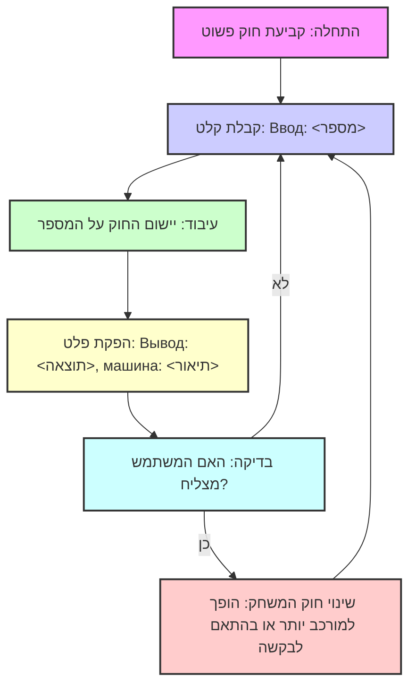

## <algorithm>

1.  **התחלה**: המשחק מתחיל עם הגדרת חוק פשוט, לדוגמה, הוספת מספר קבוע.
    *   דוגמה: "החוק הוא להוסיף 3".

2.  **קבלת קלט מהמשתמש**: המשחק מקבל מספר מהמשתמש כקלט (המכונה "Ввод").
    *   דוגמה: המשתמש מזין "Ввод: 5".

3.  **עיבוד הקלט**:
    *   המשחק מיישם את החוק שנקבע על הקלט.
        *   דוגמה: 5 + 3 = 8.
4.  **הפקת פלט**: המשחק מוציא את התוצאה יחד עם תיאור החוק.
    *   דוגמה: "Вывод: 8, машина +3".

5.  **שינוי חוק המשחק**:
    *   אם המשתמש מצליח, החוק הופך מורכב יותר (לדוגמה, כפל, חילוק או שילוב של פעולות).
        *   דוגמה: מעבר מ "+3" ל "2x+1".
    *   אם המשתמש מבקש חוק מסוים, המשחק משתמש בו.
        *   דוגמה: המשתמש מבקש " Задайте машину x * 2".
6.  **חזרה לשלב 2**: המשחק ממשיך לקבל קלט מהמשתמש ולהפעיל את החוק החדש עד שנגמר המשחק.

## <mermaid>

**ניתוח תלויות:**
אין תלויות מיובאות, התרשים מתאר את הזרימה הלוגית של המשחק.

## <explanation>

**תיאור כללי:**
הקוד מתאר מנוע משחק אינטראקטיבי פשוט שבו השחקן מנסה לנחש את החוק המתמטי הנסתר (המכונה "машина") ע"י הזנת קלטים (מספרים) וקבלת פלטים. המשחק מתחיל בחוק פשוט ועובר לחוקים מורכבים יותר ככל שהשחקן מצליח.

**פונקציות:**
אין פונקציות מוגדרות באופן מפורש בקוד זה. הוא מייצג תיאור מילולי של איך משחק צריך לפעול ולא קוד ממשי.

**משתנים:**
אין משתנים מוגדרים באופן מפורש בקוד זה.

**בעיות ושיפורים אפשריים:**
1.  **אין קוד אמיתי**: הטקסט מספק תיאור מילולי של משחק, ולא קוד ממשי. כדי שזה יהיה משחק אמיתי צריך לממש את זה בקוד.
2.  **טיפול בקלט שגוי**: אין תמיכה לטיפול בקלט שגוי, לדוגמה כאשר המשתמש מזין לא מספר.
3.  **מנגנון שינוי חוק**: מנגנון שינוי החוק הוא לא מפורט וצריך להיות מיושם. לדוגמה, איזה אלגוריתם יקבע מתי לעבור לחוק מורכב יותר?

**שרשרת קשרים עם חלקים אחרים בפרויקט:**
כיוון שהקוד אינו ממשי, אין לו קשרים ישירים לחלקים אחרים בפרויקט. אבל, אם נממש את זה, הוא יכול להיות חלק ממשחק שלם, שבו יהיו מחלקות כמו `GameEngine` , `InputHandler`, `OutputHandler` ,  `RuleGenerator` וכדומה.