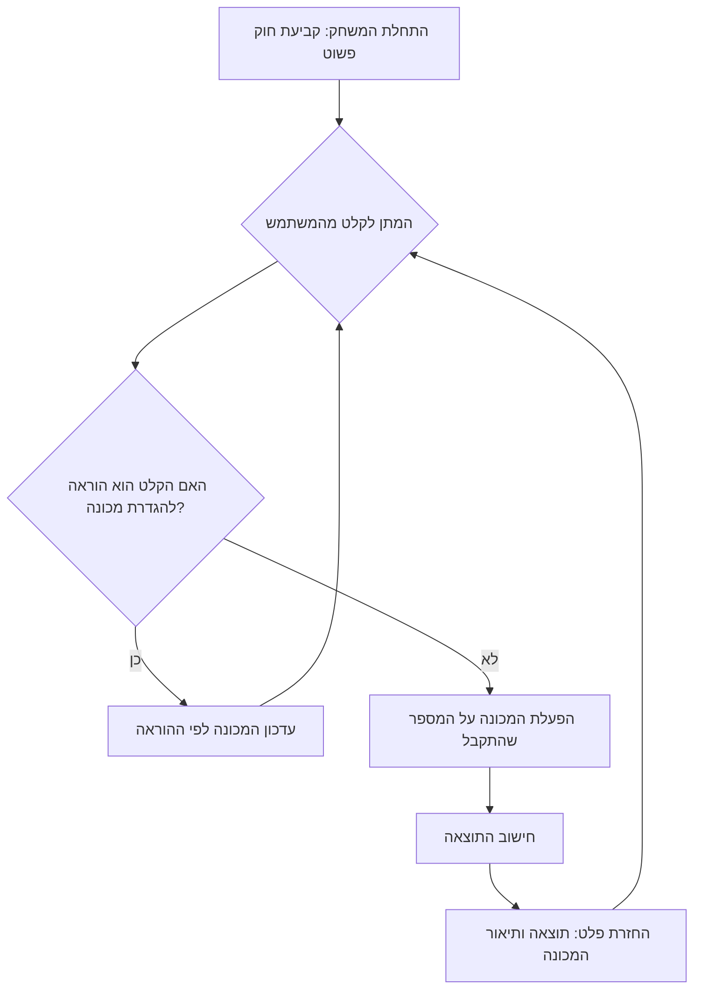

## <algorithm>

הקוד מתאר מנוע משחק למשחק מתמטי בשם "קלט-פלט". המשחק מתנהל כך:

1.  **הגדרת חוק התחלתי:** המנוע מגדיר חוק מתמטי פשוט (למשל, הוספת מספר קבוע) כ"מכונה".

    *   *דוגמה:* המכונה מוגדרת כ "+3".

2.  **קבלת קלט מהמשתמש:** המנוע מקבל מספר מהמשתמש בתבנית "קלט: <מספר>".

    *   *דוגמה:* המשתמש שולח "קלט: 5".

3.  **ביצוע החוק:** המנוע מפעיל את החוק המתמטי (המכונה) על הקלט.

    *   *דוגמה:* המנוע לוקח את המספר 5 ומפעיל עליו את המכונה "+3", ומתקבל 8.

4.  **החזרת פלט למשתמש:** המנוע מחזיר למשתמש את התוצאה בתבנית "פלט: <תוצאה>, מכונה: <תיאור המכונה>".

    *   *דוגמה:* המנוע שולח "פלט: 8, מכונה +3".

5.  **מעבר לחוקים מורכבים יותר:** ככל שהמשתמש מצליח, המנוע יכול להחליף את החוקים הפשוטים בחוקים מורכבים יותר (למשל, כפל, חילוק, שורש, שילוב של פעולות).

    *   *דוגמה:* המכונה משתנה ל "2x+1" או "שורש ריבועי".

6.  **קבלת חוקים מהמשתמש:** המנוע יכול לקבל הוראה ישירה מהמשתמש להגדיר חוק ספציפי.

    *   *דוגמה:* המשתמש שולח "הגדר מכונה x * 2".
    *   *תגובה:* המנוע מאשר "אוקיי, מכונה: x*2".

**זרימת נתונים:**

*   המשתמש מספק קלט (מספר או בקשת חוק).
*   המנוע מקבל את הקלט, מעבד אותו לפי החוק (המכונה).
*   המנוע מספק פלט (תוצאה ותיאור המכונה).

## <mermaid>

*   **`A`**: שלב התחלתי בו נקבע חוק מתמטי פשוט (למשל, "+3") באופן אוטומטי.
*   **`B`**: המנוע ממתין לקלט מהמשתמש, בין אם זה מספר להפעלה על המכונה או הוראה לשינוי המכונה.
*   **`C`**: בדיקה האם הקלט הוא הוראה לשינוי המכונה.
*   **`D`**: אם כן, המכונה מעודכנת לחוק החדש שהוגדר על ידי המשתמש.
*   **`E`**: אם לא, הקלט (מספר) מופעל על המכונה הקיימת.
*   **`F`**: חישוב התוצאה לאחר הפעלת המכונה.
*  **`G`**: החזרת הפלט למשתמש, הכולל את התוצאה ואת תיאור המכונה ששימשה לחישוב.

## <explanation>

**ייבואים (Imports):**

*   אין ייבוא בקוד זה, מכיוון שזהו תיאור של לוגיקה ולא קוד ממשי.

**מחלקות (Classes):**

*   אין מחלקות בקוד הזה. זהו תיאור של לוגיקה ולא קוד המשתמש במחלקות.

**פונקציות (Functions):**

*   אין פונקציות בקוד הזה. זהו תיאור של לוגיקה ולא קוד שמשתמש בפונקציות.

**משתנים (Variables):**

*   **"מכונה" (Machine):** משתנה שמייצג את החוק המתמטי הנוכחי (למשל, "+3", "2x+1", "שורש ריבועי"). סוג המשתנה יהיה תלוי ביישום, אבל הוא יכול להיות מחרוזת או אובייקט המכיל מידע על פעולה מתמטית.
*   **"קלט" (Input):** משתנה שמייצג את המספר שהמשתמש מספק. סוג המשתנה הוא מספר (integer או float).
*   **"פלט" (Output):** משתנה שמייצג את התוצאה לאחר הפעלת המכונה על הקלט. סוג המשתנה הוא מספר (integer או float).

**הסברים נוספים:**

*   הקוד מתאר משחק אינטראקטיבי בו המשתמש מנסה לנחש את החוק המתמטי ("המכונה") שמופעל על מספרים שהוא מספק.
*   המשחק מתחיל מחוקים פשוטים ועובר לחוקים מורכבים יותר ככל שהמשתמש מתקדם.
*   המשתמש יכול גם להגדיר חוקים ספציפיים.
*   הפורמט של הקלט והפלט מוגדר מראש כדי לאפשר תקשורת ברורה בין המשתמש למנוע המשחק.

**בעיות אפשריות או תחומים לשיפור:**

*   הקוד לא מגדיר כיצד המכונה מיושמת בפועל (למשל, כיצד היא מחושבת).
*   חסר מידע על האופן שבו החוקים המורכבים נוצרים ומנוהלים.
*   אין טיפול בשגיאות קלט (למשל, אם המשתמש מכניס קלט שאינו מספר).
*   אין מנגנון לעקוב אחר התקדמות המשחק או רמת הקושי.

**שרשרת קשרים עם חלקים אחרים בפרויקט:**

*   הקוד עשוי להיות חלק ממערכת גדולה יותר של משחקי AI, שבהם ניתן לשתף את המכונה ואת ההיסטוריה של המשחק בין משחקים שונים.
*   המנוע יכול להיות מחובר לממשק משתמש גרפי (GUI) או לממשק טקסטואלי.
*   הוא יכול לכלול רכיבים לניהול התקדמות ומשתמשים.

הקוד מספק תיאור ברור של לוגיקה למשחק מתמטי פשוט, אבל נדרשת הרחבה ויישום כדי להפוך אותו למערכת עובדת.