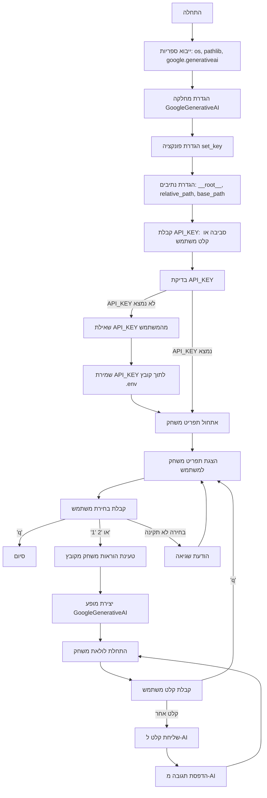

## <algorithm>

1. **הגדרה והכנה**:
   - ייבוא ספריות `os`, `pathlib`, `google.generativeai`.
   - הגדרת מחלקה `GoogleGenerativeAI` עם קבועי מודלים ושיטת אתחול לקבלת מפתח API והוראות מערכת.
     - דוגמה: `GoogleGenerativeAI(api_key="YOUR_API_KEY", system_instruction="You are a helpful AI assistant.", model_name='gemini-2-13b')`
   - הגדרת פונקציה `set_key` לשמירת זוגות מפתח-ערך לקובץ `.env`.
     - דוגמה: `set_key(".env", "API_KEY", "YOUR_API_KEY")`
   - הגדרת נתיבים בסיסיים וטעינת API_KEY או בקשה מהמשתמש.
    - דוגמה: `__root__`, `relative_path`, `base_path`
   - אם מפתח API לא נמצא, מבקש מהמשתמש ומאחסן אותו באמצעות הפונקציה `set_key`
      - דוגמה: `API_KEY = input(...)`, `set_key('.env', 'API_KEY', API_KEY)`

2. **בחירת משחק**:
   - הדפסת הודעת פתיחה והוראות משחק.
   - הצגת תפריט משחק למשתמש לבחירה.
   - לולאה שממשיכה עד שהמשתמש בוחר לצאת.
     - דוגמה:
       ```
       1. Игра "Ввод-Вывод"
       2. Игра "10-центовый компьютер"
       Введите номер игры (1 или 2, или "q" для выхода):
       ```
   - בדיקת קלט המשתמש:
     - אם הקלט הוא 'q', יוצא מהלולאה.
     - אם הקלט הוא '1' או '2', בוחרים את ההוראות המתאימות מהמפה `instructions`.
     - אם הקלט לא תואם לאף אחת מהאפשרויות, מדפיסים הודעת שגיאה ומבקשים מהמשתמש לנסות שוב.

3. **הפעלת משחק**:
   - טעינת הוראות המערכת מקובץ ה-Markdown התואם.
     - דוגמה:  `system_instruction = Path(base_path, f'{instructions[choice]}.md').read_text(encoding='UTF-8')`
   - יצירת מופע של המחלקה `GoogleGenerativeAI` עם מפתח API והוראות.
     - דוגמה: `model = GoogleGenerativeAI(api_key=API_KEY, system_instruction=system_instruction)`
   - לולאה למשחק:
     - בקשה למשתמש להזנת קלט למשחק.
       - אם הקלט הוא 'q', יוצאים מהלולאה.
     - קריאה לשיטה `ask` של המופע של `GoogleGenerativeAI` לשליחת בקשת משתמש למודל ולצפייה בתגובה.
     - הדפסת התגובה מהמודל.
     - דוגמה:
       ```
       Введите запрос для игры 'Ввод-Вывод' ('q' для выхода): 2 + 2
       4
       ```
4.  **סיום**:
    - אם המשתמש יזין 'q' בכל אחת משתי הלולאות, הלולאה תיפסק והתוכנית תסיים עם הודעה 'До свидания!'.

## <mermaid>



## <explanation>

**ייבואים (Imports)**:

*   `os`: משמש עבור אינטראקציה עם מערכת ההפעלה, כמו קריאה של משתני סביבה וקיום קבצים.
*   `pathlib.Path`:  מייצג נתיבי קבצים בצורה עצמאית למערכת ההפעלה. עוזר בבניית נתיבים בצורה נוחה וקריאה.
*  `google.generativeai as genai`: מייבא את ספריית Google Generative AI, המשמשת עבור אינטראקציה עם מודלים של ג'מיני.

**מחלקות (Classes)**:

*   **`GoogleGenerativeAI`**:
    *   **תפקיד**: מייצגת אינטראקציה עם מודל AI של גוגל.
    *   **מאפיינים**:
        *   `MODELS`: רשימה של שמות מודלים של ג'מיני שניתן להשתמש בהם.
        *   `api_key`: מפתח API לאימות עם שירות ג'מיני.
        *   `model_name`: שם המודל של ג'מיני שבו משתמשים.
        *   `model`: מופע של מודל ה-AI של גוגל.
    *   **שיטות**:
        *   `__init__`: אתחול המחלקה. מקבל מפתח API, הוראות מערכת ושם מודל. מגדיר את המודל של ג'מיני עם ההוראות שסופקו.
        *   `ask`:  מקבל שאילתת טקסט, שולח אותה למודל ומחזיר את התגובה. מטפל בשגיאות ומחזיר הודעת שגיאה במקרה הצורך.
    *  **אינטראקציה**: המופעים של `GoogleGenerativeAI` מופעלים בלולאת המשחק, שולחים שאילתות למודל ג'מיני ומקבלים תגובות להצגה למשתמש.

**פונקציות (Functions)**:

*   **`set_key(dotenv_path, key, value)`**:
    *   **פרמטרים**:
        *   `dotenv_path`: הנתיב לקובץ ה-env.
        *   `key`: המפתח שיש לשמור או לעדכן.
        *   `value`: הערך שיש לשמור או לעדכן.
    *   **ערך מוחזר**: אין.
    *   **מטרה**: שמירת זוגות מפתח-ערך לקובץ `.env`. בודקת אם הקובץ קיים, מעדכנת אם המפתח כבר קיים או יוצרת שורה חדשה אם המפתח לא קיים.
    *   **שימוש**: משמש לשמירת מפתח API בקובץ `.env`, אם המשתמש הכניס אותו דרך הקלט.
    *    דוגמאות:
      ```
      set_key(".env", "API_KEY", "your_api_key")
      ```
**משתנים (Variables)**:

*  `__root__`: הנתיב המוחלט לספרייה שבה נמצא הקובץ הנוכחי.
* `relative_path`: הנתיב היחסי לספרייה שבה נמצאים קבצי המשחק.
* `base_path`: הנתיב המוחלט לספריית המשחקים.
*  `API_KEY`: מפתח ה-API שנקרא ממשתנה הסביבה או מהמשתמש.
*  `instructions`: מפה שמקשרת בין בחירות משחק לשמות קבצי הוראות.
*  `choice`: בחירת המשתמש מהתפריט.
*  `system_instruction`: ההוראה שנקראת מקובץ ה-Markdown.
*  `model`: מופע של המחלקה `GoogleGenerativeAI` לשימוש במשחק.
* `user_input`: קלט מהמשתמש בתוך לולאת המשחק.
* `response`: תגובת המודל של ג'מיני.

**בעיות אפשריות או תחומים לשיפור**:

*   **טיפול בשגיאות**: ניתן להרחיב את הטיפול בשגיאות, למשל אם קובץ ההוראות לא נמצא.
*   **אבטחה**: שמירת ה-API key בקובץ `.env` עלולה להיות בעייתית באחסון קוד. אפשר לשקול פתרונות יותר בטוחים.
*   **בדיקות קלט**: לא מבוצעת בדיקה מעמיקה של קלט המשתמש. יכול להיות משופר על מנת למנוע תקלות לא צפויות.
*   **שימוש במודלים**: קוד זה מגדיר את רשימת המודלים של ג'מיני בתוך המחלקה. יכול להיות מועבר לקובץ תצורה או למשתני סביבה על מנת להקל על שינויים.

**קשרים עם חלקים אחרים בפרויקט**:

*   קוד זה פועל כנקודת כניסה למשחקי AI, ולכן הוא תלוי בקיומם של קבצי הוראות `.md` בספרייה `games/ai/`.
*   קובץ זה אינו תלוי ישירות בקבצים אחרים בפרויקט (לדוגמה, `header.py` לא רלוונטי כאן).
*   השימוש ב `google.generativeai` מהווה תלות חיצונית, אך הקוד מסודר כך שניתן להחליף את מודל ה-AI בקלות.