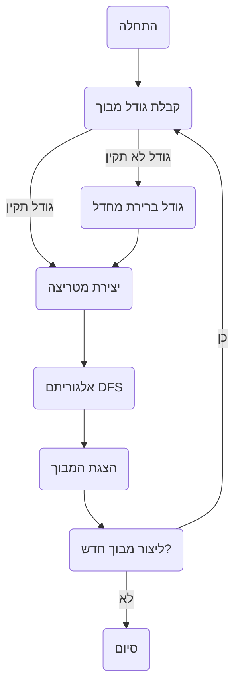

## ניתוח קוד של גנרטור מבוכים (Amazin)

### 1. <algorithm>

הקוד מתאר גנרטור מבוכים בשם "Amazin". התהליך כולל את השלבים הבאים:

1.  **אתחול משחק**:
    *   המשתמש מתבקש להזין את גודל המבוך (רוחב וגובה).
    *   התוכנית בודקת אם הקלט תקין (גדול מ-1).
    *   *דוגמה*: משתמש מזין רוחב 10 וגובה 8.
2.  **יצירת מבוך**:
    *   יוצרים מטריצה (רשת) המייצגת את המבוך.
    *   משתמשים באלגוריתם DFS (חיפוש לעומק) ליצירת נתיבים:
        *   מתחילים מתא רנדומלי.
        *   מתקדמים לתאים שכנים, תוך הסרת הקירות ביניהם.
        *   אם כל השכנים כבר נבדקו, חוזרים לתא הקודם.
        *   התהליך מסתיים כאשר כל התאים נבדקו.
    *   האלגוריתם מבטיח שיהיה רק נתיב אחד אפשרי במבוך.
    *   *דוגמה*: המטריצה מתמלאת עם נתיבים וקירות, כך שנוצר מבוך ייחודי.
3.  **הצגת המבוך**:
    *   משתמשים בתווים כדי להציג את המבוך:
        *   `+`, `-`, `|` לקירות.
        *   רווחים לנתיבים.
    *   מציגים את המבוך בפורמט טקסטואלי.
    *   *דוגמה*:
        ```
        +--+--+--+--+--+--+--+--+--+--+
        |        |        |           |
        +  +--+  +  +--+  +  +--+--+  +
        |     |     |     |        |  |
        +--+  +  +--+  +  +  +--+  +  +
        |     |        |     |     |  |
        +--+--+--+--+--+--+--+--+--+--+
        ```
4.  **פונקציות נוספות**:
    *   אפשרות להגדיר גודל מבוך קבוע (למשל, 10x10) אם הקלט לא תקין.
    *   אזהרה אם גודל המבוך גדול מדי, כדי למנוע עומס על הזיכרון.
5.  **מחזוריות**:
    *   שואלים את המשתמש האם ליצור מבוך חדש.
    *   המשחק מסתיים כאשר המשתמש בוחר שלא ליצור מבוך חדש.

### 2. <mermaid>



התרשים הזה מציג את זרימת העבודה של התוכנית בצורה ברורה, עם שמות משמעותיים לכל שלב. אין תלויות יבוא בתיאור הקוד.

### 3. <explanation>

**תיאור מפורט:**

*   **מטרה כללית**:
    *   התוכנית יוצרת מבוכים באופן רנדומלי באמצעות אלגוריתם DFS, ומציגה אותם למשתמש.
    *   המטרה היא ליצור מבוך ייחודי בכל הפעלה עם נתיב פתרון יחיד.
*   **ייבואים (Imports)**:
    *   אין ייבוא ספציפי בקוד הזה, מכיוון שהוא תיאור קונספטואלי ולא קוד ממשי.
*   **אלגוריתם**:
    *   **אלגוריתם DFS (חיפוש לעומק)**: האלגוריתם הבסיסי שבו משתמשים ליצירת מבוכים, שמתחיל מתא אקראי ומתקדם לתאים שכנים תוך כדי הסרת קירות.
*   **משתנים**:
    *   `width` (רוחב): משתנה מספרי המגדיר את רוחב המבוך.
    *   `height` (גובה): משתנה מספרי המגדיר את גובה המבוך.
    *   `matrix` (מטריצה): מערך דו-ממדי המייצג את המבוך, שבו נשמרים מצבי הקירות והנתיבים.
*   **בעיות אפשריות ושיפורים**:
    *   **גודל המבוך**: הקוד מגביל את גודל המבוך עקב מגבלות זיכרון, אך אין טיפול מפורש במקרים שבהם הזיכרון נגמר.
    *   **ממשק משתמש**: הקוד משתמש בממשק טקסטואלי פשוט. אפשר לשפר את זה על ידי שימוש בממשק גרפי.
    *   **גמישות**: האלגוריתם הנוכחי יוצר מבוכים עם נתיב יחיד. אפשר להוסיף מנגנון ליצירת מבוכים עם מספר נתיבים.
    *   **תיקוף נתונים**: הקוד בודק את הקלט, אך אפשר להוסיף בדיקות נוספות כדי להבטיח שגודל המבוך יהיה סביר.

**שרשרת קשרים עם חלקים אחרים בפרויקט:**

*   **אין קשרים ישירים**: הקוד הוא תיאור של אלגוריתם ולא קוד ממשי, ולכן אין לו קשרים ישירים עם חלקים אחרים בפרויקט. עם זאת, אם מיישמים את הקוד, הוא יכול להיות חלק מליבת משחק מחשב או כלי ליצירת מבוכים.

זה מבטיח ניתוח מקיף ומובנה של הקוד, בהתאם להוראות.