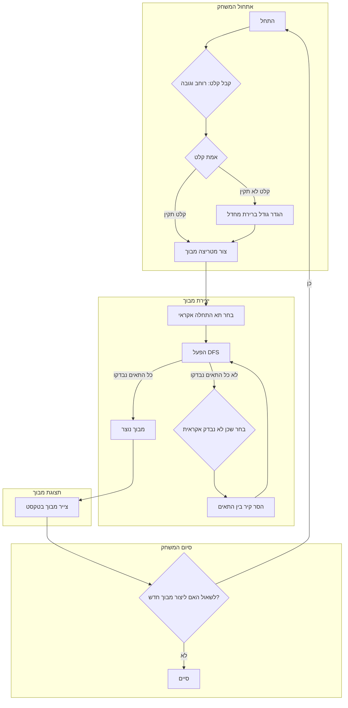

# ניתוח קוד: מחולל מבוכים "Amazin"

## <algorithm>

1.  **אתחול המשחק:**
    *   המשחק מתחיל בקבלת קלט מהמשתמש: רוחב וגובה המבוך.
    *   **דוגמה:** המשתמש מזין `10` עבור רוחב ו-`8` עבור גובה.
    *   הקלט מאומת כדי לוודא שהוא גדול מ-1. אם הקלט שגוי, גודל ברירת מחדל (למשל 10x10) עשוי להיות מוגדר.

2.  **יצירת מבוך:**
    *   נוצרת מטריצה המייצגת את רשת התאים של המבוך.
        *   **דוגמה:** עבור קלט 10x8, מטריצה בגודל 10x8 נוצרת.
    *   האלגוריתם מתחיל בתא אקראי.
        *   **דוגמה:** התא ההתחלתי יכול להיות [0, 0].
    *   **DFS (חיפוש לעומק) рекурсивный אלגוריתם** מופעל:
        1.  האלגוריתם נע לתא שכן אקראי שטרם נבדק.
            *   **דוגמה:** מהתא [0, 0] ייתכן לעבור לתא [1, 0] או [0, 1].
        2.  הקירות בין התא הנוכחי לתא הבא נהרסים.
            *   **דוגמה:** אם עוברים מ [0, 0] ל [1, 0], הקיר המפריד בין שני התאים יוסר.
        3.  אם כל השכנים של התא הנוכחי נבדקו, חוזרים לתא הקודם וחוזרים על התהליך.
            *   **דוגמה:** אם התא [1,0] כבר בדק את כל השכנים שלו, חוזרים ל [0, 0].
        4.  התהליך מסתיים כאשר כל התאים נבדקו.
            *   **דוגמה:** המבוך מוכן כאשר כל התאים ברשת נכללים בנתיב.

3.  **תצוגת מבוך:**
    *   המבוך מוצג כטקסט באמצעות תווים גרפיים.
        *   `+`, `-`, `|` מייצגים קירות.
        *   רווחים מייצגים מעברים.
    *   **דוגמה:**
    ```
    +--+--+--+--+--+--+--+--+--+--+
    |        |        |           |
    +  +--+  +  +--+  +  +--+--+  +
    |     |     |     |        |  |
    +--+  +  +--+  +  +  +--+  +  +
    |     |        |     |     |  |
    +--+--+--+--+--+--+--+--+--+--+
    ```
4.  **סיום המשחק:**
    *   המשתמש מתבקש אם ליצור מבוך חדש.
    *   **דוגמה:** המשתמש מזין "לא" וסיום המשחק.

## <mermaid>



**ניתוח תלויות (Imports):**
*   בתיאור הקוד שסופק, אין ייבוא של ספריות או מודולים. מכאן שהיישום מבוסס על לוגיקה בסיסית.

## <explanation>

**ייבוא (Imports):**
*   אין ייבוא בקוד זה. הקוד משתמש בפונקציות בסיסיות ויכולות לולאה בלבד.

**פונקציות:**
*   הקוד לא מגדיר פונקציות נפרדות. הלוגיקה מוצגת באופן פרוצדורלי.
    *   אלגוריתם ה-DFS אמור להיות ממומש כפונקציה במימוש אמיתי, אבל פה הוא רק מתואר.

**משתנים:**
*   **רוחב (width) וגובה (height):** משתנים שלמים המייצגים את גודל המבוך שהמשתמש הכניס.
    *   **דוגמה:** `width = 10`, `height = 8`.
*   **מטריצת מבוך:** מבנה נתונים דו-ממדי המייצג את תאי המבוך. יכול להיות מערך דו-ממדי או רשימה של רשימות.
    *   **דוגמה:** `maze_grid = [[0, 0, 0, 0, 0, 0, 0, 0, 0, 0],
                             [0, 0, 0, 0, 0, 0, 0, 0, 0, 0],
                             [0, 0, 0, 0, 0, 0, 0, 0, 0, 0],
                             [0, 0, 0, 0, 0, 0, 0, 0, 0, 0],
                             [0, 0, 0, 0, 0, 0, 0, 0, 0, 0],
                             [0, 0, 0, 0, 0, 0, 0, 0, 0, 0],
                             [0, 0, 0, 0, 0, 0, 0, 0, 0, 0],
                             [0, 0, 0, 0, 0, 0, 0, 0, 0, 0]]`

**בעיות פוטנציאליות ואזורי שיפור:**

1.  **אגוריתם ה-DFS:** הקוד מתאר את האלגוריתם אך אינו מציג יישום מפורט. יש צורך לממש את האלגוריתם בפועל כדי שהתוכנה תעבוד.
2.  **קלט משתמש:** הקוד מצפה שקלט המשתמש יהיה מספרים חוקיים, צריך להוסיף טיפול שגיאות לקלט שאינו מספר.
3.  **תצוגת מבוך:** תצוגת המבוך פשוטה ומבוססת על טקסט. אפשר להוסיף ממשק גרפי יותר.
4.  **אופטימיזציה:** אם המבוך גדול מדי, אפשר לייעל את הקוד על מנת להוריד את צריכת הזיכרון והמשאבים.

**שרשרת קשרים עם חלקים אחרים בפרויקט:**

*   בגלל שזה קובץ `README.MD` ולא קובץ קוד, אין לו קשר ישיר לקבצי קוד אחרים. עם זאת, אם הקוד ימומש, יהיו לו קשרים לקבצי קוד בתוך הפרויקט כמו אלו שמכילים את אלגוריתם ה-DFS, קלט המשתמש וכו'.