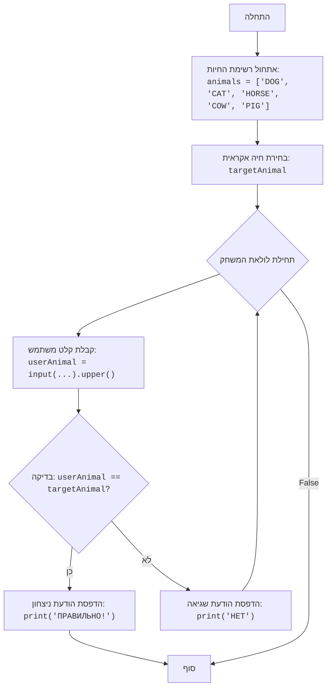

# ניתוח קוד המשחק "ANIMAL"

## <algorithm>

1.  **אתחול רשימת החיות:**
    *   רשימה של חיות מוגדרת: `animals = ['DOG', 'CAT', 'HORSE', 'COW', 'PIG']`.
    *   דוגמה: הרשימה מכילה 5 שמות של חיות.

2.  **בחירת חיה אקראית:**
    *   הקוד בוחר חיה אקראית מהרשימה ומאחסן אותה במשתנה `targetAnimal`.
    *   דוגמה: אם הרשימה היא `animals`, והבחירה האקראית היא `1`, `targetAnimal` יהיה שווה ל-`'CAT'`.

3.  **לולאה ראשית של המשחק:**
    *   הקוד נכנס ללולאה אינסופית `while True:`.
    *   דוגמה: הלולאה רצה עד שהשחקן ינצח.

4.  **קלט משתמש:**
    *   המשתמש מתבקש להזין את שם החיה. הקלט מומר לאותיות גדולות.
    *   דוגמה: המשתמש מזין "dog". המשתנה `userAnimal` הופך ל-`'DOG'`.

5.  **בדיקת ניצחון:**
    *   הקוד בודק אם `userAnimal` שווה ל-`targetAnimal`.
    *   דוגמה: אם `userAnimal` הוא `'DOG'` וגם `targetAnimal` הוא `'DOG'`, התנאי מתקיים.

6.  **אם ניצחון:**
    *   אם התנאי מתקיים, ההודעה "ПРАВИЛЬНО!" (נכון!) מודפסת.
    *   דוגמה: מודפסת ההודעה "ПРАВИЛЬНО!".

7.  **סיום לולאה:**
    *   הלולאה מסתיימת באמצעות `break`.
    *   דוגמה: אחרי הניצחון, הלולאה נגמרת.

8.  **אם לא ניצחון:**
    *   אם התנאי לא מתקיים, ההודעה "НЕТ" (לא) מודפסת.
    *   דוגמה: מודפסת ההודעה "НЕТ".

9.  **חזרה ללולאה:**
    *   הלולאה חוזרת לשלב הקלט.
    *   דוגמה: המשתמש מתבקש להזין חיה נוספת.

## <mermaid>

## <explanation>

### ייבוא
- `import random`: ייבוא מודול `random` שמאפשר לייצר ערכים אקראיים. המודול משמש לבחירת חיה אקראית מרשימת החיות.

### משתנים
- `animals`: רשימה שמכילה מחרוזות של שמות חיות.
- `targetAnimal`: משתנה המכיל את שם החיה שנבחרה באופן אקראי על ידי המחשב.
- `userAnimal`: משתנה המכיל את שם החיה שהמשתמש הזין.

### פונקציות
- `random.choice(animals)`: פונקציה מתוך מודול `random` שבוחרת באופן אקראי איבר אחד מתוך הרשימה `animals`.
- `input(...)`: פונקציה מובנית בפייתון שמקבלת קלט מהמשתמש.
- `.upper()`: פונקציה של מחרוזת שממירה את המחרוזת לאותיות גדולות, כדי להתעלם מהבדלי רישיות.

### הסבר מפורט
- הקוד מתחיל עם רשימה של חיות.
- הוא בוחר חיה אקראית מהרשימה.
- לאחר מכן מתחילה לולאה אינסופית, בה המשתמש מתבקש לנחש את החיה.
- אם המשתמש מצליח לנחש את החיה, ההודעה "ПРАВИЛЬНО!" מודפסת והלולאה מסתיימת.
- אם המשתמש לא מצליח לנחש את החיה, ההודעה "НЕТ" מודפסת והלולאה ממשיכה.
- אין פה יצירה של מחלקות, או אינטראקציה עם קבצים אחרים, הקוד עומד בפני עצמו.

### בעיות אפשריות או תחומים לשיפור
- הקוד לא כולל טיפול בשגיאות. לדוגמה, אם המשתמש מזין משהו שהוא לא שם חיה, הקוד לא יתמודד עם זה בצורה אלגנטית.
- ניתן להרחיב את הרשימה של החיות או לאפשר למשתמש לבחור רשימה שונה.
- ניתן להוסיף מספר ניסיונות מוגבל לניחוש.
- הקוד פשוט, ולא ניתן למצוא בו קשרי תלות.