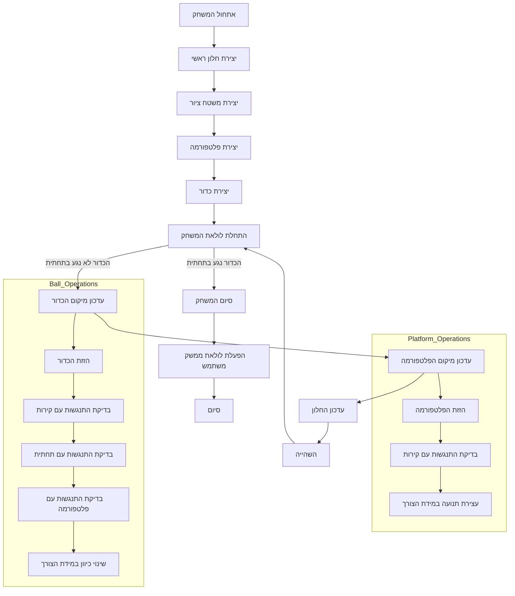

## <algorithm>
1. **אתחול המשחק:**
   - יצירת חלון ראשי באמצעות `Tk()`.
   - הגדרת כותרת לחלון, אי-שינוי גודל והצגה מעל שאר החלונות.
   - יצירת משטח ציור (`Canvas`) בגודל 500x400.
   - יצירת אובייקט פלטפורמה (`Platform`) בצבע ירוק ומיקום התחלתי.
   - יצירת אובייקט כדור (`Ball`) בצבע אדום ומיקום התחלתי, קישור לפלטפורמה.

   *דוגמה:*
   ```python
   window = Tk()
   canvas = Canvas(window, width=500, height=400)
   platform = Platform(canvas, 'green')
   ball = Ball(canvas, platform, 'red')
   ```

2. **לולאת המשחק:**
   - כל עוד הכדור לא נגע בתחתית החלון:
     - הזזת הכדור (`ball.draw()`) ועדכון מצב.
       - בדיקה אם הכדור פגע בקירות:
         - אם פגע בקיר העליון: כיוון התנועה האנכי משתנה כלפי מטה.
         - אם פגע בתחתית: סימון שהכדור נגע בתחתית.
         - אם פגע בפלטפורמה: כיוון התנועה האנכי משתנה כלפי מעלה.
         - אם פגע בקיר השמאלי: כיוון התנועה האופקי משתנה כלפי ימין.
         - אם פגע בקיר הימני: כיוון התנועה האופקי משתנה כלפי שמאל.
     - הזזת הפלטפורמה (`platform.draw()`) ועדכון מצב.
       - בדיקה אם הפלטפורמה פגעה בקירות:
        - אם פגעה בקיר השמאלי: עצירת התנועה האופקית.
        - אם פגעה בקיר הימני: עצירת התנועה האופקית.
     - עדכון החלון `window.update()`.
     - השהייה קצרה `time.sleep(0.01)`.

   *דוגמה לזרימת נתונים:*
   - הכדור משנה את המיקום שלו בהתאם לערכים `self.x` ו `self.y` שלו בתוך הפונקציה `draw()`.
   - הפלטפורמה משנה את המיקום שלה בהתאם לערך `self.x` שלה בתוך הפונקציה `draw()`.

3. **סיום המשחק:**
   - כאשר הכדור נגע בתחתית, הלולאה מסתיימת.
   - המשחק מסיים את הפעולה שלו.
   - הפעלת `window.mainloop()`, המאפשרת לממשק המשתמש להישאר פתוח עד לסגירתו.

   *דוגמה:*
   ```python
   while True:
       if not ball.touch_bottom:
           ball.draw()
           platform.draw()
       else:
           break
   ```

## <mermaid>


## <explanation>
### ייבואים (Imports)
- `tkinter`: הספרייה המרכזית ליצירת ממשקי משתמש גרפיים (GUI). משמשת ליצירת החלון הראשי, הקנבס (Canvas) שעליו מצוירים הפריטים במשחק והוספת אירועים.
- `time`: משמשת לפונקציית `sleep` להשהיית הלולאה הראשית של המשחק וליצור קצב סביר.
- `random`: משמשת לפונקציה `choice` לבחירת כיוון התחלתי אקראי לכדור.
- `pygame`: מיובאת אך אינה בשימוש. ניתן להסיר את הייבוא הזה.

### מחלקות (Classes)

1.  **`Ball`**
    - **תפקיד:** מייצגת את הכדור במשחק.
    - **מאפיינים:**
        - `canvas`: אובייקט הקנבס עליו מצויר הכדור.
        - `platform`: אובייקט הפלטפורמה, משמש לזיהוי התנגשויות.
        - `oval`: אובייקט אליפסה (כדור) שנוצר על הקנבס.
        - `dir`: רשימה של כיוונים אופקיים אפשריים.
        - `x`, `y`: מהירות תנועה אופקית ואנכית.
        - `touch_bottom`: דגל המציין אם הכדור פגע בתחתית המסך.
    - **שיטות:**
        - `__init__(self, canvas, platform, color)`: מאתחלת את הכדור, מקצה לו מיקום התחלתי, צבע ומהירות.
        - `touch_platform(self, ball_pos)`: בודקת האם הכדור פגע בפלטפורמה, מחזירה `True` אם כן, אחרת `False`.
        - `draw(self)`: מעדכנת את מיקום הכדור בקנבס, בודקת התנגשויות עם קירות ופלטפורמה ומשנה את כיוון תנועתו בהתאם.
        - **אינטראקציה**:
          -  הכדור משתמש בשיטת `touch_platform()` על מנת לבדוק האם הכדור פגע בפלטפורמה.

2.  **`Platform`**
    - **תפקיד:** מייצגת את הפלטפורמה במשחק.
    - **מאפיינים:**
        - `canvas`: אובייקט הקנבס עליו מצוירת הפלטפורמה.
        - `rect`: אובייקט מלבן (פלטפורמה) שנוצר על הקנבס.
        - `x`: מהירות תנועה אופקית של הפלטפורמה.
    - **שיטות:**
        - `__init__(self, canvas, color)`: מאתחלת את הפלטפורמה, מקצה לה מיקום התחלתי, צבע ומאזינה לאירועי לחיצה על מקשי החצים.
        - `left(self, event)`: מטפלת באירוע הלחיצה על מקש החץ השמאלי, משנה את מהירות התנועה של הפלטפורמה שמאלה.
        - `right(self, event)`: מטפלת באירוע הלחיצה על מקש החץ הימני, משנה את מהירות התנועה של הפלטפורמה ימינה.
        - `draw(self)`: מעדכנת את מיקום הפלטפורמה בקנבס, בודקת התנגשויות עם קירות ועוצרת את תנועתה במידת הצורך.
        - **אינטראקציה**:
           - משתמשת בפונקציה `bind_all()` על מנת להקשיב לאירועי לחיצות מקלדת של מקשי החצים.

### פונקציות (Functions)

-   **אין פונקציות גלובליות מוגדרות בקוד.**
-   פונקציות קיימות רק כשיטות של המחלקות.

### משתנים (Variables)

-   `window`: אובייקט החלון הראשי מסוג `Tk`.
-   `canvas`: אובייקט הקנבס מסוג `Canvas` לציור.
-   `platform`: אובייקט הפלטפורמה מסוג `Platform`.
-   `ball`: אובייקט הכדור מסוג `Ball`.

### בעיות אפשריות ותחומים לשיפור

-   **חוסר שימוש ב-`pygame`**: הספרייה `pygame` מיובאת, אך אינה בשימוש. יש להסיר את הייבוא הזה או להשתמש בה.
-   **לוגיקה פשוטה של התנגשות**: בדיקת ההתנגשות בין הכדור לפלטפורמה היא בסיסית ומשתמשת בבדיקה ריבועית בלבד. ניתן לשפר את הלוגיקה לדיוק רב יותר.
-   **תנועה קבועה**: מהירות התנועה של הכדור והפלטפורמה קבועה. ניתן להוסיף שינויי מהירות כתלות באירועים שונים במשחק, או רמות קושי.
-   **חוסר בניהול מצב**: אין ניהול מצב משחק (התחלה, סיום, ניקוד, רמות). ניתן להרחיב את הקוד לכיוון הזה.
-   **קוד לא גמיש**: קשה להרחיב את המשחק לרכיבים נוספים (בלוקים, בונוסים). ייתכן שימוש בתבניות עיצוב יעזור לגמישות ולמדרגיות של הקוד.
-   **קריאות קוד**: יש לשפר את הקריאות של הקוד.
-   **אפשרות להוספת כפתור הפסקה**: יהיה נחמד אם היה כפתור הפסקה.

### שרשרת קשרים עם חלקים אחרים בפרויקט
- הקוד הנוכחי הוא משחק עצמאי ואינו קשור ישירות לחלקים אחרים בפרויקט.