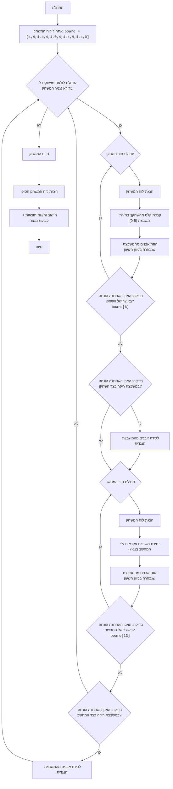

## ניתוח קוד: משחק AWARI

### 1. <algorithm>

**תרשים זרימה צעד-אחר-צעד:**

1.  **התחלה:**
    *   המשחק מתחיל עם אתחול לוח המשחק. לדוגמה, `board = [4, 4, 4, 4, 4, 4, 0, 4, 4, 4, 4, 4, 4, 0]`. כל שחקן מתחיל עם 6 משבצות (0-5 לאיגרוק ו 7-12 למחשב) וארבע אבנים בכל אחת מהן. משבצות 6 ו-13 הם האוצרות של כל שחקן.
2.  **לולאת משחק:**
    *   המשחק נמשך עד שכל המשבצות בצד של שחקן או המחשב ריקות. כלומר, המשחק מסתיים כאשר `is_game_over()` מחזירה אמת.
3.  **תור השחקן:**
    *   הצג את לוח המשחק באמצעות `display_board()`.
    *   בקש מהשחקן לבחור משבצת (0-5).
        *   דוגמה: השחקן בוחר את משבצת 2.
    *   העבר את האבנים מהמשבצת הנבחרת (2) באופן כזה שכל פעם מוסיפים אבן אחת לכל משבצת, בכיוון השעון.
        *   דוגמה: אם למשבצת 2 היו 4 אבנים, אחרי ההעברה היא תהיה 0, וכל המשבצות הבאות יקבלו אבן אחת כל אחת.
    *   **בדיקת תור נוסף:** אם האבן האחרונה הונחה באוצר של השחקן (משבצת 6), תן לו תור נוסף.
    *   **בדיקת לכידה:** אם האבן האחרונה הונחה במשבצת ריקה בצד השחקן, בדוק אם יש אבנים במשבצת שמולה.
        *   דוגמה: אם השחקן סיים את התור שלו במשבצת 3, והמשבצת שמולה (9) לא ריקה, אז השחקן לוקח את כל האבנים משבצת 3 ו-9 לתוך האוצר שלו (6).
4.  **תור המחשב:**
    *   הצג את לוח המשחק באמצעות `display_board()`.
    *   המחשב בוחר משבצת באופן אקראי (7-12), כל עוד המשבצת לא ריקה.
    *   העבר את האבנים מהמשבצת הנבחרת, בדיוק כמו בתור של השחקן.
    *   **בדיקת תור נוסף:** אם האבן האחרונה הונחה באוצר של המחשב (משבצת 13), תן לו תור נוסף.
    *   **בדיקת לכידה:** אם האבן האחרונה הונחה במשבצת ריקה בצד המחשב, בדוק אם יש אבנים במשבצת שמולה, ולכוד אותן בהתאם.
5.  **סיום משחק:**
    *   כאשר `is_game_over()` מחזירה אמת, המשחק נגמר.
    *   הצג את לוח המשחק האחרון.
    *   חשב את הניקוד של כל שחקן והדפס את התוצאות באמצעות `calculate_winner()`.
        *   דוגמה: אם לשחקן יש 20 אבנים באוצר שלו (6) ולמחשב יש 10 אבנים באוצר שלו (13), השחקן ינצח.

**זרימת נתונים:**

*   `board` (רשימה): נתונים משותפים המאחסנים את מצב המשחק. מועברים בין כל הפונקציות.
*   `cell` (מספר שלם): מספר המשבצת שנבחרה, מועבר כקלט לפונקציות `player_turn` ו-`computer_turn`.
*   `stones` (מספר שלם): מספר האבנים במשבצת שנבחרה, מועבר לפונקציות `player_turn` ו-`computer_turn`.
*   `current_cell` (מספר שלם): מספר המשבצת הנוכחית בזמן העברת האבנים, מועבר לפונקציות `player_turn` ו-`computer_turn`.
*   `player_score` (מספר שלם): מספר הנקודות של השחקן, מוחזר ע"י `calculate_winner`.
*   `computer_score` (מספר שלם): מספר הנקודות של המחשב, מוחזר ע"י `calculate_winner`.

### 2. <mermaid>

**הסבר תלויות:**

*   אין יבוא חיצוני, כלומר כל הקוד מוגדר בקובץ אחד.

### 3. <explanation>

**ייבואים (Imports):**

*   `import random`: משמש ליצירת מספרים אקראיים עבור בחירת משבצת על ידי המחשב.

**משתנים (Variables):**

*   `board` (רשימה): רשימה של 14 מספרים שלמים המייצגת את מצב המשחק. משמשת לאחסון מספר האבנים בכל משבצת.
*   `cell` (מספר שלם): מספר משבצת נבחרת על ידי השחקן או המחשב.
*   `stones` (מספר שלם): מספר האבנים במשבצת הנבחרת.
*   `current_cell` (מספר שלם): משבצת הנוכחית במהלך סיבוב העברת האבנים.
*   `player_score` (מספר שלם): מספר האבנים באוצר של השחקן בסיום המשחק.
*   `computer_score` (מספר שלם): מספר האבנים באוצר של המחשב בסיום המשחק.
*   `possible_moves` (רשימה): רשימה של משבצות אפשריות למהלך המחשב.
*   `opposite_cell` (מספר שלם): מספר המשבצת הנגדית למשבצת הנוכחית, לצורך לכידת אבנים.

**פונקציות (Functions):**

*   `display_board()`:
    *   פרמטרים: אין.
    *   ערך מוחזר: אין.
    *   מטרה: להציג את לוח המשחק בפורמט קריא.
    *   דוגמה לשימוש: `display_board()` תציג את המערך board בצורה ויזואלית למשתמש.

*   `player_turn()`:
    *   פרמטרים: אין.
    *   ערך מוחזר: אין.
    *   מטרה: לטפל בתור של השחקן, כולל קבלת קלט, העברת אבנים, בדיקת תור נוסף ולכידת אבנים.
    *   דוגמה לשימוש: `player_turn()` תבקש מהשחקן לבחור משבצת, תזיז אבנים בהתאם לכללי המשחק ותבצע בדיקות למהלכים נוספים.

*   `computer_turn()`:
    *   פרמטרים: אין.
    *   ערך מוחזר: אין.
    *   מטרה: לטפל בתור של המחשב, כולל בחירת משבצת אקראית, העברת אבנים, בדיקת תור נוסף ולכידת אבנים.
    *   דוגמה לשימוש: `computer_turn()` תבחר משבצת באופן רנדומלי ותבצע את המהלכים לפי חוקי המשחק.

*   `is_game_over()`:
    *   פרמטרים: אין.
    *   ערך מוחזר: `True` אם המשחק נגמר, `False` אחרת.
    *   מטרה: לבדוק אם המשחק הסתיים (כל המשבצות בצד אחד של הלוח ריקות).
    *   דוגמה לשימוש: `if is_game_over(): break` עוצרת את המשחק.

*   `calculate_winner()`:
    *   פרמטרים: אין.
    *   ערך מוחזר: אין.
    *   מטרה: לחשב את הניקוד של כל שחקן, להציג את התוצאות ולקבוע מנצח.
    *   דוגמה לשימוש: `calculate_winner()` תוצג בסיום המשחק ותודיע למשתמש מי ניצח.

**בעיות אפשריות או תחומים לשיפור:**

1.  **בחירת משבצות של המחשב:** המחשב בוחר משבצות באופן אקראי. ניתן לשפר את הבינה המלאכותית של המחשב על ידי שימוש באלגוריתם יותר מתוחכם שיאפשר לו לבחור משבצות אסטרטגיות.
2.  **לכידת אבנים:** לכידת אבנים מתבצעת רק כאשר האבן האחרונה נוחתת במשבצת ריקה, שיכולה להיות מגבילה, אפשר להוסיף חוקים נוספים ללכידה.
3.  **ממשק משתמש:** הממשק הנוכחי הוא טקסטואלי. ניתן לשפר את חוויית המשתמש על ידי יצירת ממשק גרפי.
4.  **אימות קלט:** קיימת בדיקה בסיסית לווידוא שהמשבצת שנבחרה על ידי השחקן חוקית, אבל ניתן להוסיף בדיקות נוספות כדי להתמודד עם קלטים לא חוקיים.

**שרשרת קשרים:**

*   הקוד הוא עצמאי ואין לו קשר עם חלקים אחרים בפרויקט.
*   כל הפונקציות קוראות ומשנות את אותו ה- `board`.

זהו ניתוח מקיף ומובנה של הקוד שסופק.