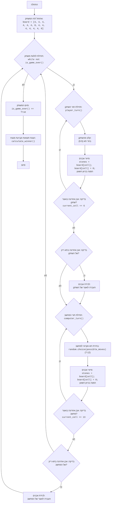

## ניתוח קוד: משחק אוארי

### <algorithm>

1. **אתחול לוח המשחק**:
   - נוצר מערך `board` המכיל 14 תאים.
   - תאים 0-5 מייצגים את צד השחקן, תאים 7-12 מייצגים את צד המחשב, תא 6 הוא האוצר של השחקן, ותא 13 הוא האוצר של המחשב.
   - בתחילה, כל תא מכיל 4 אבנים, מלבד האוצרות המכילים 0.
   - דוגמה: `board = [4, 4, 4, 4, 4, 4, 0, 4, 4, 4, 4, 4, 4, 0]`

2. **לולאת משחק ראשית**:
    - הלולאה ממשיכה עד שהמשחק מסתיים (אחד הצדדים ריק).
    - בכל איטרציה מבוצע תור שחקן ואז תור מחשב.

3. **תור השחקן (`player_turn`)**:
    - השחקן מתבקש לבחור תא (0-5) עם אבנים.
    - אם התא שנבחר חוקי (בתחום 0-5 ויש בו אבנים):
       - האבנים מהתא נלקחות.
       - האבנים מפוזרות על פני התאים הבאים בכיוון השעון, אבן אחת בכל תא.
       - אם האבן האחרונה נוחתת באוצר של השחקן (תא 6), השחקן מקבל תור נוסף.
       - אם האבן האחרונה נוחתת בתא ריק בצד של השחקן, נבדק האם יש אבנים בתא הנגדי בצד של המחשב, ואם כן הן נלקחות לאוצר של השחקן יחד עם האבן האחרונה שנחתה בתא הריק.
    - אם התא לא חוקי, מתבקש קלט נוסף מהמשתמש.
    - דוגמה:
       - שחקן בוחר בתא 2, שבו 4 אבנים.
       - אחרי הפצה, לוח המשחק יכול להיראות כך: `board = [4, 4, 0, 5, 5, 5, 1, 4, 4, 4, 4, 4, 4, 0]`

4. **תור המחשב (`computer_turn`)**:
    - המחשב בוחר תא אקראי (7-12) עם אבנים.
    - אם אין תאים עם אבנים, התור מבוטל.
    - האבנים מפוזרות על פני התאים הבאים בכיוון השעון, אבן אחת בכל תא.
    - אם האבן האחרונה נוחתת באוצר של המחשב (תא 13), המחשב מקבל תור נוסף.
    - אם האבן האחרונה נוחתת בתא ריק בצד של המחשב, נבדק האם יש אבנים בתא הנגדי בצד של השחקן, ואם כן הן נלקחות לאוצר של המחשב יחד עם האבן האחרונה שנחתה בתא הריק.
    - דוגמה:
       - מחשב בוחר בתא 8, שבו 4 אבנים.
       - אחרי הפצה, לוח המשחק יכול להיראות כך: `board = [4, 4, 0, 5, 5, 5, 1, 4, 0, 5, 5, 5, 5, 1]`

5. **בדיקת סיום המשחק (`is_game_over`)**:
    - המשחק מסתיים אם כל התאים בצד של השחקן או המחשב ריקים.
    - הלולאה מסתיימת והמשחק נגמר.

6. **חישוב והכרזת מנצח (`calculate_winner`)**:
    - מחושב ציון השחקן (ערך בתא 6) וציון המחשב (ערך בתא 13).
    - מודפס ציון כל שחקן ומוכרז המנצח.

7. **תצוגת הלוח (`display_board`)**:
   - מדפיס תצוגה ויזואלית של לוח המשחק עם התאים והאבנים.

### <mermaid>

**הסבר תרשים Mermaid:**

*   התרשים מתאר את זרימת הפעולה של המשחק, החל מאתחול הלוח, דרך תורי השחקן והמחשב, וכלה בהכרזת המנצח.
*   הקשרים בין האלמנטים השונים מתוארים על ידי חצים המראים את כיוון הזרימה.
*   התרשים מתאר את התהליכים וההחלטות המרכזיות בכל שלב במשחק.
*   כל תיבה מייצגת פונקציה או חלק לוגי בקוד, וכוללת תיאור תמציתי של פעולתה.

### <explanation>

**ייבוא (Imports):**

*   `import random`: ספריית פייתון מובנית המשמשת ליצירת מספרים אקראיים, בה משתמשים למימוש תור המחשב.

**פונקציות (Functions):**

*   **`display_board()`**:
    *   מטרה: להדפיס תצוגה נוחה למשתמש של מצב לוח המשחק הנוכחי.
    *   פרמטרים: אין.
    *   ערך מוחזר: אין.
    *   דוגמה: מודפסת תצוגה גרפית של הלוח עם האבנים בכל תא.
*   **`player_turn()`**:
    *   מטרה: לטפל בתור השחקן.
    *   פרמטרים: אין.
    *   ערך מוחזר: אין.
    *   דוגמה: השחקן בוחר תא, והאבנים מפוזרות, או מתבצעת לכידה.
*   **`computer_turn()`**:
    *   מטרה: לטפל בתור המחשב.
    *   פרמטרים: אין.
    *   ערך מוחזר: אין.
    *   דוגמה: המחשב בוחר תא באופן אקראי, והאבנים מפוזרות, או מתבצעת לכידה.
*   **`is_game_over()`**:
    *   מטרה: לבדוק האם המשחק הסתיים.
    *   פרמטרים: אין.
    *   ערך מוחזר: `True` אם המשחק נגמר, `False` אחרת.
    *   דוגמה: מחזירה `True` כאשר כל התאים בצד של השחקן או המחשב ריקים.
*   **`calculate_winner()`**:
    *   מטרה: לחשב את הניקוד ולהכריז על המנצח.
    *   פרמטרים: אין.
    *   ערך מוחזר: אין.
    *   דוגמה: מודפס הניקוד של כל שחקן ומוכרז המנצח.

**משתנים (Variables):**

*   `board`: רשימה (list) המייצגת את לוח המשחק. סוג הנתונים בכל תא הוא מספר שלם (int).

**בעיות אפשריות ותחומים לשיפור:**

*   **קלט לא תקין**: קוד זה מטפל באופן בסיסי בשגיאות קלט, אבל ניתן לשפר את הטיפול בבעיות קלט כמו קלט שאינו מספר.
*   **ממשק משתמש**: ממשק המשתמש הוא בסיסי (טקסטואלי) וניתן לשפר אותו על ידי הוספת ממשק גרפי.
*   **אלגוריתם מחשב**: האלגוריתם של המחשב הוא אקראי ואינו אופטימלי, ניתן לשפר אותו על ידי שימוש באלגוריתם חכם יותר.

**שרשרת קשרים עם חלקים אחרים בפרויקט:**
קובץ זה עומד בפני עצמו ואין לו תלות בחלקים אחרים בפרויקט, למעט ספריית ה-random המובנית של פייתון.