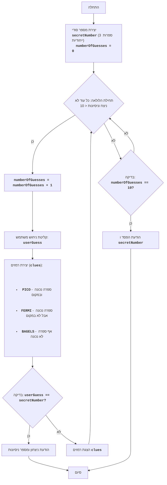

## <algorithm>
הקוד מתאר משחק ניחושים בשם "בייגלס", בו המחשב בוחר מספר בן שלוש ספרות ייחודיות והשחקן מנסה לנחש אותו. לאחר כל ניסיון, השחקן מקבל רמזים: "PICO" אם ספרה אחת נכונה ובמקום הנכון, "FERMI" אם ספרה אחת נכונה אך לא במקום הנכון, ו-"BAGELS" אם אף ספרה לא נכונה. המשחק נמשך עד שהשחקן מנחש את המספר או עד שמספר הניסיונות מגיע ל-10.

1.  **התחלה:**
    *   המחשב מגריל מספר סודי בן שלוש ספרות שונות, למשל `123`.
    *   מאפס את מונה הניסיונות `numberOfGuesses` ל-0.
2.  **לולאה (כל עוד לא ניצח או הגיע למקסימום ניסיונות):**
    *   מגדיל את מונה הניסיונות ב-1, כלומר `numberOfGuesses = numberOfGuesses + 1`.
    *   מבקש מהשחקן להזין ניחוש בן שלוש ספרות, למשל `456`.
    *   משווה את הניחוש למספר הסודי ויוצר רמזים:
        *   אם הספרה במיקום הנכון זהה - מוסיף "PICO".
            *   דוגמה: אם הסודי הוא `123` והניחוש הוא `156`, יתווסף רמז "PICO" כי `1` הוא נכון ובמקום.
        *   אם הספרה קיימת אך לא במיקום הנכון - מוסיף "FERMI".
            *   דוגמה: אם הסודי הוא `123` והניחוש הוא `416`, יתווסף רמז "FERMI" כי `1` נמצא אך לא במיקום הנכון.
        *   אם אף ספרה לא נכונה - הרמז יהיה "BAGELS".
            *   דוגמה: אם הסודי הוא `123` והניחוש הוא `456`, הרמז יהיה "BAGELS".
        *   הרמזים מורכבים לפי סדר המיקומים במספר הסודי.
            *   דוגמה: אם הסודי הוא `123` והניחוש הוא `213`, יווצרו הרמזים "FERMI FERMI PICO".
    *   **בדיקת ניצחון:** אם הניחוש זהה למספר הסודי, המשחק מסתיים בהודעת ניצחון ומספר הניסיונות.
        *   דוגמה: אם הסודי הוא `123` והניחוש הוא `123`, המשחק מסתיים.
    *   אם הניחוש לא נכון, מוצגים הרמזים לשחקן, והלולאה ממשיכה.
3.  **בדיקת הפסד:** אם הגיעו ל-10 ניסיונות והניחוש לא נכון, המשחק מסתיים בהודעת הפסד והמספר הסודי מוצג.
    *   דוגמה: אם לאחר 10 ניסיונות השחקן לא ניחש נכון את המספר `123`, המשחק מסתיים והמספר מוצג.
4.  **סיום:** המשחק מסתיים, או בניצחון או בהפסד.

## <mermaid>

**ניתוח תלויות ב-mermaid:**

*   **flowchart TD:** מגדיר את סוג התרשים כתרשים זרימה מלמעלה למטה.
*   **Start, GenerateSecretNumber, LoopStart וכו':**  אלה הם צמתים (nodes) בתוך התרשים, כאשר כל צומת מייצג שלב ספציפי בתהליך.
*   **-->:** מסמל זרימה או מעבר בין שלבים.
*   **-- כן -->, -- לא -->:** מסמנים זרימה מותנית לפי תנאים.
*   **
 ... 
, <code><b>...</b></code>:** תגיות HTML להצגת טקסט מפורמט.
*   **{}**: מעגלים שמשמשים לסימון נקודות פיצול/חיבור (לולאות).
*   **[]**: מלבנים שמשמשים לייצוג פעולות או שלבים.
*   **()**: צורה אובלית שמשמשת לתחילת או סיום.

התרשים הזה מתאר בצורה ויזואלית את הלוגיקה של משחק "בייגלס".

## <explanation>
**ייבואים (Imports):**
    *   אין ייבוא מפורש בקוד שסופק, אך בדרך כלל יהיו כאלה במשחקים שנוצרו עם חבילות `src`. אם הקוד היה כולל `import header`, היינו מציירים את תרשים הזרימה שלו כפי שצוין בהוראות.

**מחלקות (Classes):**
    *   הקוד שסופק אינו מכיל מחלקות, אלא מתאר את האלגוריתם של המשחק בלבד. אם היו מחלקות, למשל, `Game` או `Player`, היינו מנתחים את המאפיינים שלהן (attributes), השיטות (methods) והאינטראקציות עם חלקים אחרים בפרויקט.

**פונקציות (Functions):**
    *   הקוד שסופק לא מגדיר פונקציות באופן מפורש, אלא מתאר את הלוגיקה כרצף פעולות. אם היו פונקציות, היינו מתארים את הפרמטרים שלהן, הערכים המוחזרים, המטרה והדוגמאות לשימוש.
        *   למשל, `generate_secret_number()` הייתה יוצרת את המספר הסודי, `check_guess(secret_number, user_guess)` הייתה בודקת את הניחוש ומחזירה רמזים, וכדומה.

**משתנים (Variables):**

*   `secretNumber`: משתנה שמכיל את המספר הסודי שנוצר על ידי המחשב. סוג: מחרוזת של 3 ספרות ייחודיות.
    *   דוגמה: `"123"`
*   `numberOfGuesses`: משתנה שמכיל את מספר הניסיונות שהשחקן ביצע. סוג: מספר שלם (integer).
    *   דוגמה: `0`, `1`, `2` וכו'.
*   `userGuess`: משתנה שמכיל את הניחוש שהשחקן הזין. סוג: מחרוזת של 3 ספרות.
    *   דוגמה: `"456"`, `"123"` וכו'.
*   `clues`: משתנה שמכיל את הרמזים שנוצרו בהשוואה בין הניחוש למספר הסודי. סוג: מחרוזת המכילה רמזים.
    *   דוגמה: `"PICO FERMI"`, `"BAGELS"`, `"PICO PICO"` וכו'.

**שרשרת קשרים עם חלקים אחרים בפרויקט:**

    *   במשחק שלם, הקוד הזה יכול להיות חלק ממחלקה `Game` או מודול של משחקים, וייתכן שיש לו קשר לממשק משתמש. לדוגמה, פונקציה כמו `input()` לוקחת קלט מהשחקן, ופונקציה כמו `print()` מציגה את התוצאות או ההוראות. קשרים נוספים יכולים להיות:
        *   קריאה לקובץ הגדרות, שם יכולות להיות שמורות הגדרות של רמות קושי, הגדרות תצוגה וכו' .
        *   שימוש במחלקות עזר לניהול קלט, פלט או הגרלה של מספרים.
        *   אחסון נתונים או היסטוריה של המשחקים.

**בעיות אפשריות או תחומים לשיפור:**

*   **קלט משתמש:** אין בדיקה שהקלט של המשתמש הוא אכן מספר בן 3 ספרות ייחודיות, וזה עלול לגרום לשגיאה.
*   **ממשק משתמש:** אין ממשק משתמש, ולכן המשחק מוגבל לטרמינל בלבד.
*   **קריאות הקוד:** חוסר בפונקציות מוגדרות הופך את הקוד לקשה לקריאה ולתחזוקה.

**לסיכום:**
הקוד מספק תיאור ברור של האלגוריתם למשחק "בייגלס". עם זאת, חסרים בו מימוש מלא של פונקציות ובדיקות קלט מהמשתמש, כמו גם ממשק משתמש. כדי להפוך אותו למשחק עובד, צריך להוסיף פונקציות מתאימות ולטפל בקלט ופלט.