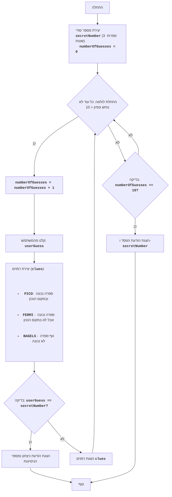

## <algorithm>
הקוד מתאר את המשחק "בייגלס", שהוא משחק ניחושים לוגי. המשחק מתנהל כך:

1. **אתחול:**
   - המחשב בוחר באופן אקראי מספר תלת-ספרתי שכל ספרותיו שונות זו מזו (לדוגמה, 123).
   - מונה הניסיונות מאותחל לאפס.

2. **לולאת משחק:**
   - הלולאה נמשכת כל עוד השחקן לא ניחש נכון את המספר וגם מספר הניסיונות קטן מ-10.
   - בכל איטרציה של הלולאה:
     - מונה הניסיונות גדל ב-1.
     - השחקן מתבקש להכניס מספר תלת-ספרתי כניחוש.
     - המחשב בודק את הניחוש ומייצר רמזים:
       - "PICO" - ספרה אחת נכונה ובמקום הנכון.
       - "FERMI" - ספרה אחת נכונה אך לא במקום הנכון.
       - "BAGELS" - אף ספרה אינה נכונה.
       - הרמזים מוצגים בסדר בו הספרות מופיעות במספר המטרה. לדוגמה, אם המספר המטרה הוא 123 והשחקן ניחש 142, הרמז יהיה "PICO FERMI".
     - אם השחקן ניחש נכון את המספר:
        - מוצגת הודעת ניצחון ומספר הניסיונות שלקח.
        - המשחק מסתיים.
     - אם השחקן לא ניחש נכון:
        - מוצגים הרמזים.

3. **סיום המשחק:**
    - אם השחקן לא ניחש נכון את המספר אחרי 10 ניסיונות:
        - מוצגת הודעת הפסד והמספר הנכון.
        - המשחק מסתיים.
    
    **דוגמה לזרימת הנתונים:**
    - המספר הסודי (`secretNumber`) נוצר בתחילת המשחק ולא משתנה.
    - מספר הניסיונות (`numberOfGuesses`) גדל בכל ניסיון.
    - הניחוש של השחקן (`userGuess`) נקלט ומושוה למספר הסודי.
    - הרמזים (`clues`) נוצרים על סמך השוואה בין הניחוש למספר הסודי.

## <mermaid>

התרשים מתאר את זרימת המשחק בצורה ויזואלית, כאשר כל תיבה מייצגת שלב בתהליך, והחצים מייצגים את זרימת הנתונים והשליטה בין השלבים.
השתמשתי בשמות משמעותיים לכל משתנה, כגון `secretNumber`, `numberOfGuesses`, `userGuess` ו-`clues`, כדי להפוך את התרשים לקריא ומובן יותר.

## <explanation>
**ייבוא (Imports):**
  - לא מופיע ייבוא של קבצים חיצוניים בקוד זה.

**מחלקות (Classes):**
  - אין שימוש במחלקות בקוד זה.

**פונקציות (Functions):**
  - לא מופיעות פונקציות מוגדרות בקוד זה. כל הלוגיקה מרוכזת בתרשים הזרימה ומתוארת כשלבים ברורים.
  
**משתנים (Variables):**
- `secretNumber`: משתנה המייצג את המספר הסודי שנוצר על ידי המחשב. זהו מספר תלת ספרתי שכל ספרותיו שונות זו מזו.
- `numberOfGuesses`: משתנה המייצג את מספר הניסיונות שהשחקן ביצע. משתנה זה מאותחל ל-0 וגדל באחד בכל ניסיון.
- `userGuess`: משתנה המייצג את הניחוש של השחקן, מספר תלת-ספרתי.
- `clues`: משתנה המייצג את רשימת הרמזים שנוצרה על ידי המחשב על סמך השוואה בין `userGuess` ל-`secretNumber`.

**הסברים נוספים:**

- הקוד מתאר משחק לוגי פשוט וקלאסי.
- התהליך מתחיל ביצירת מספר סודי ולאחר מכן ממשיך בלולאה עד שהשחקן מנצח או נכשל.
- הלוגיקה של המשחק פשוטה, עם זאת, ניתן להרחיב את המשחק על ידי הוספת רמות קושי או תכונות אחרות.
- כרגע, הקוד מתמקד בעיקרון הבסיסי של המשחק.
- ניתן לשפר את הקוד על ידי הוספת פונקציות נפרדות לכל שלב במשחק, כמו פונקציה ליצירת המספר הסודי, פונקציה להצגת רמזים וכו'.
- בנוסף, ניתן לשפר את הקוד על ידי שימוש במחלקות כדי ליצור מבנה ארגוני טוב יותר.
- אין בקוד זה תלות בחלקים אחרים בפרויקט, והוא עצמאי.