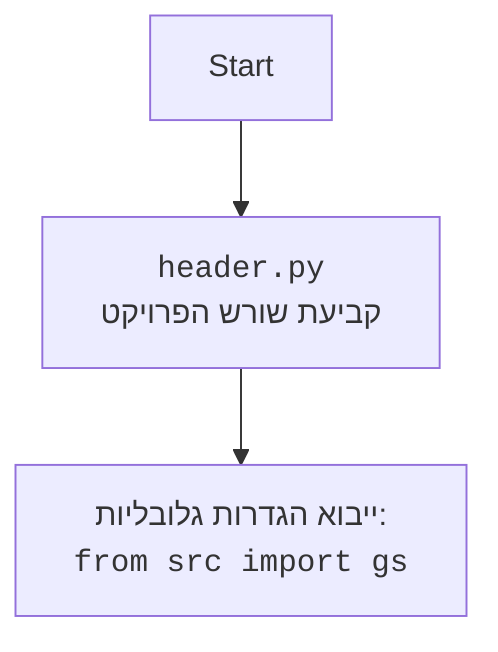

## <algorithm>

1. **התחלה**:
   - המשחק מתחיל.
   - לדוגמה: המשתמש מפעיל את הסקריפט `bagles.py`.

2. **יצירת מספר סודי**:
   - הפונקציה `generate_secret_number()` יוצרת מספר סודי תלת-ספרתי עם ספרות שונות.
   - לדוגמה:  הפונקציה יוצרת את המספר "123".

3. **איפוס מספר הניסיונות**:
   - משתנה `number_of_guesses` מאותחל ל-0.
   - לדוגמה: `number_of_guesses = 0`.

4. **הצגת הודעת פתיחה**:
   - מוצגת הודעה למשתמש עם הסבר על המשחק ועל סוגי הרמזים.
   - לדוגמה: "אני חשבתי על מספר תלת ספרתי..."

5. **לולאת ניחושים**:
   - המשחק ממשיך כל עוד `number_of_guesses` קטן מ-10.

    6. **הגדלת מספר הניסיונות**:
       - `number_of_guesses` גדל ב-1.
       - לדוגמה: אם `number_of_guesses` הוא 0, הוא יהפוך ל-1.

    7. **קבלת ניחוש מהמשתמש**:
      - המשחק מבקש מהמשתמש להכניס מספר תלת-ספרתי.
      - לדוגמה: המשתמש מכניס "456".

    8. **אימות ניחוש המשתמש**:
       - בדיקה שהקלט מהמשתמש הוא מספר תלת ספרתי, אם לא חוזרים לבקש שוב.
       - לדוגמה: "456" עובר את האימות, "12" או "abc" לא יעברו.

    9. **בדיקת ניחוש**:
       - אם הניחוש שווה למספר הסודי:
         - המשתמש ניצח, מוצגת הודעת ניצחון ומספר הניסיונות.
         - לדוגמה: אם המספר הסודי הוא "123" והמשתמש ניחש "123", מוצגת הודעת ניצחון.

       - אחרת:
            10. **קבלת רמזים**:
             - הפונקציה `get_clues()` מייצרת רמזים על סמך ההשוואה בין הניחוש למספר הסודי.
             - לדוגמה: אם המספר הסודי הוא "123" והמשתמש ניחש "142", הרמז יהיה "PICO FERMI".
            11. **הצגת רמזים**:
             - הרמזים מוצגים למשתמש.
             - לדוגמה: "PICO FERMI" מוצג למשתמש.

6. **סיום לולאת הניחושים**:
   - אם הלולאה הסתיימה (המשתמש ניסה 10 פעמים ולא ניחש את המספר):
      - מוצגת הודעת הפסד והמספר הסודי.
       - לדוגמה: "הפסדת! המספר הסודי היה 123".

7. **סוף המשחק**.

## <mermaid>

```mermaid
flowchart TD
    Start(התחלה) --> GenerateSecretNumber[יצירת מספר סודי <br> `secret_number = generate_secret_number()`];
    GenerateSecretNumber --> InitializeGuesses[איפוס ניסיונות <br> `number_of_guesses = 0`];
    InitializeGuesses --> DisplayWelcome[הצגת הודעת פתיחה];
    DisplayWelcome --> GuessLoopStart{`number_of_guesses < 10?`};
    GuessLoopStart -- Yes --> IncrementGuesses[הגדלת ניסיונות <br> `number_of_guesses += 1`];
    IncrementGuesses --> GetUserGuess[קבלת ניחוש <br> `user_guess = input(...)`];
    GetUserGuess --> ValidateGuess{בדיקת קלט תקין?<br>`len(user_guess) == 3 and user_guess.isdigit()`};
    ValidateGuess -- Yes --> CheckGuess[בדיקת ניחוש <br> `user_guess == secret_number?`];
    ValidateGuess -- No --> GetUserGuess;    
    CheckGuess -- Yes --> DisplayWin[הצגת ניצחון <br> "ניצחת!"];
    CheckGuess -- No --> GenerateClues[קבלת רמזים <br> `clues = get_clues(...)`];
    GenerateClues --> DisplayClues[הצגת רמזים <br> `print(" ".join(clues))`];
    DisplayClues --> GuessLoopStart;
    GuessLoopStart -- No --> DisplayLose[הצגת הפסד <br> "הפסדת! המספר היה {...}"]
    DisplayWin --> End(סיום המשחק);
    DisplayLose --> End;


```



## <explanation>

1.  **ייבוא `random`**:
    - `import random`: מודול זה משמש ליצירת מספרים אקראיים, ובמקרה הזה, הוא נחוץ כדי לערבב את הספרות לצורך יצירת המספר הסודי.

2.  **פונקציה `generate_secret_number()`**:
    - **תפקיד**: פונקציה זו יוצרת את המספר הסודי התלת-ספרתי שהמשתמש צריך לנחש.
    - **פרמטרים**: אין פרמטרים.
    - **ערך מוחזר**: מחזירה מחרוזת המייצגת את המספר הסודי.
    - **מימוש**:
        - `digits = list(range(10))`: יוצרת רשימה של ספרות מ-0 עד 9.
        - `random.shuffle(digits)`: מערבבת את הספרות בצורה אקראית.
        - `secret_number = str(digits[0]) + str(digits[1]) + str(digits[2])`: לוקחת את שלוש הספרות הראשונות מהרשימה המעורבבת ומחברת אותן למחרוזת.
        - `return secret_number`: מחזירה את המחרוזת עם המספר הסודי.
    - **דוגמה**: אם הרשימה המעורבבת היא `[3, 7, 2, 9, 1, 0, 4, 5, 6, 8]`, הפונקציה תחזיר את המחרוזת "372".

3.  **פונקציה `get_clues(secret_number, user_guess)`**:
    - **תפקיד**: פונקציה זו מייצרת רמזים ("PICO", "FERMI", "BAGELS") על סמך השוואה בין ניחוש המשתמש למספר הסודי.
    - **פרמטרים**:
        - `secret_number`: מחרוזת המייצגת את המספר הסודי.
        - `user_guess`: מחרוזת המייצגת את ניחוש המשתמש.
    - **ערך מוחזר**: מחזירה רשימה של מחרוזות המכילות את הרמזים.
    - **מימוש**:
        - `clues = []`: יוצרת רשימה ריקה לאחסון הרמזים.
        - לולאה העוברת על כל ספרה בתוך הניחוש של המשתמש:
            -  `if user_guess[i] == secret_number[i]`: אם הספרה נמצאת במיקום הנכון, מתווסף רמז "PICO".
            - `elif user_guess[i] in secret_number`: אם הספרה נמצאת במספר הסודי אך לא במיקום הנכון, מתווסף רמז "FERMI".
        - `if not clues`: אם לא נמצא אף רמז, מתווסף רמז "BAGELS".
        - `return clues`: מחזירה את רשימת הרמזים.
    - **דוגמה**: אם `secret_number` הוא "123" ו-`user_guess` הוא "142", הפונקציה תחזיר `["PICO", "FERMI"]`. אם `user_guess` הוא "456", הפונקציה תחזיר `["BAGELS"]`.

4. **פונקציה `play_bagels()`**:
    - **תפקיד**: פונקציה זו מנהלת את מהלך המשחק.
    - **פרמטרים**: אין פרמטרים.
    - **ערך מוחזר**: אין ערך מוחזר (הפונקציה מסיימת את פעולתה באמצעות `return` במקרה של ניצחון).
    - **מימוש**:
        - `secret_number = generate_secret_number()`: קוראת לפונקציה `generate_secret_number()` כדי ליצור את המספר הסודי.
        - `number_of_guesses = 0`: מאתחלת את מונה הניסיונות.
        - מציגה הודעות פתיחה ורמזים למשתמש.
        - לולאה `while number_of_guesses < 10`: לולאה זו ממשיכה כל עוד מספר הניסיונות קטן מ-10:
           -  `number_of_guesses += 1`: מגדילה את מספר הניסיונות ב-1.
           - לולאה פנימית `while True`: לולאה זו מבקשת מהמשתמש להכניס ניחוש, ובודקת שהוא תקין (מספר תלת-ספרתי). אם לא תקין, מבקשת שוב.
           - `if user_guess == secret_number`: אם המשתמש ניחש נכון, מוצגת הודעת ניצחון והפונקציה מסתיימת באמצעות `return`.
           - `else`: אם המשתמש לא ניחש נכון:
                - `clues = get_clues(secret_number, user_guess)`: קוראת לפונקציה `get_clues()` כדי לקבל רמזים.
                - `print(" ".join(clues))`: מדפיסה את הרמזים.
        - אם הלולאה מסתיימת (המשתמש לא ניחש את המספר ב-10 ניסיונות), מוצגת הודעת הפסד והמספר הסודי.
    - **דוגמה**: הפונקציה מפעילה את המשחק, מקבלת קלט מהמשתמש, ומציגה תוצאות ורמזים עד שהמשחק מסתיים (ניצחון או הפסד).

5. **משתנים**:
    - `digits`: רשימה של ספרות מ-0 עד 9, משמשת ליצירת המספר הסודי.
    - `secret_number`: מחרוזת המייצגת את המספר הסודי שהמשתמש צריך לנחש.
    - `user_guess`: מחרוזת המייצגת את הניחוש של המשתמש.
    - `clues`: רשימה של מחרוזות המכילות את הרמזים למשתמש.
    - `number_of_guesses`: מספר ניסיונות הניחוש שהמשתמש ביצע.

6. **בעיות אפשריות ושיפורים**:
   - **טיפול בשגיאות**: הקוד בודק רק אם הקלט הוא מספר תלת ספרתי. אפשר להוסיף בדיקות נוספות, למשל, לוודא שהקלט מכיל רק ספרות.
   - **ממשק משתמש**: הממשק בסיסי מאוד. אפשר להוסיף ממשק משתמש ידידותי יותר, אולי אפילו גרפי.
   - **מורכבות**: הקוד פשוט וקל להבנה, אך אפשר להוסיף אפשרויות נוספות כמו רמות קושי שונות (מספר ספרות שונה במספר הסודי), או אפשרות לשחק נגד המחשב.

7.  **קשרים עם חלקים אחרים בפרויקט**:
    - קוד זה הוא משחק עצמאי ואין לו קשר ישיר עם חלקים אחרים בפרויקט, למעט השימוש במודול `random` מתוך הספריה הסטנדרטית של פייתון.
    - עם זאת, ניתן לאחד את המשחק לחלק גדול יותר שכולל מספר משחקים בתוך פרויקט גדול יותר.