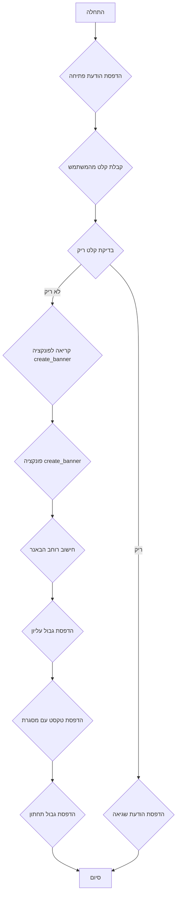

## <algorithm>

1.  **התחלה:** התוכנית מתחילה את ריצתה.
    *   דוגמה: `if __name__ == "__main__":` מתחיל את הביצוע של הקוד הראשי.
2.  **הדפסת הודעת פתיחה:** התוכנית מציגה הודעת פתיחה למשתמש ומסבירה את מטרתה.
    *   דוגמה: `print("ברוכים הבאים למשחק באנר!")`
3.  **קבלת קלט מהמשתמש:** התוכנית מבקשת מהמשתמש להזין טקסט.
    *   דוגמה: `user_text = input("הזן טקסט: ")`
4.  **בדיקת קלט ריק:** התוכנית בודקת אם הטקסט שהוזן ריק.
    *   דוגמה: `if user_text.strip() == "":`
5.  **הדפסת הודעת שגיאה (אם קלט ריק):** אם הטקסט ריק, התוכנית מדפיסה הודעת שגיאה ומסיימת.
    *   דוגמה: `print("לא הזנת טקסט. נסה שוב.")`
6.  **קריאה לפונקציה `create_banner` (אם קלט לא ריק):** אם הטקסט לא ריק, התוכנית קוראת לפונקציה `create_banner` עם הטקסט כפרמטר.
    *   דוגמה: `create_banner(user_text)`
7.  **פונקציה `create_banner`:**
    *   **חישוב רוחב הבאנר:** הפונקציה מחשבת את רוחב הבאנר בהתבסס על אורך הטקסט ומוסיפה 4 תווים עבור המסגרת.
        *   דוגמה: `banner_width = len(text) + 4`
    *   **הדפסת גבול עליון:** הפונקציה מדפיסה את הגבול העליון של הבאנר עם כוכביות.
        *   דוגמה: `print("*" * banner_width)`
    *   **הדפסת טקסט עם מסגרת:** הפונקציה מדפיסה את הטקסט עם מסגרת של כוכביות משני הצדדים.
        *   דוגמה: `print(f"* {text} *")`
    *   **הדפסת גבול תחתון:** הפונקציה מדפיסה את הגבול התחתון של הבאנר עם כוכביות.
        *   דוגמה: `print("*" * banner_width)`
8.  **סיום:** התוכנית מסיימת את ריצתה לאחר שהפונקציה `create_banner` סיימה את ביצועה.

## <mermaid>



**הסבר התרשים:**

*   **A (התחלה):** נקודת ההתחלה של התוכנית.
*   **B (הדפסת הודעת פתיחה):**  התוכנית מדפיסה הודעת פתיחה המברכת את המשתמש ומסבירה את מטרת התוכנית.
*   **C (קבלת קלט מהמשתמש):** התוכנית מקבלת קלט טקסט מהמשתמש.
*   **D (בדיקת קלט ריק):** התוכנית בודקת האם הקלט שהמשתמש הכניס הוא ריק.
*   **E (הדפסת הודעת שגיאה):** אם הקלט ריק, התוכנית מדפיסה הודעה למשתמש שהקלט ריק.
*   **F (קריאה לפונקציה `create_banner`):** אם הקלט לא ריק, התוכנית קוראת לפונקציה `create_banner` שתייצר את הבאנר.
*   **G (פונקציה `create_banner`):**  הפונקציה `create_banner` אחראית על יצירת הבאנר.
*   **H (חישוב רוחב הבאנר):** הפונקציה מחשבת את רוחב הבאנר על ידי הוספת 4 תווים לאורך הטקסט שהמשתמש הכניס.
*   **I (הדפסת גבול עליון):** הפונקציה מדפיסה את השורה העליונה של הבאנר על ידי שימוש בתו כוכבית (`*`).
*   **J (הדפסת טקסט עם מסגרת):** הפונקציה מדפיסה את הטקסט שהמשתמש הכניס כאשר הוא ממוסגר משני הצדדים עם תווים כוכבית.
*   **K (הדפסת גבול תחתון):** הפונקציה מדפיסה את השורה התחתונה של הבאנר על ידי שימוש בתו כוכבית (`*`).
*   **L (סיום):** נקודת הסיום של התוכנית.

## <explanation>

**ייבואים (Imports):**

*   אין ייבוא בסקריפט זה. הקוד משתמש בפונקציות בסיסיות של פייתון כמו `print`, `input`, `len`.

**פונקציות (Functions):**

*   **`create_banner(text)`:**
    *   **פרמטרים:** `text` (סוג: `str`)- מחרוזת הטקסט שתוצג בתוך הבאנר.
    *   **ערך מוחזר:** אין (`None`).
    *   **מטרה:** הפונקציה יוצרת ומדפיסה באנר טקסטואלי סביב הטקסט שהוזן.
    *   **דוגמאות שימוש:**
        ```python
        create_banner("שלום!")  # מדפיס באנר עם הטקסט "שלום!"
        ```
*   **`if __name__ == "__main__":`:** בלוק זה מגדיר את נקודת הכניסה לתוכנית. הקוד שנמצא בבלוק זה יתבצע רק כאשר הסקריפט מורץ ישירות, ולא כמודול מיובא.

**משתנים (Variables):**

*   `banner_width` (סוג: `int`): משתנה שמכיל את רוחב הבאנר, מחושב כאורך הטקסט + 4 (עבור המסגרת).
*   `user_text` (סוג: `str`): משתנה שמקבל את קלט המשתמש, הטקסט שיוצג בבאנר.

**בעיות אפשריות ושיפורים:**

*   **טיפול בשגיאות:** הקוד מטפל רק בקלט ריק. ניתן להוסיף טיפול בשגיאות נוספות, כמו למשל, אם המשתמש מכניס סוג קלט לא תקין (למרות שבמקרה זה הקלט הוא טקסט).
*   **התאמה אישית:** ניתן להוסיף אפשרויות התאמה אישית לבאנר, כמו שינוי תו המסגרת או הגדרת רוחב מקסימלי.
*   **גמישות:** ניתן לשנות את הפונקציה `create_banner` כך שתחזיר מחרוזת של הבאנר, במקום להדפיס אותה ישירות. זה יאפשר להשתמש בבאנר במסגרות נוספות.
*   **ריבוי שפות:** הקוד כתוב בשפה אחת, ניתן להרחיב אותו לתמיכה במספר שפות.

**שרשרת קשרים עם חלקים אחרים בפרויקט:**
במקרה זה, הקוד עומד בפני עצמו ואין לו קשרים ישירים לחלקים אחרים בפרויקט. הוא מהווה דוגמה עצמאית למשחק פשוט, אך יכול להיות חלק ממערכת רחבה יותר של משחקים קטנים.