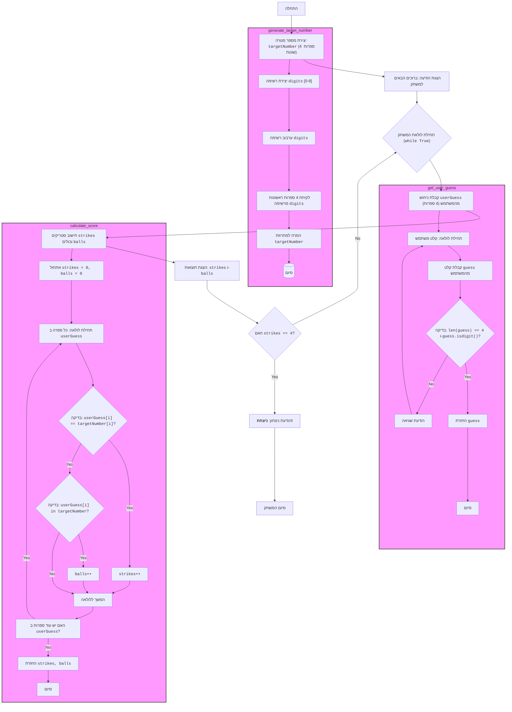
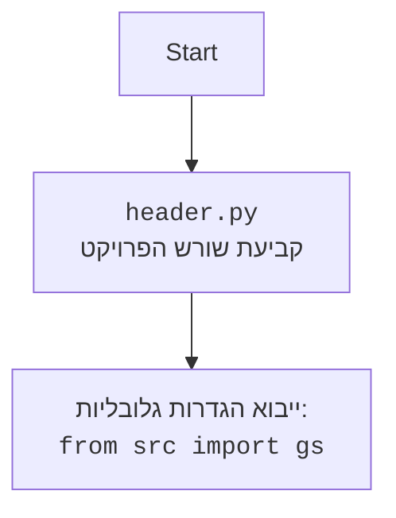

## <algorithm>
1. **התחלה:**
   - המשחק מתחיל בנקודת כניסה (`if __name__ == "__main__":`).
   - לדוגמה: `play_baseball()` נקראת.

2. **יצירת מספר מטרה:**
   - הפונקציה `generate_target_number()` יוצרת מספר בן 4 ספרות שונות באופן אקראי.
   - לדוגמה: מספר המטרה יכול להיות "1234".
   - קוד:
     ```python
     digits = list(range(10)) # [0, 1, 2, 3, 4, 5, 6, 7, 8, 9]
     random.shuffle(digits)    # לדוגמה: [3, 1, 4, 2, 0, 5, 6, 7, 8, 9]
     target = "".join(map(str, digits[:4])) # לדוגמה: "3142"
     ```
   - נתונים: רשימת ספרות `digits`, רשימה מעורבבת, והמספר הסופי `target`

3. **הודעת פתיחה:**
   - מודפסת הודעת פתיחה למשתמש: "ברוכים הבאים למשחק בייסבול!".
   - מודפסת הודעה נוספת המיידעת שהמחשב בחר מספר אקראי ומבקשת מהמשתמש לנחש.

4. **לולאת ניחושים:**
   - לולאה אינסופית מתחילה (`while True:`), המאפשרת למשתמש לנחש שוב ושוב עד שהוא מנצח.
   - לדוגמה, הפעם הראשונה שהלולאה רצה.

5. **קבלת ניחוש מהמשתמש:**
   - הפונקציה `get_user_guess()` קוראת מהמשתמש ניחוש בן 4 ספרות ומבצעת בדיקה שאכן מדובר ב-4 ספרות.
   - לדוגמה: המשתמש מזין "1234".
   - אם הקלט לא תקין, תתבקש הזנה נוספת.

6. **חישוב תוצאות:**
   - הפונקציה `calculate_score(target, guess)` מחשבת כמה ספרות בניחוש נמצאות במקום הנכון (סטריקים) וכמה ספרות נמצאות במספר המטרה אך לא במקום הנכון (בול).
   - לדוגמה, עבור ניחוש "1243" והמספר מטרה "3142":
     - סטריקים: 1 (הספרה '4' במקום השלישי)
     - בולים: 2 (הספרות '1' ו-'2' קיימות, אך לא במקום הנכון)
   - קוד:
     ```python
     strikes = 0
     balls = 0
     # target = "3142", guess = "1243"
     for i in range(4): # i = 0, 1, 2, 3
        if guess[i] == target[i]: # בדיקה אם מיקום וספרה זהים
            strikes += 1 # strikes = 0+0, 0+0, 0+1, 1+0
        elif guess[i] in target: # בדיקה אם ספרה קיימת אבל לא במיקום
            balls += 1 # balls = 0+1, 1+1, 2+0, 2+0
     # strikes = 1, balls = 2
     ```
   - נתונים: המחרוזות `target` ו-`guess`, המשתנים `strikes` ו-`balls`

7. **הצגת תוצאות:**
   - מספר הסטריקים והבולים מודפס למסך.
   - לדוגמה: "1 סטריקים, 2 בולים"

8. **בדיקת ניצחון:**
   - אם מספר הסטריקים הוא 4, משמע שהמשתמש ניצח.
   - לדוגמה, אחרי ניחוש נכון "3142".
    - מודפסת הודעת ניצחון "ברכות! ניצחת!"
    - הלולאה מסתיימת.

9. **המשך משחק:**
    - אם לא ניצחו, חוזרים ללולאה ומשתמש מזין ניחוש נוסף.

10. **סיום:**
    - כאשר מנצחים המשחק מסתיים.

## <mermaid>


**ניתוח תלויות יבוא:**
- `random`: משמש ליצירת רצף מספרים אקראי לצורך יצירת מספר המטרה.  אין תלות בפרויקט `src` .

**בנוסף**


## <explanation>
**ייבואים (Imports):**
- `import random`: מודול זה משמש ליצירת מספר אקראי לצורך יצירת המספר המטרה במשחק. הוא חלק מספריית הסטנדרט של פייתון ואין לו תלות בחבילות `src`.

**פונקציות (Functions):**
1.  **`generate_target_number()`:**
    -   **פרמטרים:** אין.
    -   **ערך מוחזר:** מחרוזת בת 4 ספרות שונות באופן אקראי.
    -   **מטרה:** מייצרת מספר מטרה למשחק.
    -   **דוגמה לשימוש:**
        ```python
        target = generate_target_number() # target יכול להיות לדוגמה "1234"
        ```
2.  **`get_user_guess()`:**
    -   **פרמטרים:** אין.
    -   **ערך מוחזר:** מחרוזת בת 4 ספרות מהמשתמש.
    -   **מטרה:** מבקשת מהמשתמש להזין ניחוש ומוודאת שהקלט תקין.
    -   **דוגמה לשימוש:**
        ```python
        guess = get_user_guess() # מחכה לקלט מהמשתמש, לדוגמה "1234"
        ```
3.  **`calculate_score(target, guess)`:**
    -   **פרמטרים:**
        -   `target` (מחרוזת): מספר המטרה.
        -   `guess` (מחרוזת): הניחוש של המשתמש.
    -   **ערך מוחזר:** טופל המכיל את מספר הסטריקים והבולים.
    -   **מטרה:** מחשבת כמה סטריקים וכמה בולים יש לניחוש בהשוואה למספר המטרה.
    -   **דוגמה לשימוש:**
        ```python
        target = "1234"
        guess = "1324"
        strikes, balls = calculate_score(target, guess) # strikes יהיה 2 ו balls יהיה 2
        ```
4.  **`play_baseball()`:**
    -   **פרמטרים:** אין.
    -   **ערך מוחזר:** אין.
    -   **מטרה:** מכילה את הלוגיקה הראשית של המשחק, מנהלת את מחזור המשחק ומציגה את התוצאות למשתמש.
    -   **דוגמה לשימוש:**
        ```python
        play_baseball() # יפעיל את משחק הבייסבול
        ```

**משתנים (Variables):**
-   `digits` (רשימה): רשימה של ספרות מ-0 עד 9. משמשת לייצור מספר המטרה.
-   `target_number` (מחרוזת): המספר בן 4 הספרות שנבחר באופן אקראי על ידי המחשב.
-   `user_guess` (מחרוזת): הניחוש של המשתמש כמחרוזת בת 4 ספרות.
-   `strikes` (מספר שלם): מספר הספרות בניחוש הנמצאות במקום הנכון.
-   `balls` (מספר שלם): מספר הספרות בניחוש הקיימות במספר המטרה, אך לא במקום הנכון.

**בעיות אפשריות או תחומים לשיפור:**
-   **קלט שגוי:** הקוד בודק אם הקלט של המשתמש הוא באורך 4 וכולל רק ספרות, אבל לא בודק אם הספרות ייחודיות. ניתן להוסיף בדיקה לוודא שהספרות שהמשתמש הכניס הן שונות.
-   **הודעות שגיאה:** הודעות השגיאה יכולות להיות מפורטות יותר, לדוגמה, להגיד למשתמש שהקלט צריך להיות מורכב מ-4 ספרות שונות.
-   **קוד קריא יותר:** ניתן לשפר את קריאות הקוד על ידי הוספת הערות מפורטות יותר, בעיקר לפונקציה `calculate_score`.
-   **ממשק משתמש:** המשחק הוא טקסטואלי בלבד, אפשר לשקול שימוש בספריה כמו `pygame` ליצירת ממשק משתמש גרפי.

**קשרים עם חלקים אחרים בפרויקט:**
-   אין קשר ישיר עם חלקים אחרים בפרויקט מאחר ואין ייבוא מחבילות `src`.