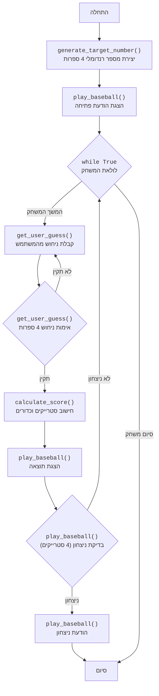

## <algorithm>

1. **התחלה**: תחילת ריצת התוכנית.
   *דוגמה*: הפעלת הסקריפט `basebl.py`.

2. **יצירת מספר מטרה**: פונקציה `generate_target_number` יוצרת מספר בן 4 ספרות, כאשר כל הספרות ייחודיות, באופן רנדומלי.
   *דוגמה*: המספר שנוצר יכול להיות "1234", "9876", "5023" וכו'.

3. **הצגת הודעת פתיחה**: פונקציה `play_baseball` מציגה הודעה המברכת את השחקן ומסבירה את כללי המשחק.
   *דוגמה*: "ברוכים הבאים למשחק בייסבול!" "ניחשתי מספר בן 4 ספרות, נסה לנחש אותו."

4. **לולאת משחק**: מתחיל לולאה אינסופית עד שהמשתמש מנצח.

   4.1. **קבלת ניחוש משתמש**: פונקציה `get_user_guess` מבקשת מהמשתמש להכניס מספר בן 4 ספרות.
       *דוגמה*: המשתמש מזין "1234".

   4.2. **אימות ניחוש**: פונקציה `get_user_guess` בודקת שהניחוש הוא בן 4 ספרות והוא מורכב רק מספרות. אם לא, המערכת מבקשת מהמשתמש להזין קלט מחדש.
       *דוגמה*: אם המשתמש הזין "123", תתקבל הודעת שגיאה ותתבקש הזנה חדשה.

   4.3. **חישוב תוצאה**: פונקציה `calculate_score` מקבלת את מספר המטרה ואת ניחוש המשתמש, ומחזירה את מספר ה"סטרייקים" וה"כדורים".
        *דוגמה*: אם מספר המטרה הוא "1234" וניחוש המשתמש הוא "1245", יהיה 2 סטרייקים (במיקומים 0 ו-1) ו-1 כדור (ספרה 4, במיקום 2).

   4.4. **הצגת תוצאה**: מודפס מספר הסטרייקים והכדורים.
        *דוגמה*: "2 סטרייקים, 1 כדורים".

   4.5. **בדיקת ניצחון**: בודקת האם מספר הסטרייקים שווה 4. אם כן, השחקן ניצח.
       *דוגמה*: אם מספר הסטרייקים הוא 4, המשחק מסתיים בהודעת ניצחון.

   4.6. **סיום משחק**: אם השחקן ניצח, מוצגת הודעת ניצחון, הלולאה נשברת והמשחק מסתיים. אם לא, המשחק ממשיך בלולאה והמשתמש מתבקש להזין ניחוש חדש.
   
5. **סיום**: תוכנית המשחק מסתיימת.

## <mermaid>

## <explanation>

**ייבואים (Imports):**

-   `import random`:  המודול `random` משמש ליצירת מספרים אקראיים. הוא משמש בפונקציה `generate_target_number` כדי לייצר מספר מטרה בן 4 ספרות עם ספרות ייחודיות.

**פונקציות (Functions):**

1.  `generate_target_number()`:
    -   **פרמטרים:** אין.
    -   **ערך מוחזר:** מחרוזת המייצגת מספר בן 4 ספרות עם ספרות ייחודיות.
    -   **מטרה:**  יוצרת מספר אקראי בן 4 ספרות שבו כל הספרות ייחודיות.  
    -   **דוגמה:** `generate_target_number()` יכולה להחזיר `"1234"` או `"9876"`.
    -   **הסבר**: הפונקציה מתחילה ביצירת רשימה של ספרות מ-0 עד 9, מערבבת אותן באופן אקראי, ובוחרת את ארבע הספרות הראשונות, ולאחר מכן מאחדת אותם למחרוזת.

2.  `get_user_guess()`:
    -   **פרמטרים:** אין.
    -   **ערך מוחזר:** מחרוזת המייצגת את הניחוש של המשתמש (מספר בן 4 ספרות).
    -   **מטרה:** מקבלת את קלט המשתמש ומוודאת שהוא מספר תקין בן 4 ספרות.
    -   **דוגמה:** אם המשתמש מזין `"1234"`, הפונקציה תחזיר `"1234"`.
    -   **הסבר**: הפונקציה פועלת בלולאה עד שהמשתמש מזין קלט תקין. היא בודקת שאורך הקלט הוא 4 תווים, ושהוא מכיל רק ספרות.

3.  `calculate_score(target, guess)`:
    -   **פרמטרים:**
        -   `target`: מחרוזת המייצגת את מספר המטרה.
        -  `guess`: מחרוזת המייצגת את ניחוש המשתמש.
    -   **ערך מוחזר:** טאפל המכיל שני מספרים שלמים: מספר הסטרייקים ומספר הכדורים.
    -   **מטרה:** מחשבת כמה סטרייקים וכדורים יש בניחוש המשתמש בהשוואה למספר המטרה.
    -   **דוגמה:** `calculate_score("1234", "1245")` תחזיר `(2, 1)`.
    -   **הסבר**: הפונקציה עוברת על כל ספרה בניחוש, ובודקת האם היא נמצאת באותו מיקום במספר המטרה (סטרייק). אחרת, בודקת האם היא קיימת במספר המטרה במיקום אחר (כדור).

4.  `play_baseball()`:
    -   **פרמטרים:** אין.
    -   **ערך מוחזר:** אין.
    -   **מטרה:** פונקציית הליבה של המשחק, מתאמת בין קבלת קלט מהמשתמש, חישוב התוצאה, והצגתה למשתמש.
    -   **הסבר**: הפונקציה מתחילה ביצירת מספר מטרה, מציגה הודעות פתיחה. לאחר מכן, היא נכנסת ללולאה אינסופית בה היא מבקשת מהמשתמש ניחוש, מחשבת את התוצאה ומדפיסה אותה. במידה וניצח, מודפסת הודעת ניצחון, הלולאה מסתיימת והמשחק נגמר.
    
**משתנים (Variables):**

-   `digits`: רשימה המכילה את הספרות מ-0 עד 9, המשמשת ליצירת המספר האקראי.
-   `target_number`: מחרוזת המכילה את מספר המטרה, שנוצרה ע"י `generate_target_number`.
-   `guess`: מחרוזת המייצגת את ניחוש המשתמש.
-   `strikes`: משתנה שלם הסופר כמה ספרות נמצאות בניחוש באותו המיקום במספר המטרה.
-   `balls`: משתנה שלם הסופר כמה ספרות נמצאות בניחוש במספר המטרה, אך במיקום אחר.

**בעיות אפשריות או תחומים לשיפור:**

-   **קלט לא תקין:**  הקוד מטפל במקרה שבו המשתמש לא מכניס 4 ספרות, אך אין טיפול בקלט שהוא לא מספר (למשל, אותיות). אפשר לשפר את הקוד כך שיבדוק שהקלט הוא מספר שלם בן 4 ספרות, וידחה קלט לא תקין.
-  **ממשק משתמש:** ממשק המשתמש הוא מאוד בסיסי. אפשר לשפר את הממשק על ידי הצגת היסטוריית הניחושים, או מתן יותר פידבק למשתמש.
-   **מניעת רמאות:** אם המשתמש מזין קלט שהוא אינו מספר בעל 4 ספרות, או אם הוא מנסה להזין קלט שאינו מספר, או שהוא מנסה להזין יותר מדי ניחושים, אפשר להוסיף מגבלה על כמות הניחושים או טיפול נוסף בכניסות לא תקינות.

**שרשרת קשרים עם חלקים אחרים בפרויקט:**

הקוד הזה הוא משחק עצמאי ואינו תלוי בחלקים אחרים בפרויקט.