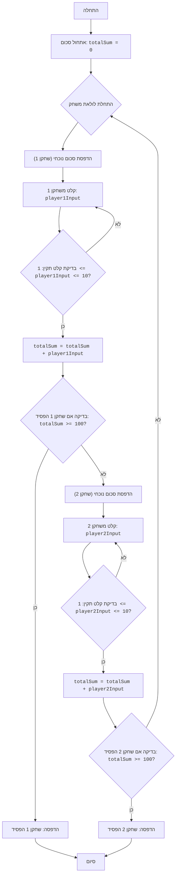

## <algorithm>
1. **אתחול סכום:**
   - משתנה `totalSum` מאותחל ל-0.
   - דוגמה: `totalSum = 0`.

2. **תחילת לולאת משחק:**
   - לולאה אינסופית `while True` מתחילה את המשחק.

3. **תור השחקן הראשון:**
   - הדפסת הסכום הנוכחי באמצעות `print(f"Текущая сумма: {totalSum}")`.
   - לולאה פנימית מתחילה לקבל קלט מהשחקן הראשון.
   - בקשת קלט מהשחקן הראשון (`player1Input = int(input("Игрок 1, введите число от 1 до 10: "))`).
     - דוגמה: אם שחקן 1 מזין '5', אז `player1Input` שווה 5.
   - בדיקת תקינות הקלט:
     - בדיקה שהקלט הוא בין 1 ל-10.
     - אם הקלט תקין, יוצאים מהלולאה הפנימית.
     - אם הקלט לא תקין, מדפיסים הודעה וחוזרים לראש הלולאה הפנימית.
        - דוגמה: אם שחקן 1 מזין '12', הוא יקבל הודעה ויצטרך להזין קלט חדש.
        - דוגמה: אם שחקן 1 מזין 'a', הוא יקבל הודעה ויצטרך להזין קלט חדש.
   - עדכון הסכום הכולל: `totalSum += player1Input`.
     - דוגמה: אם `totalSum` היה 20, ואז `player1Input` הוא 5, אז `totalSum` יהיה 25.
   - בדיקה אם השחקן הראשון הפסיד:
     - אם `totalSum` גדול או שווה ל-100, מודפסת הודעה "Игрок 1 проиграл!" והמשחק מסתיים.
     - דוגמה: אם `totalSum` הוא 105, אז שחקן 1 מפסיד.

4. **תור השחקן השני:**
    - הדפסת הסכום הנוכחי באמצעות `print(f"Текущая сумма: {totalSum}")`.
    - לולאה פנימית מתחילה לקבל קלט מהשחקן השני.
    - בקשת קלט מהשחקן השני (`player2Input = int(input("Игрок 2, введите число от 1 до 10: "))`).
       - דוגמה: אם שחקן 2 מזין '8', אז `player2Input` שווה 8.
    - בדיקת תקינות הקלט:
     - בדיקה שהקלט הוא בין 1 ל-10.
     - אם הקלט תקין, יוצאים מהלולאה הפנימית.
     - אם הקלט לא תקין, מדפיסים הודעה וחוזרים לראש הלולאה הפנימית.
        - דוגמה: אם שחקן 2 מזין '0', הוא יקבל הודעה ויצטרך להזין קלט חדש.
        - דוגמה: אם שחקן 2 מזין 'b', הוא יקבל הודעה ויצטרך להזין קלט חדש.
    - עדכון הסכום הכולל: `totalSum += player2Input`.
      - דוגמה: אם `totalSum` היה 25, ואז `player2Input` הוא 8, אז `totalSum` יהיה 33.
    - בדיקה אם השחקן השני הפסיד:
     - אם `totalSum` גדול או שווה ל-100, מודפסת הודעה "Игрок 2 проиграл!" והמשחק מסתיים.
       - דוגמה: אם `totalSum` הוא 102, אז שחקן 2 מפסיד.

5. **חזרה ללולאת המשחק:**
   - אם אף שחקן לא הפסיד, הלולאה חוזרת לשלב 3.

## <mermaid>

**ניתוח תלויות:**
- אין תלויות מיובאות בקוד הזה.
- הקוד משתמש בפונקציות מובנות של פייתון (`print`, `input`, `int`).

## <explanation>
**ייבואים (Imports):**

- אין ייבואות בקוד זה. הקוד משתמש בפונקציות מובנות של פייתון.

**מחלקות (Classes):**

- אין מחלקות בקוד זה.

**פונקציות (Functions):**

- אין פונקציות המוגדרות על ידי המשתמש בקוד הזה.

**משתנים (Variables):**
- `totalSum`: משתנה מסוג `int` המייצג את הסכום הכולל במשחק. מאותחל ל-0 בתחילת המשחק ומעודכן בכל תור של שחקן.
- `player1Input`: משתנה מסוג `int` המייצג את הקלט שניתן על ידי השחקן הראשון. הוא מקבל ערך לאחר בקשת קלט מהמשתמש.
- `player2Input`: משתנה מסוג `int` המייצג את הקלט שניתן על ידי השחקן השני. הוא מקבל ערך לאחר בקשת קלט מהמשתמש.

**הסברים מפורטים:**

1. **אתחול:**
   - `totalSum = 0`: משתנה `totalSum` מוגדר ושווה ל-0, הוא ישמש לחישוב הסכום הכולל במשחק.

2. **לולאת המשחק:**
   - `while True`: לולאה אינסופית שממשיכה עד שאחד השחקנים מגיע ל-100 או יותר ומפסיד.
   - הפקודה `break` משמשת ליציאה מהלולאה כאשר אחד השחקנים מפסיד.

3. **תור השחקן הראשון:**
   - `print(f"Текущая сумма: {totalSum}")`: מציג את הסכום הנוכחי של המשחק.
   - לולאת `while True` פנימית: מבקשת קלט מהשחקן הראשון ומבצעת בדיקת תקינות.
        - `try...except ValueError`: מטפל בשגיאות קלט. אם השחקן מזין לא מספר, הוא יתבקש להזין שוב מספר תקין.
   - `player1Input = int(input(...))`: מבקש מהשחקן הראשון להזין מספר בין 1 ל-10.
   - `if 1 <= player1Input <= 10`: בודק שהמספר שהשחקן הראשון הזין הוא בתחום המותר. אם כן, הלולאה הפנימית נשברת. אחרת, השחקן יתבקש להזין מספר חדש.
   - `totalSum += player1Input`: מעדכן את `totalSum` על ידי הוספת הקלט של השחקן הראשון.
   - `if totalSum >= 100`: בודק אם השחקן הראשון הפסיד. אם כן, הוא מודפס הודעה שהשחקן הפסיד והלולאה הראשית מסתיימת.

4. **תור השחקן השני:**
     - `print(f"Текущая сумма: {totalSum}")`: מציג את הסכום הנוכחי של המשחק.
   - לולאת `while True` פנימית: מבקשת קלט מהשחקן השני ומבצעת בדיקת תקינות.
        - `try...except ValueError`: מטפל בשגיאות קלט. אם השחקן מזין לא מספר, הוא יתבקש להזין שוב מספר תקין.
   - `player2Input = int(input(...))`: מבקש מהשחקן השני להזין מספר בין 1 ל-10.
   - `if 1 <= player2Input <= 10`: בודק שהמספר שהשחקן השני הזין הוא בתחום המותר. אם כן, הלולאה הפנימית נשברת. אחרת, השחקן יתבקש להזין מספר חדש.
   - `totalSum += player2Input`: מעדכן את `totalSum` על ידי הוספת הקלט של השחקן השני.
   - `if totalSum >= 100`: בודק אם השחקן השני הפסיד. אם כן, הוא מודפס הודעה שהשחקן הפסיד והלולאה הראשית מסתיימת.

**בעיות אפשריות או תחומים לשיפור:**
- הקוד לא מטפל במקרה של תיקו, כלומר, אם אף אחד מהשחקנים לא מגיע ל-100, הלולאה ממשיכה לנצח. ניתן להוסיף תנאי סיום נוסף או להגדיר מספר מקסימלי של סיבובים.
- הקוד לא מציג הודעה על ניצחון. כדאי להוסיף הודעה שאומרת שהשחקן השני ניצח אם הראשון הפסיד ולהפך.

**שרשרת קשרים עם חלקים אחרים בפרויקט:**
- הקוד הוא משחק עצמאי ואין לו קשרים ישירים עם חלקים אחרים בפרויקט.
- ניתן לראות בו כחלק מתיקיית משחקי AI, אך אין בו תלות הדדית עם שאר המשחקים.