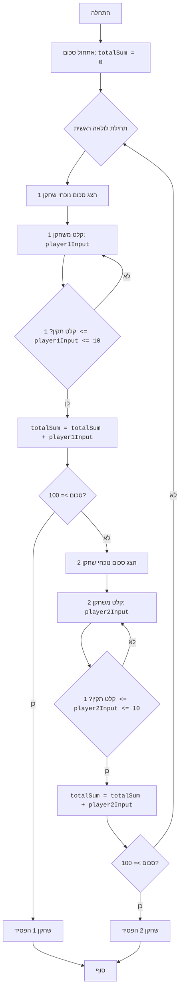

## <algorithm>

1. **אתחול סכום:**
   - מתחילים עם סכום משותף (`totalSum`) השווה ל-0.
   - דוגמה: `totalSum = 0`

2. **תחילת לולאה ראשית:**
   - מתחילים לולאה אינסופית (`while True`), אשר תרוץ עד שאחד השחקנים יפסיד.

3. **תור שחקן 1:**
   - מציגים את הסכום הנוכחי: `print(f"Текущая сумма: {totalSum}")`.
     - לדוגמה, אם `totalSum` הוא 35, הפלט יהיה: "Текущая сумма: 35"
   - **לולאת קליטת קלט שחקן 1:**
     - מתחילים לולאת `while True` כדי להבטיח קלט תקין.
     - מנסים לקלוט מספר שלם בין 1 ל-10.
       - דוגמה: משתמש מזין את הערך 5.
     - בודקים אם הקלט תקין: `if 1 <= player1Input <= 10:`.
       - אם תקין, יוצאים מהלולאה הפנימית.
       - אם לא תקין, מבקשים קלט נוסף.
       - דוגמה: אם המשתמש הכניס 12 או 'abc' תודפס הודעה מתאימה.
   - מוסיפים את הקלט לסכום הכולל: `totalSum += player1Input`.
     - דוגמה: אם `totalSum` היה 35 והקלט הוא 5, אז `totalSum` יהפוך ל-40.
   - בודקים האם סכום עבר את 100: `if totalSum >= 100:`.
     - אם כן, מודיעים ששחקן 1 הפסיד ומסיימים את המשחק עם `break`.
       - דוגמה: אם `totalSum` הוא 102, ההודעה "Игрок 1 проиграл!" תודפס והמשחק יסתיים.

4. **תור שחקן 2:**
   - מציגים את הסכום הנוכחי: `print(f"Текущая сумма: {totalSum}")`.
     - לדוגמה, אם `totalSum` הוא 40, הפלט יהיה: "Текущая сумма: 40"
   - **לולאת קליטת קלט שחקן 2:**
     - מתחילים לולאת `while True` כדי להבטיח קלט תקין.
     - מנסים לקלוט מספר שלם בין 1 ל-10.
       - דוגמה: משתמש מזין את הערך 8.
     - בודקים אם הקלט תקין: `if 1 <= player2Input <= 10:`.
       - אם תקין, יוצאים מהלולאה הפנימית.
       - אם לא תקין, מבקשים קלט נוסף.
         -דוגמה: אם המשתמש הכניס 0 או 'a' תודפס הודעה מתאימה.
   - מוסיפים את הקלט לסכום הכולל: `totalSum += player2Input`.
     - דוגמה: אם `totalSum` היה 40 והקלט הוא 8, אז `totalSum` יהפוך ל-48.
   - בודקים האם סכום עבר את 100: `if totalSum >= 100:`.
     - אם כן, מודיעים ששחקן 2 הפסיד ומסיימים את המשחק עם `break`.
       - דוגמה: אם `totalSum` הוא 101, ההודעה "Игрок 2 проиграл!" תודפס והמשחק יסתיים.

5. **חזרה ללולאה הראשית:**
   - אם אף שחקן לא הפסיד, הלולאה הראשית ממשיכה וחוזרת לתורו של שחקן 1.

## <mermaid>

## <explanation>

**ייבואים (Imports):**

- אין ייבוא בסקריפט הזה. הקוד משתמש בפונקציות מובנות של פייתון בלבד.

**משתנים (Variables):**
- `totalSum`: משתנה מסוג מספר שלם (int), המייצג את הסכום המצטבר במהלך המשחק. הוא מאותחל ל-0 בתחילת המשחק.
- `player1Input`: משתנה מסוג מספר שלם (int), המקבל את הקלט של שחקן 1.
- `player2Input`: משתנה מסוג מספר שלם (int), המקבל את הקלט של שחקן 2.

**פונקציות (Functions):**

- **פונקציות מובנות:**
    - `print()`: משמשת להדפסת טקסט לקונסולה, כולל הודעות מצב, הודעות שגיאה ופלט המשחק.
    - `input()`: משמשת לקבלת קלט מהמשתמש.
    - `int()`: משמשת להמרת מחרוזת (קלט מהמשתמש) למספר שלם.
-   הקוד אינו כולל פונקציות מוגדרות על ידי המשתמש.

**הסברים נוספים:**

1.  **אתחול משחק:**
    - `totalSum = 0`: אתחול הסכום הכולל של המשחק.

2.  **לולאת המשחק:**
    - `while True`: לולאה אינסופית המאפשרת את המשחק עד שאחד השחקנים מפסיד.

3.  **תור שחקן 1:**
    - הדפסת הסכום הנוכחי.
    - לולאת קלט עם בדיקה:
        - `try...except ValueError`: טיפול בשגיאות קלט.
        - קליטת מספר בין 1 ל-10 משחקן 1.
        - בדיקה שהקלט הוא בין 1 ל-10.
    - הוספת הקלט לסכום הכולל.
    - בדיקה אם שחקן 1 הפסיד.
        - אם כן, הודעה על הפסד וסיום הלולאה.

4.  **תור שחקן 2:**
    - הדפסת הסכום הנוכחי.
    - לולאת קלט עם בדיקה:
        - `try...except ValueError`: טיפול בשגיאות קלט.
        - קליטת מספר בין 1 ל-10 משחקן 2.
        - בדיקה שהקלט הוא בין 1 ל-10.
    - הוספת הקלט לסכום הכולל.
    - בדיקה אם שחקן 2 הפסיד.
        - אם כן, הודעה על הפסד וסיום הלולאה.

5.  **סיום משחק:**
    - כאשר אחד השחקנים מגיע או עובר את סכום 100, הלולאה מסתיימת והמשחק נגמר.

**בעיות אפשריות ותחומים לשיפור:**

1.  **אימות קלט:** הקוד מטפל בשגיאות קלט של ערכים לא שלמים, אך ניתן להוסיף טיפול טוב יותר בקלט לא מספרי או חורג מהטווח.
2.  **הודעות שגיאה:** הודעות השגיאה יכולות להיות יותר ידידותיות למשתמש.
3.  **קוד משוכפל:** הקוד עבור שחקן 1 ושחקן 2 כמעט זהה, וניתן לצמצם את כפילות הקוד באמצעות פונקציה.
4.  **הפרדה בין לוגיקה ומשחק:** הקוד מערבב בין לוגיקת המשחק לבין ממשק המשתמש. ניתן להפריד בין השניים לטובת קריאות ושימוש חוזר.
5.  **אין אפשרות לשחק שוב:** לאחר סיום המשחק, אין אפשרות לשחק שוב מבלי להריץ את הסקריפט מחדש.

**שרשרת קשרים עם חלקים אחרים בפרויקט:**
-   הקוד עומד בפני עצמו ואינו תלוי בחלקים אחרים בפרויקט, אך ניתן לשלב אותו עם ממשק משתמש גרפי או ממשק אינטרנטי לשיפור חוויית המשתמש.