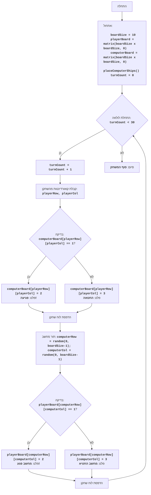

# ניתוח קוד: משחק "קרב"

## 1. <algorithm>

### תרשים זרימה של האלגוריתם:

1.  **התחלה:**
    *   הגדרת גודל לוח המשחק (`BOARD_SIZE = 10`).
    *   יצירת לוח משחק לשחקן ולמחשב כלוחות דו-ממדיים מלאים באפסים (תאים ריקים). לדוגמה:
        ```
        player_board = [[0, 0, 0, 0, 0, 0, 0, 0, 0, 0],
                        [0, 0, 0, 0, 0, 0, 0, 0, 0, 0],
                        [0, 0, 0, 0, 0, 0, 0, 0, 0, 0],
                        [0, 0, 0, 0, 0, 0, 0, 0, 0, 0],
                        [0, 0, 0, 0, 0, 0, 0, 0, 0, 0],
                        [0, 0, 0, 0, 0, 0, 0, 0, 0, 0],
                        [0, 0, 0, 0, 0, 0, 0, 0, 0, 0],
                        [0, 0, 0, 0, 0, 0, 0, 0, 0, 0],
                        [0, 0, 0, 0, 0, 0, 0, 0, 0, 0],
                        [0, 0, 0, 0, 0, 0, 0, 0, 0, 0]]
        ```
    *   הצבת 5 ספינות מחשב באופן אקראי בלוח המחשב. כל ספינה תופסת תא אחד.
    *   איפוס מונה הסיבובים (`turn_count = 0`).

2.  **לולאת משחק (עד 30 סיבובים):**
    *   הגדלת מונה הסיבובים ב-1.
    *   **תור השחקן:**
        *   קבלת קואורדינטות ירי מהשחקן (שורה ועמודה) בצורה של קלט מהמשתמש.
        *   בדיקה האם הקואורדינטות שצוינו פגעו בספינה של המחשב (ערך 1).
        *   אם פגיעה:
            *   החלפת הערך בלוח המחשב מ-1 ל-2 (פגיעה).
            *   הדפסת הודעה "HIT!".
        *   אם לא פגיעה:
            *   החלפת הערך בלוח המחשב מ-0 ל-3 (החטאה).
            *   הדפסת הודעה "MISS!".
        *   הדפסת לוח המשחק של השחקן עם סימני פגיעה/החטאה.

    *   **תור המחשב:**
        *   בחירת קואורדינטות ירי באופן אקראי.
        *   בדיקה האם הקואורדינטות שצוינו פגעו בספינה של השחקן (ערך 1).
        *   אם פגיעה:
            *   החלפת הערך בלוח השחקן מ-1 ל-2 (פגיעה).
            *   הדפסת הודעה "COMPUTER HITS!".
        *   אם לא פגיעה:
            *   החלפת הערך בלוח השחקן מ-0 ל-3 (החטאה).
            *   הדפסת הודעה "COMPUTER MISSES".
        *   הדפסת לוח המשחק של השחקן עם סימני פגיעה/החטאה.

3.  **סוף משחק:**
    *   הדפסת הודעה "END OF GAME".

### זרימת נתונים:

*   הפונקציה `play_battle()` משתמשת ב:
    *   `create_board()` כדי ליצור לוחות משחק.
    *   `place_computer_ships()` כדי למקם ספינות מחשב באופן אקראי.
    *   `display_board()` כדי להציג את הלוחות למשתמש.
    *   `random.randint()` כדי ליצור קואורדינטות אקראיות לתור המחשב.
*   נתונים מועברים מהקלט של המשתמש לתוך משתני `player_row`, `player_col`.
*   נתונים מלוחות המשחק (`player_board`, `computer_board`) מעודכנים בזמן המשחק ומוצגים על המסך.

## 2. <mermaid>



**הסבר:**

*   **Start**: תחילת ריצת התוכנית.
*   **InitializeGame**: פעולת אתחול המשחק.
    *   `boardSize` - קבוע המגדיר את גודל לוח המשחק.
    *   `playerBoard` - לוח המשחק של השחקן, מאותחל לאפסים.
    *   `computerBoard` - לוח המשחק של המחשב, מאותחל לאפסים.
    *   `placeComputerShips()` - פונקציה הממלאת את `computerBoard` עם ספינות מחשב.
    *   `turnCount` - מונה מספר הסיבובים במשחק, מתחיל מאפס.
*   **GameLoopStart**: תחילת הלולאה הראשית של המשחק. כל עוד `turnCount` קטן מ-30, המשחק ממשיך.
*   **IncreaseTurnCount**: הגדלת מונה הסיבובים.
*   **PlayerInput**: קבלת קואורדינטות מהשחקן באמצעות קלט מהמשתמש (`playerRow`, `playerCol`).
*   **CheckPlayerHit**: בדיקה אם פגיעה של השחקן בלוח המחשב.
*   **PlayerHit**: פעולה המתבצעת אם יש פגיעה של השחקן. עדכון לוח המחשב והדפסת הודעה "פגיעה!".
*   **PlayerMiss**: פעולה המתבצעת אם אין פגיעה של השחקן. עדכון לוח המחשב והדפסת הודעה "החטאה".
*   **PrintPlayerBoard**: הדפסת לוח המשחק של השחקן למסך.
*   **ComputerTurn**: תור המחשב, בוחר קואורדינטות ירי באופן אקראי (`computerRow`, `computerCol`).
*   **CheckComputerHit**: בדיקה אם פגיעה של המחשב בלוח השחקן.
*   **ComputerHit**: פעולה המתבצעת אם יש פגיעה של המחשב. עדכון לוח השחקן והדפסת הודעה "מחשב פגע!".
*   **ComputerMiss**: פעולה המתבצעת אם אין פגיעה של המחשב. עדכון לוח השחקן והדפסת הודעה "מחשב החטיא".
*   **PrintPlayerBoard2**: הדפסת לוח המשחק של השחקן למסך.
*   **End**: סיום המשחק והדפסת הודעה "סוף המשחק".

**ייבוא תלויות:**

אין תלויות מיוחדות מלבד המודול המובנה `random`, המשמש ליצירת מספרים אקראיים לצורך מיקום ספינות המחשב ובחירת קואורדינטות הירי שלו.

## 3. <explanation>

### ייבואים (Imports)

*   `import random`: מייבא את המודול `random`, המספק פונקציות ליצירת מספרים פסאודו-אקראיים. משמש למיקום ספינות המחשב ולבחירת קואורדינטות הירי של המחשב.

### מחלקות (Classes)

אין בקוד מחלקות. הקוד בנוי מפונקציות בלבד.

### פונקציות (Functions)

1.  `create_board(size)`:
    *   **פרמטר:** `size` (int) - גודל הלוח הרצוי (מספר השורות/עמודות).
    *   **ערך מוחזר:** רשימה דו-ממדית (לוח) מלאה באפסים.
    *   **מטרה:** יוצרת לוח משחק בגודל שצוין, מאותחל לאפסים.
    *   **דוגמה:** `create_board(10)` תחזיר לוח 10x10 מלא באפסים.

2.  `place_computer_ships(board)`:
    *   **פרמטר:** `board` (list) - לוח המשחק של המחשב.
    *   **ערך מוחזר:** אין (הלוח משתנה ישירות).
    *   **מטרה:** ממקמת 5 ספינות בגודל 1 באופן אקראי על לוח המחשב.
    *   **דוגמה:** אם `board` הוא לוח ריק, לאחר ההפעלה הוא יכיל 5 תאים שונים עם הערך 1 (ספינה).
    *   **הסבר:** הפונקציה בוחרת תאים באופן אקראי וממקמת ספינה (הערך 1) כל עוד לא הונחו 5 ספינות.

3.  `display_board(board, is_computer=False)`:
    *   **פרמטרים:**
        *   `board` (list) - לוח המשחק להצגה.
        *   `is_computer` (bool) - דגל המציין אם להסתיר את ספינות המחשב (ברירת מחדל `False`).
    *   **ערך מוחזר:** אין (מדפיסה לוח לקונסול).
    *   **מטרה:** מציגה את לוח המשחק למשתמש. ספינות המחשב מוסתרות אם `is_computer` הוא `True`.
    *   **דוגמה:**
        *   `display_board(player_board)` תציג את לוח השחקן עם "O" (ריק), "X" (פגיעה) ו"-" (החטאה).
        *   `display_board(computer_board, True)` תציג את לוח המחשב כאשר הספינות מסומנות ב-* , "O" (ריק), "X" (פגיעה) ו"-" (החטאה).

4.  `play_battle()`:
    *   **פרמטרים:** אין.
    *   **ערך מוחזר:** אין.
    *   **מטרה:** פונקציה ראשית המבצעת את כל לוגיקת המשחק, כולל אתחול, קבלת קלט מהמשתמש, תורות השחקן והמחשב, והצגת תוצאות.
    *   **הסבר:** פונקציה זו מכילה את הלולאה הראשית של המשחק, המבצעת עד 30 סיבובים, ומנהלת את זרימת המשחק, כולל את תורות השחקן והמחשב.

### משתנים (Variables)

*   `BOARD_SIZE` (int): גודל לוח המשחק (קבוע).
*   `player_board` (list): רשימה דו-ממדית המייצגת את לוח המשחק של השחקן.
*   `computer_board` (list): רשימה דו-ממדית המייצגת את לוח המשחק של המחשב.
*   `turn_count` (int): מונה את מספר הסיבובים במשחק.
*   `player_row`, `player_col` (int): קואורדינטות השורה והעמודה שהשחקן בחר לירי.
*   `computer_row`, `computer_col` (int): קואורדינטות השורה והעמודה שהמחשב בחר לירי.

### בעיות אפשריות ותחומים לשיפור

1.  **גודל ספינות:** כרגע הספינות הן בגודל 1 בלבד. ניתן להרחיב את המשחק לתמוך בספינות בגדלים שונים.
2.  **מיקום ספינות השחקן:** השחקן לא יכול למקם את הספינות שלו.
3.  **סיום משחק:** המשחק מסתיים לאחר 30 סיבובים ללא בדיקה אם אחד השחקנים ניצח. יש להוסיף לוגיקה לבדיקת ניצחון על ידי השמדת כל ספינות היריב.
4.  **אימות קלט:** אימות הקלט של השחקן מוגבל לבדיקה שהקואורדינטות הן בטווח הלוח. יש להוסיף בדיקות נוספות, למשל, לבדוק אם השחקן לא ירה כבר בתא זה.
5.  **הצגת לוח המחשב:** כרגע, השחקן לא יכול לראות את לוח המחשב, גם לא את ההחטאות/פגיעות. אפשר להוסיף אפשרות להציג חלק מלוח המחשב (במיוחד את הפגיעות וההחטאות).

### שרשרת קשרים עם חלקים אחרים בפרויקט

אין קשרים ישירים לחלקים אחרים בפרויקט זה. קוד זה הוא עצמאי ומגדיר את כל הנדרש למשחק.

אך ניתן לומר שהקוד שייך ל"משחקים בסיסיים" והוא יכול לשמש כדוגמה ליישום של משחק לוח פשוט. ניתן לראות איך המודול `random` יכול לשמש במשחקים שונים.