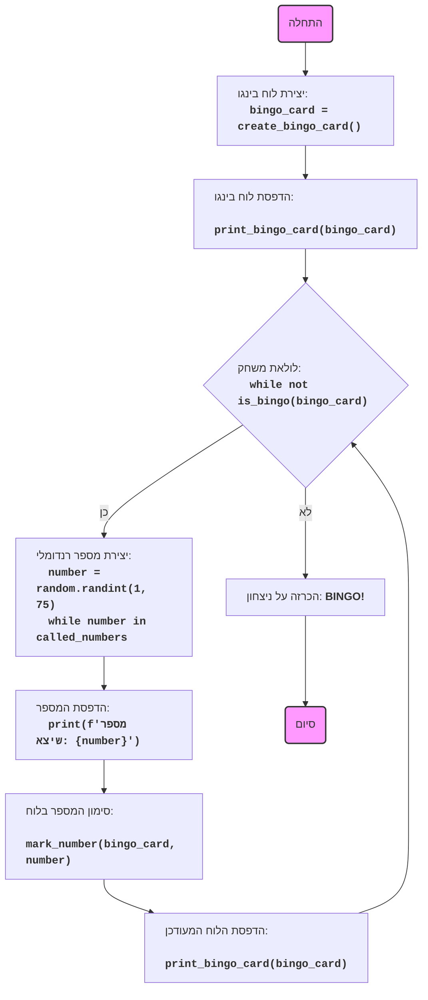

## ניתוח קוד: משחק בינגו

### 1. <algorithm>

**תרשים זרימה של הקוד:**

1.  **התחלה:**
    *   התחלת המשחק.
2.  **יצירת לוח בינגו:**
    *   פונקציה `create_bingo_card()` יוצרת לוח בינגו 5x5.
    *   דוגמה:
        *   יוצרת רשימה של מספרים מ-1 עד 75 (לא כולל כפולות של 10).
        *   מערבבת את הרשימה.
        *   ממלאת את הלוח עם 5 שורות ו-5 עמודות מהרשימה המעורבבת.
    *   דוגמה: `[[1, 2, 3, 4, 5], [6, 7, 8, 9, 11], [12, 13, 14, 15, 16], [17, 18, 19, 21, 22], [23, 24, 25, 26, 27]]`
3.  **הדפסת לוח הבינגו:**
    *   פונקציה `print_bingo_card(card)` מדפיסה את הלוח לקונסולה.
    *   דוגמה: הדפסה של המטריצה בצורה נוחה למשתמש.
4.  **לולאה ראשית של המשחק (כל עוד אין בינגו):**
    *   `while not is_bingo(bingo_card)`: הלולאה ממשיכה עד שכל המספרים על הלוח סומנו.
    *   דוגמה: הלולאה מתחילה כאשר לפחות מספר אחד בלוח לא סומן (לא 0).
5.  **בחירת מספר רנדומלי:**
    *   פונקציה `random.randint(1, 75)` בוחרת מספר רנדומלי בין 1 ל-75.
        *   מוודאים שהמספר לא נבחר בעבר על ידי בדיקה בסט `called_numbers`.
    *   דוגמה: בוחרים מספר 23.
6.  **הדפסת המספר שנבחר:**
    *   מדפיסים את המספר שנבחר למשתמש.
        *   דוגמה: "המספר שיצא הוא: 23".
7.  **סימון המספר על הלוח:**
    *   פונקציה `mark_number(bingo_card, number)` מסמנת את המספר על הלוח על ידי החלפתו ב-0.
    *   דוגמה: אם 23 נמצא בלוח, הוא מוחלף ב-0.
8.  **הדפסת לוח מעודכן:**
    *   פונקציה `print_bingo_card(card)` מדפיסה את הלוח המעודכן לקונסולה.
    *   דוגמה: הצגת הלוח עם הסימון החדש.
9.  **בדיקה אם יש בינגו:**
    *   פונקציה `is_bingo(card)` בודקת אם כל המספרים בלוח הם 0.
    *   אם כן, המשחק נגמר.
    *   אם לא, חוזרים לשלב 4.
10. **הכרזה על ניצחון:**
     *   הדפסת ההודעה "BINGO!".
11. **סיום:**
    *   סיום המשחק.

**זרימת נתונים:**

*   `create_bingo_card()`: יוצרת לוח בינגו (רשימה של רשימות) ומחזירה אותו.
*   `print_bingo_card(card)`: מקבלת לוח בינגו ומדפיסה אותו.
*   `mark_number(card, number)`: מקבלת לוח בינגו ומספר, ומסמנת את המספר בלוח.
*   `is_bingo(card)`: מקבלת לוח בינגו ומחזירה `True` אם יש בינגו, אחרת `False`.
*   `play_bingo()`: משתמשת בכל הפונקציות האלה כדי לנהל את המשחק.

### 2. <mermaid>

**הסבר על התלויות המיובאות:**

*   `import random`: מייבאת את מודול `random` של פייתון, המאפשר יצירת מספרים רנדומליים, שימוש מרכזי במשחק.

### 3. <explanation>

**ייבואים (Imports):**

*   `import random`: מודול זה משמש ליצירת מספרים רנדומליים. הוא משמש בפונקציות `create_bingo_card()` (כדי לערבב את רשימת המספרים), ו `play_bingo()` (כדי לבחור מספרים אקראיים למשחק).

**פונקציות (Functions):**

*   **`create_bingo_card()`**:
    *   **פרמטרים:** אין.
    *   **ערך מוחזר:** רשימה של רשימות (לוח בינגו 5x5).
    *   **מטרה:** ליצור לוח בינגו עם מספרים ייחודיים מ-1 עד 75 (לא כולל כפולות של 10) באופן אקראי.
    *   **דוגמה לשימוש:** `card = create_bingo_card()` תיצור לוח בינגו חדש.
*   **`print_bingo_card(card)`**:
    *   **פרמטרים:** `card` - רשימה של רשימות (לוח בינגו).
    *   **ערך מוחזר:** אין.
    *   **מטרה:** להדפיס את לוח הבינגו לקונסולה בצורה קריאה.
    *   **דוגמה לשימוש:** `print_bingo_card(my_card)` תדפיס את לוח הבינגו `my_card`.
*   **`mark_number(card, number)`**:
    *   **פרמטרים:**
        *   `card` - רשימה של רשימות (לוח בינגו).
        *   `number` - המספר שיש לסמן בלוח.
    *   **ערך מוחזר:** אין.
    *   **מטרה:** לסמן מספר ספציפי בלוח הבינגו על ידי החלפתו ב-0.
    *   **דוגמה לשימוש:** `mark_number(my_card, 23)` תסמן את המספר 23 בלוח `my_card` אם הוא קיים.
*   **`is_bingo(card)`**:
    *   **פרמטרים:** `card` - רשימה של רשימות (לוח בינגו).
    *   **ערך מוחזר:** `True` אם כל המספרים בלוח סומנו, אחרת `False`.
    *   **מטרה:** לבדוק אם המשחק הסתיים (כל המספרים סומנו).
    *   **דוגמה לשימוש:** `if is_bingo(my_card): print("BINGO!")`.
*   **`play_bingo()`**:
    *   **פרמטרים:** אין.
    *   **ערך מוחזר:** אין.
    *   **מטרה:** לנהל את המשחק כולו, כולל יצירת הלוח, הדפסתו, קריאת מספרים אקראיים וסימונם, ובדיקה אם הושג בינגו.
    *   **דוגמה לשימוש:** `play_bingo()` תפעיל את המשחק.

**משתנים (Variables):**

*   `card`: רשימה של רשימות המייצגת את לוח הבינגו.
*   `numbers`: רשימה המשמשת ליצירת מספרי הלוח.
*   `row`: רשימה המייצגת שורה אחת בלוח.
*   `number`: מספר אקראי שנבחר במשחק.
*   `called_numbers`: סט המכיל את כל המספרים שכבר נקראו במהלך המשחק.
*   `bingo_card`: לוח בינגו ספציפי שנוצר בתחילת משחק.

**בעיות אפשריות ותחומים לשיפור:**

*   **יצירת מספרים אקראיים:** הקוד משתמש בלולאת `while` כדי להבטיח שלא יחזרו על אותו מספר. זה יכול להיות לא יעיל אם יש הרבה מספרים שכבר נקראו. ניתן לשקול להשתמש בשיטה אחרת להגריל מספרים ייחודיים.
*   **פורמט הדפסה:** אפשר לשפר את פורמט ההדפסה של הלוח כדי להפוך אותו לקריא יותר, למשל על ידי הוספת קווים מפרידים.
*   **קלט מהמשתמש:** כרגע, המשחק רץ אוטומטית ללא קלט מהמשתמש. ניתן לשפר את המשחק על ידי הוספת אפשרות לקבל קלט מהמשתמש כדי להמשיך בכל שלב.

**שרשרת קשרים עם חלקים אחרים בפרויקט:**

הקוד עצמאי ואינו תלוי באופן ישיר בחלקים אחרים בפרויקט. עם זאת, הוא יכול לשמש כחלק ממשחקי AI גדולים יותר.