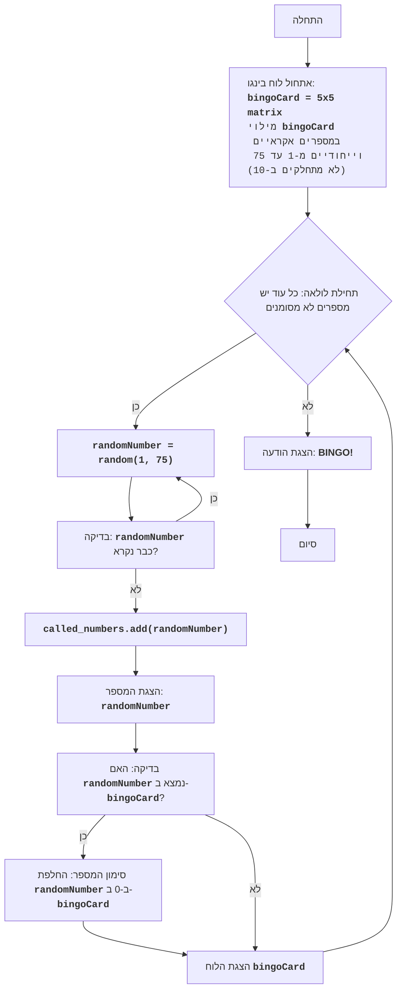

# ניתוח קוד המשחק בינגו

## 1. <algorithm>
להלן תיאור מפורט של תהליך העבודה של קוד משחק הבינגו, בשילוב דוגמאות להמחשה:

1.  **אתחול המשחק:**
    *   מתחילים על ידי יצירת לוח בינגו ריק, המיוצג על ידי מטריצה דו-ממדית בגודל 5x5.
    *   ממלאים את הלוח במספרים אקראיים וייחודיים מ-1 עד 75 (לא כולל מספרים המתחלקים ב-10 כמו 10, 20, 30 וכו').
        *   דוגמא: `bingo_card = [[2, 14, 33, 41, 62], [7, 25, 39, 48, 51], [8, 16, 37, 58, 71], [3, 12, 31, 56, 66], [9, 22, 35, 63, 74]]`

2.  **לולאת משחק:**
    *   המשחק נמשך בלולאה, כל עוד קיימים מספרים לא מסומנים בלוח הבינגו.
    *   בכל איטרציה של הלולאה:
        *   **הגרלת מספר:** מגרילים מספר אקראי מ-1 עד 75.
            *   דוגמא: `random_number = 22`
        *   **הצגת המספר:** המספר האקראי מוצג למשתמש.
        *   **בדיקה בלוח:** מחפשים את המספר בלוח הבינגו.
            *   דוגמא: בודקים אם `22` נמצא בתוך `bingo_card`
        *   **סימון המספר:** אם המספר נמצא בלוח, הוא מוחלף ב-0 (מסומן).
            *   דוגמא: אם המספר 22 נמצא בלוח, הלוח ישתנה ל:
                `bingo_card = [[2, 14, 33, 41, 62], [7, 25, 39, 48, 51], [8, 16, 37, 58, 71], [3, 12, 31, 56, 66], [9, 0, 35, 63, 74]]`
        *   **הצגת הלוח:** הלוח המעודכן מוצג למשתמש.

3.  **סיום המשחק:**
    *   המשחק מסתיים כאשר כל המספרים בלוח הבינגו סומנו (הוחלפו ב-0).
    *   מוצגת הודעת ניצחון "BINGO!".

**זרימת נתונים:**

*   הפונקציה `create_bingo_card()` יוצרת את לוח הבינגו ומחזירה אותו כרשימה של רשימות.
*   הפונקציה `print_bingo_card(card)` מקבלת את לוח הבינגו ומדפיסה אותו לקונסולה.
*   הפונקציה `mark_number(card, number)` מקבלת את הלוח ואת המספר להחלפה, משנה את הלוח ומחזירה אותו.
*   הפונקציה `is_bingo(card)` מקבלת את לוח הבינגו ובודקת האם כל המספרים סומנו, ומחזירה ערך בוליאני.
*   הפונקציה `play_bingo()` משלבת את כל הפונקציות יחד ומבצעת את כל שלבי המשחק.

## 2. <mermaid>



**הסבר לתלויות:**

*   **random:** המודול `random` משמש ליצירת מספרים אקראיים, ערבוב רשימות ומילוי לוח הבינגו במספרים אקראיים. הוא משמש גם להגרלת מספרים במהלך המשחק. המודול `random` הוא חלק מהספרייה הסטנדרטית של פייתון ואינו דורש התקנה נוספת.

## 3. <explanation>

**ייבוא (Imports):**

*   `import random`: מייבא את המודול `random` לפונקציונליות הקשורה ליצירת מספרים אקראיים וערבוב רשימות. מודול זה מסופק על ידי ספריית הפייתון הסטנדרטית.

**פונקציות (Functions):**

*   `create_bingo_card()`:
    *   **פרמטרים:** אין.
    *   **ערך מוחזר:** רשימה של רשימות המייצגת את לוח הבינגו (מטריצה 5x5) עם מספרים אקראיים וייחודיים מ-1 עד 75 (לא כולל מספרים המתחלקים ב-10).
    *   **מטרה:** יוצרת לוח בינגו חדש ומוכן למשחק.
    *   **דוגמה:** קריאה לפונקציה זו מחזירה: `[[2, 14, 33, 41, 62], [7, 25, 39, 48, 51], [8, 16, 37, 58, 71], [3, 12, 31, 56, 66], [9, 22, 35, 63, 74]]`.
*   `print_bingo_card(card)`:
    *   **פרמטרים:** `card` - לוח הבינגו לייצוג.
    *   **ערך מוחזר:** אין (הפונקציה מדפיסה בלבד).
    *   **מטרה:** מדפיסה את לוח הבינגו בצורה נוחה לקריאה במסוף.
    *   **דוגמה:** עבור הלוח `[[2, 14, 33, 41, 62], [7, 25, 39, 48, 51], [8, 16, 37, 58, 71], [3, 12, 31, 56, 66], [9, 22, 35, 63, 74]]`, הפלט יהיה:
        ```
        2 14 33 41 62
        7 25 39 48 51
        8 16 37 58 71
        3 12 31 56 66
        9 22 35 63 74
        ```
*   `mark_number(card, number)`:
    *   **פרמטרים:** `card` - לוח הבינגו, `number` - המספר לסימון.
    *   **ערך מוחזר:** אין (הפונקציה משנה את הלוח ישירות).
    *   **מטרה:** מחליפה את המספר שצוין ב-0 בלוח הבינגו, אם הוא קיים.
    *   **דוגמה:** אם הלוח הוא `[[2, 14, 33, 41, 62], [7, 25, 39, 48, 51], [8, 16, 37, 58, 71], [3, 12, 31, 56, 66], [9, 22, 35, 63, 74]]` והמספר הוא `22`, הלוח ישתנה ל: `[[2, 14, 33, 41, 62], [7, 25, 39, 48, 51], [8, 16, 37, 58, 71], [3, 12, 31, 56, 66], [9, 0, 35, 63, 74]]`
*   `is_bingo(card)`:
    *   **פרמטרים:** `card` - לוח הבינגו לבדיקה.
    *   **ערך מוחזר:** `True` אם כל המספרים בלוח סומנו (הוחלפו ב-0), אחרת `False`.
    *   **מטרה:** בודקת האם המשחק הסתיים.
    *   **דוגמה:** אם הלוח הוא `[[0, 0, 0, 0, 0], [0, 0, 0, 0, 0], [0, 0, 0, 0, 0], [0, 0, 0, 0, 0], [0, 0, 0, 0, 0]]`, הפונקציה תחזיר `True`.
*    `play_bingo()`:
     *   **פרמטרים:** אין.
     *   **ערך מוחזר:** אין.
     *  **מטרה:** מנהלת את מהלך המשחק. יוצרת לוח, מגרילה מספרים, מסמנת אותם בלוח ומציגה אותו. מסיימת את המשחק כאשר כל המספרים מסומנים.

**משתנים (Variables):**

*   `card` (בתוך הפונקציות `create_bingo_card`, `print_bingo_card`, `mark_number`, `is_bingo`): משתנה מסוג רשימה של רשימות המייצג את לוח הבינגו.
*   `numbers` (בתוך `create_bingo_card`): רשימה של מספרים אקראיים וייחודיים שמשמשת למילוי לוח הבינגו.
*  `called_numbers` (בתוך `play_bingo`): סט של מספרים שכבר נקראו במהלך המשחק.
*   `number` (בתוך `mark_number` ו- `play_bingo`): משתנה מספרי המייצג את המספר האקראי שהוגרל או המספר שיש לסמן בלוח.
*   `row` (בתוך `create_bingo_card` ו- `print_bingo_card`): משתנה מסוג רשימה המייצג שורה בלוח הבינגו.
*   `bingo_card` (בתוך `play_bingo`): משתנה המכיל את לוח המשחק.

**בעיות אפשריות ושיפורים:**

*   **בדיקת תקינות קלט:** הקוד לא בודק תקינות של קלט המשתמש.
*   **שיפור ממשק המשתמש:** ממשק המשתמש מוגבל לפלט טקסטואלי במסוף. ניתן לשפר אותו באמצעות ממשק גרפי.
*   **הפרדה בין לוגיקה לתצוגה:** ניתן להפריד את לוגיקת המשחק מהתצוגה לקבלת קוד יותר מודולרי.

**שרשרת קשרים עם חלקים אחרים בפרויקט:**

*   הקוד עצמאי, ואינו תלוי בקבצים אחרים בפרויקט מלבד המודול `random`, שהוא חלק מהספרייה הסטנדרטית של פייתון.