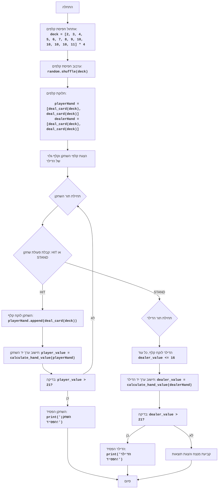
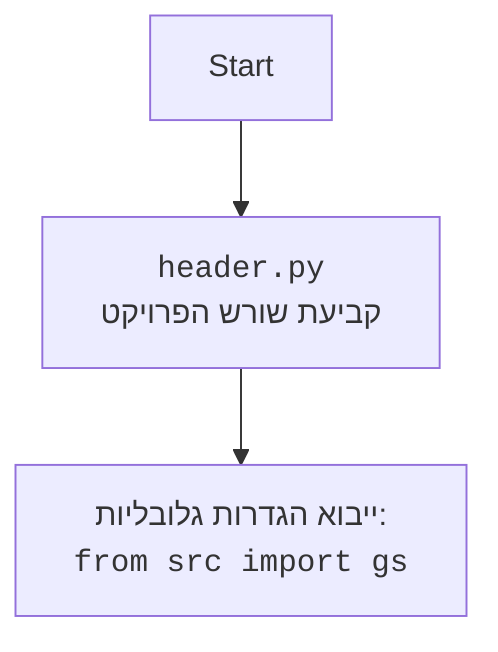

## <algorithm>

1.  **אתחול חפיסת קלפים:**
    *   יוצר רשימה של 52 קלפים, כאשר כל קלף מיוצג על ידי ערכו (2-10, כאשר וולט, דאם ומלך שווים 10, ואס שווה 11).
    *   דוגמה: `deck = [2, 3, 4, 5, 6, 7, 8, 9, 10, 10, 10, 10, 11] * 4`
2.  **ערבוב החפיסה:**
    *   מערבב את סדר הקלפים בחפיסה באופן אקראי.
    *   דוגמה: `random.shuffle(deck)`
3.  **חלוקת קלפים התחלתית:**
    *   מחלק שני קלפים לשחקן ושני קלפים לדילר.
    *   דוגמה: `player_hand = [deal_card(deck), deal_card(deck)]`, `dealer_hand = [deal_card(deck), deal_card(deck)]`
    *   הפונקציה `deal_card` מחזירה את הקלף האחרון מהחפיסה (מורידה אותו מהרשימה).
4.  **הצגת ידיים:**
    *   מציג את קלפי השחקן וקלף אחד של הדילר (השני מוסתר).
    *   דוגמה: `display_cards(player_hand, dealer_hand)`
5.  **תור השחקן:**
    *   השחקן יכול לבחור:
        *   **HIT:** לקחת עוד קלף.
            *   מוסיף קלף ליד השחקן.
            *   דוגמה: `player_hand.append(deal_card(deck))`
            *   מחשב מחדש את סכום הקלפים של השחקן.
            *   אם הסכום גדול מ-21, השחקן מפסיד, ומסתיים התור.
            *   אם השחקן קיבל 21, השחקן מנצח, ומסתיים המשחק.
        *   **STAND:** להפסיק לקחת קלפים.
            *   מעביר את התור לדילר.
    *   הפעולה חוזרת עד שהשחקן בוחר לעצור או שהסכום שלו גדול מ-21.
6.  **תור הדילר:**
    *   הדילר לוקח קלפים עד שסכום קלפיו גדול מ-16.
    *   דוגמה: `while calculate_hand_value(dealer_hand) <= 16:`
    *   אם סכום קלפי הדילר גדול מ-21, הדילר מפסיד והשחקן מנצח.
7.  **קביעת המנצח:**
    *   אם סכום קלפי השחקן גדול מסכום קלפי הדילר ולא עובר את 21, השחקן מנצח.
    *   אם סכום קלפי הדילר גדול מסכום קלפי השחקן ולא עובר את 21, הדילר מנצח.
    *   אם הסכומים שווים, יש תיקו.
    *   מציג את תוצאת המשחק.
8.  **סוף המשחק:**
    *   משחק מסתיים.

## <mermaid>

## <explanation>

**ייבואים (Imports):**

*   `import random`: מייבא את המודול `random`, המאפשר פעולות אקראיות כמו ערבוב חפיסה.

**פונקציות (Functions):**

*   `deal_card(deck)`:
    *   פרמטר: `deck` (רשימת קלפים).
    *   מחזיר: את הקלף האחרון מחפיסת הקלפים (ומוחק אותו מהחפיסה).
    *   מטרה: לוקח קלף מהחפיסה.
    *   דוגמה: `card = deal_card(deck)`
*   `calculate_hand_value(hand)`:
    *   פרמטר: `hand` (רשימת קלפים ביד).
    *   מחזיר: סכום ערך הקלפים ביד, תוך התחשבות בכך שאס יכול להיות 1 או 11.
    *   מטרה: חישוב סכום הנקודות ביד, מתקן את ערך האס במידת הצורך.
    *   דוגמה: `total = calculate_hand_value(player_hand)`
*   `display_cards(player_hand, dealer_hand, show_dealer_full=False)`:
    *   פרמטרים: `player_hand` (יד השחקן), `dealer_hand` (יד הדילר), `show_dealer_full` (דגל בוליאני אם להציג את כל קלפי הדילר).
    *   מחזיר: כלום (הפונקציה מדפיסה לקונסולה).
    *   מטרה: הצגת קלפי השחקן והדילר (אם כי רק קלף אחד של הדילר מוצג בהתחלה).
    *   דוגמה: `display_cards(player_hand, dealer_hand, True)` - מציג את כל הקלפים של הדילר.
*   `play_blackjack()`:
    *   פרמטרים: אין.
    *   מחזיר: כלום (המשחק מודפס לקונסולה).
    *   מטרה: מכיל את הלוגיקה הראשית של משחק הבלאק ג'ק.
    *   דוגמה: `play_blackjack()`

**משתנים (Variables):**

*   `deck`: רשימה המייצגת את חפיסת הקלפים.
*   `player_hand`: רשימה המייצגת את הקלפים ביד השחקן.
*   `dealer_hand`: רשימה המייצגת את הקלפים ביד הדילר.
*   `player_value`: סכום ערך הקלפים ביד השחקן.
*   `dealer_value`: סכום ערך הקלפים ביד הדילר.
*   `action`: קלט מהמשתמש - האם לבחור 'HIT' או 'STAND'.
*   `ace_count` : סופר את מספר האסים ביד.

**בעיות אפשריות ושיפורים:**

*   **ממשק משתמש:** הקוד משתמש בהדפסה לקונסולה, ולא בממשק משתמש גרפי, מה שיכול להגביל את חווית המשתמש.
*   **טיפול בשגיאות:** אין טיפול מפורש בשגיאות קלט (למשל, אם המשתמש מזין משהו שאינו 'HIT' או 'STAND').
*   **הערות קוד:** קיימות הערות קוד, אך ניתן להוסיף הערות נוספות להסבר מפורט יותר של לוגיקת הקוד.
*   **ניתוק לוגיקות:** ניתן לנתק את הלוגיקה של המשחק לקבצים/מחלקות נוספות לצורך תחזוקה וקריאות קוד יותר טובים.

**שרשרת קשרים:**

*   הקוד אינו תלוי בחלקים אחרים של הפרויקט. הוא משחק בפני עצמו.
*   השימוש ב`random` הוא עצמאי ואינו תלוי בקוד אחר.