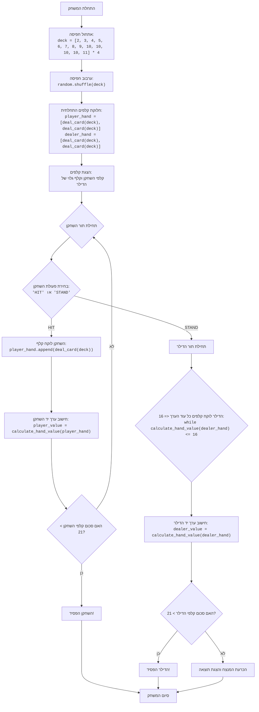

## ניתוח קוד משחק בלאק ג'ק

### <algorithm>

הקוד מממש משחק בלאק ג'ק פשוט בין שחקן לדילר. להלן תרשים זרימה מפורט של שלבי המשחק:

1.  **אתחול חפיסה**:
    *   יוצרים חפיסה סטנדרטית של 52 קלפים, כאשר כל קלף מיוצג על ידי ערכו המספרי (2-10, כאשר הנסיך, המלכה והמלך שווים ל-10, והאס שווה ל-11).
    *   דוגמה: `deck = [2, 3, 4, 5, 6, 7, 8, 9, 10, 10, 10, 10, 11] * 4`
2.  **ערבוב חפיסה**:
    *   מערבבים את סדר הקלפים בחפיסה באופן אקראי.
    *   דוגמה: `random.shuffle(deck)`
3.  **חלוקת קלפים התחלתית**:
    *   מחלקים שני קלפים לשחקן ושני קלפים לדילר. קלף אחד של הדילר נשאר גלוי.
    *   דוגמה:
        ```python
        player_hand = [deal_card(deck), deal_card(deck)]
        dealer_hand = [deal_card(deck), deal_card(deck)]
        ```
4.  **תור השחקן**:
    *   מציגים את הקלפים של השחקן ואת הקלף הגלוי של הדילר.
    *   השחקן בוחר אם לקחת עוד קלף (HIT) או לעצור (STAND).
        *   **HIT**: אם השחקן בוחר לקחת קלף, קלף נוסף מתווסף ליד שלו. אם סכום הקלפים של השחקן גדול מ-21, השחקן מפסיד. אחרת, חוזרים לאפשרות הבחירה.
            *   דוגמה: `player_hand.append(deal_card(deck))`
        *   **STAND**: אם השחקן בוחר לעצור, התור עובר לדילר.
5.  **תור הדילר**:
    *   הדילר לוקח קלפים עד שסכום הקלפים שלו גדול מ-16.
    *   אם סכום הקלפים של הדילר גדול מ-21, השחקן מנצח.
6.  **הכרעת המנצח**:
    *   אם סכום הקלפים של הדילר לא גדול מ-21, משווים את סכום הקלפים של השחקן לזה של הדילר.
        *   אם סכום הקלפים של השחקן קרוב יותר ל-21 (אך לא מעל) מאשר סכום הקלפים של הדילר, השחקן מנצח.
        *   אם סכום הקלפים של הדילר קרוב יותר ל-21 (אך לא מעל) מאשר סכום הקלפים של השחקן, הדילר מנצח.
        *   אם הסכומים שווים, יש תיקו.

### <mermaid>



### <explanation>

**ייבוא (Imports)**:

*   `import random`: המודול `random` משמש לייצור מספרים אקראיים, ובמקרה הזה הוא משמש לערבוב חפיסת הקלפים לפני תחילת המשחק.

**פונקציות (Functions)**:

1.  `deal_card(deck)`:
    *   **פרמטרים**: מקבלת את רשימת הקלפים (חפיסה) כקלט.
    *   **ערך מוחזר**: מחזירה את הקלף האחרון מהחפיסה (באמצעות `deck.pop()`) ומסירה אותו מהחפיסה.
    *   **מטרה**:  מספקת קלף מהחפיסה לשחקן או לדילר.
    *   **דוגמה לשימוש**: `card = deal_card(deck)`
2.  `calculate_hand_value(hand)`:
    *   **פרמטרים**: מקבלת את רשימת הקלפים ביד כשחקן.
    *   **ערך מוחזר**: מחזירה את הסכום הכולל של הקלפים ביד. אס יכול להיות 1 או 11, תלוי בסכום הכולל של היד.
    *   **מטרה**: מחשבת את ערך היד (סכום הקלפים) תוך טיפול מיוחד במקרה של אס (1 או 11).
    *   **דוגמה לשימוש**: `total_value = calculate_hand_value(player_hand)`
3.  `display_cards(player_hand, dealer_hand, show_dealer_full=False)`:
    *   **פרמטרים**: מקבלת את הידיים של השחקן והדילר, וכן פרמטר אופציונלי `show_dealer_full` המציין אם להציג את כל הקלפים של הדילר או רק אחד.
    *   **ערך מוחזר**: אין ערך מוחזר (פונקציה מסוג void).
    *   **מטרה**: מציגה את הקלפים של השחקן והדילר בצורה קריאה למשתמש.
    *   **דוגמה לשימוש**:
        *   `display_cards(player_hand, dealer_hand)`: מציג קלפי שחקן וקלף אחד של הדילר.
        *    `display_cards(player_hand, dealer_hand, True)`: מציג קלפי שחקן וכל קלפי הדילר.
4. `play_blackjack()`:
   *   **פרמטרים**: אין פרמטרים.
   *   **ערך מוחזר**: אין ערך מוחזר.
   *   **מטרה**: הפונקציה הראשית שמתחילה את המשחק ומנהלת את מהלכי השחקן והדילר, ומכריעה מי ניצח.
   *   **תהליך**:
         1. **אתחול חפיסה:** יוצר חפיסה חדשה של קלפים.
         2. **חלוקת קלפים:** מחלק 2 קלפים לכל שחקן.
         3. **תור שחקן:** השחקן בוחר לקחת עוד קלף או לעצור. אם השחקן עובר 21, הוא מפסיד.
         4. **תור דילר:** הדילר לוקח קלפים עד לסכום של לפחות 17.
         5. **הכרעה:** משווה את סכום הקלפים בין השחקן לדילר ומכריע מי ניצח.

**משתנים (Variables)**:

*   `deck` (רשימה): מייצגת את חפיסת הקלפים.
*   `player_hand` (רשימה): מייצגת את הקלפים ביד של השחקן.
*   `dealer_hand` (רשימה): מייצגת את הקלפים ביד של הדילר.
*   `player_value` (מספר): מייצג את הערך המספרי של הקלפים ביד של השחקן.
*   `dealer_value` (מספר): מייצג את הערך המספרי של הקלפים ביד של הדילר.
* `action` (מחרוזת): מייצגת את בחירת הפעולה של השחקן ('HIT' או 'STAND').
* `ace_count` (מספר): סופר את כמות האסים ביד.
* `total` (מספר): סוכם את הערך של כל הקלפים ביד.

**בעיות אפשריות או תחומים לשיפור**:

*   **ממשק משתמש**: הקוד משתמש בפונקציות `print` ו-`input` בלבד. ניתן לשפר אותו על ידי שימוש בספריית GUI ליצירת ממשק משתמש גרפי.
*   **בדיקת קלט**: הקוד לא בודק באופן מקיף את קלט המשתמש (למשל, אם המשתמש מכניס קלט שאינו "HIT" או "STAND").
*   **טיפול בשגיאות**: אין טיפול בשגיאות, למשל אם החפיסה ריקה או קלט לא חוקי.
*   **אסטרטגיית דילר**: האסטרטגיה של הדילר פשוטה (לוקח קלפים עד שהוא מגיע ל-17). ניתן להוסיף אסטרטגיות דילר מורכבות יותר.

**קשרים עם חלקים אחרים בפרויקט**:
בשלב זה, הקוד הוא עצמאי ואין לו קשרים ישירים עם חלקים אחרים בפרויקט, אך הוא יכול להיות חלק ממודול רחב יותר של משחקי AI.

בנוסף, הקוד מספק חווית משחק בסיסית ופונקציונלית למשחק הבלאק ג'ק.