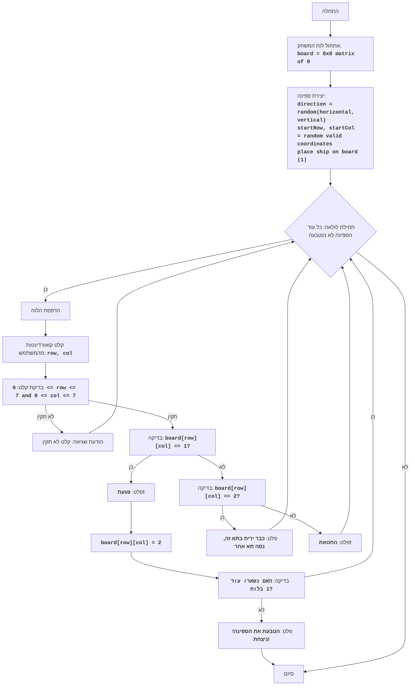

## ניתוח קוד: משחק "צי"

### <algorithm>

1. **אתחול הלוח**:
   - יוצר לוח משחק בגודל 8x8, וממלא אותו באפסים.
   - לדוגמה: `board = [[0, 0, 0, 0, 0, 0, 0, 0], [0, 0, 0, 0, 0, 0, 0, 0], ..., [0, 0, 0, 0, 0, 0, 0, 0]]`

2. **הצבת ספינה**:
   - בוחר באופן אקראי כיוון לספינה (אופקי או אנכי).
   - בוחר באופן אקראי את קואורדינטות ההתחלה של הספינה, תוך כדי לוודא שהיא לא חורגת מגבולות הלוח.
   - אם הספינה אופקית:
     -  קואורדינטות ההתחלה לדוגמה: row = 2, col = 3
     - ממקם את הספינה בלוח ע"י שינוי הערכים ל-1: `board[2][3] = 1`, `board[2][4] = 1`, `board[2][5] = 1`
   - אם הספינה אנכית:
     - קואורדינטות ההתחלה לדוגמה: row = 3, col = 4
     - ממקם את הספינה בלוח ע"י שינוי הערכים ל-1: `board[3][4] = 1`, `board[4][4] = 1`, `board[5][4] = 1`

3. **לולאה ראשית של המשחק**:
   - מדפיס את הלוח הנוכחי למסך.
   - מבקש מהמשתמש להזין קואורדינטות ירי (שורה ועמודה, מופרדות בפסיק).
   - לדוגמה: קלט משתמש "2,3"
   - אם הקלט לא תקין (פורמט שגוי, קואורדינטות מחוץ לגבולות), מבקש מהמשתמש להזין מחדש.

4. **בדיקת פגיעה**:
   - בודק אם הערך בלוח בקואורדינטות שהוזנו הוא 1 (פגיעה בספינה).
   - אם פגיעה:
     - מדפיס "פגעת!"
     - משנה את הערך בלוח ל-2 (פגיעה).
   - אחרת (אם הערך הוא 0):
     - מדפיס "החטאת!"
   - אם הערך הוא 2:
     - מדפיס "כבר ירית בתא הזה, נסה תא אחר"

5. **בדיקת טביעה**:
   - לאחר פגיעה, בודק אם נשארו עוד חלקים מהספינה (אם יש עדיין ערכים 1 בלוח).
   - אם לא נשארו חלקים:
      - מדפיס "הטבעת את הספינה! ניצחת!" ומסיים את המשחק.

6. **חזרה ללולאה**: אם הספינה לא הוטבעה, חוזר לשלב 3.

### <mermaid>

### <explanation>

*   **ייבוא (Imports)**:
    *   `import random`:  המודול `random` משמש ליצירת מספרים אקראיים לצורך הצבת הספינה באופן אקראי וכן לבחירת כיוון הספינה.

*   **משתנים (Variables)**:
    *   `board`: רשימה דו-ממדית (מטריצה) שמייצגת את לוח המשחק. הערכים בלוח מייצגים:
        *   `0`: משבצת ריקה.
        *   `1`: משבצת עם חלק מהספינה.
        *   `2`: משבצת בה פגעו.
    *  `direction`:  משתנה שלם (0 או 1) המייצג את הכיוון של הספינה (0 - אופקי, 1 - אנכי).
    * `row`, `col`: משתנים שלמים המייצגים את השורה והעמודה בלוח המשחק.
    * `coordinates`: מחרוזת שמכילה את הקלט של המשתמש (קואורדינטות).
    * `ship_sunk`: משתנה בוליאני שבודק האם כל הספינה הוטבעה.

*   **פונקציות (Functions)**:
    *   `place_ship()`:
        *   מטרה: ממקמת את הספינה בלוח באופן אקראי.
        *   פרמטרים: אין.
        *   ערך החזרה: אין.
        *   דוגמאות:
            *   אם `direction` הוא 0 (אופקי), והספינה תמוקם בשורה 2, עמודה 3:  `board[2][3] = 1`, `board[2][4] = 1`, `board[2][5] = 1`
            *   אם `direction` הוא 1 (אנכי), והספינה תמוקם בשורה 3, עמודה 4: `board[3][4] = 1`, `board[4][4] = 1`, `board[5][4] = 1`

*  **לולאות**:
    * `while True:`: לולאה אינסופית שממשיכה עד שהמשתמש מנצח (מטביע את הספינה).
    * `for row in board`: מדפיסה את הלוח למסך, שורה אחר שורה.
    * `for row_b in board`: בודקת האם יש עוד חלקים מהספינה (ערך 1) בלוח.

*  **תנאים**:
    * `if direction == 0`: בודקת אם הכיוון הוא אופקי.
    *  `if not (0 <= row <= 7 and 0 <= col <= 7)`: בודקת האם הקואורדינטות שהוזנו תקינות.
    * `if board[row][col] == 1`: בודקת אם הפגיעה היא בספינה.
    * `elif board[row][col] == 0`: בודקת אם הפגיעה היא במים.
    * `elif board[row][col] == 2`: בודקת אם הפגיעה היא בתא שכבר נפגע.
    * `if ship_sunk`: בודקת אם כל הספינה הוטבעה.

*   **בעיות אפשריות ושיפורים**:
    *  **אימות קלט משופר**: ניתן להוסיף בדיקות נוספות לקלט המשתמש, כמו טיפול במקרים של קלט שאינו מספרים.
    *   **ממשק משתמש**: כרגע המשחק הוא טקסטואלי בלבד, ניתן לשפר את הממשק ולהציג את הלוח בצורה גרפית יותר.
    *   **אפשרויות משחק**: ניתן להוסיף אפשרויות נוספות כמו כמה ספינות או גדלים שונים של ספינות.
    *   **בדיקת כפל יריות:** המערכת בודקת רק אם פגעו בעבר או לא, אך לא מונעת מהמשתמש מלנסות לירות שוב בתא ריק. ניתן לתת הודעה גם במקרה זה.

* **קשרים עם חלקים אחרים בפרויקט**:

    קובץ זה פועל כמשחק עצמאי ואינו תלוי בקבצים אחרים בפרויקט. הוא משתמש רק בספריה סטנדרטית של פייתון (random).