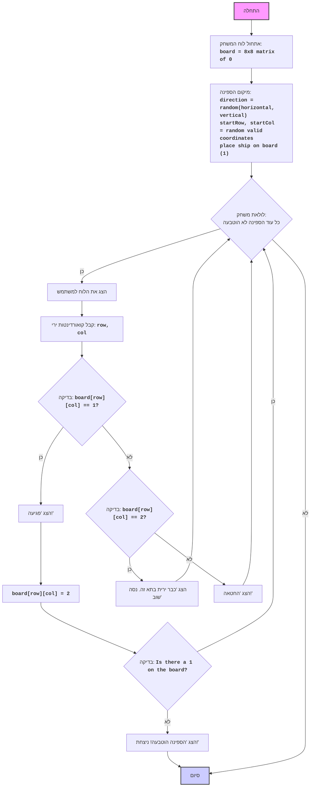

## ניתוח קוד: משחק סירות

### 1. <algorithm>

**תרשים זרימה צעד-אחר-צעד:**

1. **אתחול לוח המשחק:**
   - יוצרים מטריצה בגודל 8x8 ומאכלסים אותה באפסים.
   - `board = [[0, 0, 0, 0, 0, 0, 0, 0], [0, 0, 0, 0, 0, 0, 0, 0], ..., [0, 0, 0, 0, 0, 0, 0, 0]]`

2. **מיקום הספינה:**
   - בוחרים באקראי כיוון (אופקי או אנכי).
   - בוחרים באקראי את נקודת ההתחלה של הספינה (שורה ועמודה) כך שהספינה לא תצא מגבולות הלוח.
   - מסמנים את תאי הספינה ב-1.
     - לדוגמה: אם הכיוון אופקי, השורה היא 2 והעמודה היא 3, התאים `board[2][3]`, `board[2][4]`, `board[2][5]` יקבלו ערך 1.

3. **לולאת משחק:**
   - כל עוד הספינה לא הוטבעה:
     - הצג את לוח המשחק למשתמש.
     - קבל מהמשתמש קואורדינטות ירי (שורה ועמודה).
       - לדוגמה: קלט "2,3"
     - בדוק האם הקואורדינטות פגעו בספינה (`board[row][col] == 1`).
       - אם פגעו:
         - הצג "פגיעה!"
         - סמן את התא כפגוע על ידי החלפת הערך מ-1 ל-2.
         - בדוק האם הספינה הוטבעה (אין יותר תאים עם ערך 1).
           - אם הוטבעה, הצג "הספינה הוטבעה! ניצחת!" וסיים את המשחק.
       - אם לא פגעו:
         - בדוק האם הקואורדינטות כבר נורו בעבר (ערך 2).
          - אם כן, הצג "כבר ירית בתא זה. נסה שוב".
         - אם לא, הצג "החטאה!".

4. **סיום המשחק:**
   - המשחק מסתיים כאשר הספינה הוטבעה.

**זרימת הנתונים:**

-   **אתחול לוח:** יצירת מערך דו-ממדי (board).
-   **מיקום ספינה:** שינוי ערכים בתוך `board` על ידי הפונקציה `place_ship()`.
-   **לולאת משחק:**
    -   קלט מהמשתמש (row, col) מעדכן את המשתנה `board` (2 עבור פגיעה).
    -   בדיקה אם ישנם ערכים שווים ל-1 ב-`board` עבור בדיקת הטבעה.

### 2. <mermaid>

**הסבר התלויות:**

*   **`random`**: משמש ליצירת מספרים אקראיים, שמשמשים ל:
    *   בחירת כיוון הספינה (אופקי או אנכי).
    *   בחירת קואורדינטות ההתחלה של הספינה.

### 3. <explanation>

**ייבוא (Imports):**

*   `import random`: מייבא את המודול `random` המשמש ליצירת מספרים אקראיים. הוא נחוץ למיקום הספינה באופן אקראי ולכיוון הספינה.

**משתנים (Variables):**

*   `board`: מערך דו-ממדי (רשימה של רשימות) בגודל 8x8, המייצג את לוח המשחק. בהתחלה מאוכלס באפסים.
*   `direction`: משתנה שמכיל את כיוון הספינה (0 לאופקי, 1 לאנכי).
*   `row`, `col`: משתנים המייצגים את קואורדינטות השורה והעמודה בלוח המשחק.
*   `i`: משתנה המשמש בלולאות לסימון תאי הספינה.
*   `coordinates`: מחרוזת שמכילה את קלט המשתמש של הקואורדינטות, כמו "1,2".
*   `ship_sunk`: משתנה בוליאני המציין האם הספינה הוטבעה (True) או לא (False).

**פונקציות (Functions):**

*   **`place_ship()`**:
    *   **פרמטרים:** אין.
    *   **ערך החזרה:** אין.
    *   **מטרה:** ממקמת את הספינה באופן אקראי בלוח המשחק.
        1.  בוחרת כיוון אקראי (אופקי או אנכי).
        2.  בוחרת קואורדינטות התחלה אקראיות, כך שהספינה לא תצא מגבולות הלוח.
        3.  מסמנת את תאי הספינה בערך 1 בלוח המשחק.
    *   **דוגמה:**
        *   אם הכיוון הוא אופקי והקואורדינטות ההתחלה הן (2,3), התאים board[2][3], board[2][4], board[2][5] יקבלו את הערך 1.

**בעיות אפשריות ותחומים לשיפור:**

*   **ממשק משתמש:** הממשק הוא טקסטואלי, ניתן לשפר עם ממשק גרפי או ממשק משתמש מודרני יותר.
*   **בדיקת תקינות קלט:** ניתן לשפר את בדיקת תקינות הקלט, למשל כדי למנוע קריסה אם הקלט אינו מספרים או אינו בפורמט הנכון.
*   **אפשרות למספר ספינות:** המשחק מוגבל לספינה אחת, אפשר להוסיף אפשרות למספר ספינות.
*   **התאמת קושי:** אפשר להוסיף רמות קושי שונות על ידי שינוי גודל הלוח, גודל הספינה, או מספר הספינות.
*  **הודעות למשתמש:** אפשר לשפר את הודעות למשתמש,  למשל, להודיע לו אם הוא כבר ניסה תא זה, או לתת לו רמזים.
*  **שימוש בפונקציות:** ניתן לפצל את קוד המשחק למספר פונקציות קטנות יותר כדי להגדיל את הקריאות והתחזוקה שלו.
*   **התאמה למסכים שונים:** הקוד מניח מסך טקסטואלי עם רוחב מספיק כדי להציג את הלוח. צריך לשקול התאמה למסכים עם רוחב מוגבל.

**שרשרת קשרים עם חלקים אחרים בפרויקט (אם רלוונטי):**

*  אין קשר ישיר לחלקים אחרים בפרויקט שסופק, מדובר במשחק עצמאי. אם קיימת חבילה משותפת להגדרות משחק כלליות, ניתן יהיה לחבר את הקוד הזה אליה.