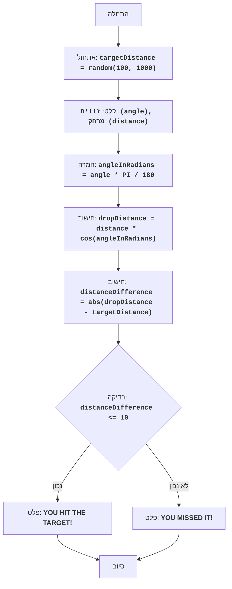

## ניתוח קוד: משחק "בוםבר"

### <algorithm>
1.  **אתחול מרחק מטרה:**
    *   התוכנית מתחילה ביצירת מרחק מטרה אקראי בין 100 ל-1000. לדוגמה, `targetDistance = 550`.
2.  **קלט מהמשתמש:**
    *   התוכנית מבקשת מהמשתמש להזין זווית זריקה (במעלות) ומרחק זריקה.
    *   לדוגמה, `angle = 45`, `distance = 200`.
3.  **המרת זווית לרדיאנים:**
    *   הזווית מומרת מרדיאנים על ידי הכפלה ב- `π / 180`. לדוגמה, `angleInRadians = 45 * 3.14159 / 180 = 0.785`.
4.  **חישוב מרחק נפילה:**
    *   מרחק הנפילה מחושב באמצעות הנוסחה: `dropDistance = distance * cos(angleInRadians)`.
        *   לדוגמה: `dropDistance = 200 * cos(0.785) ≈ 200 * 0.707 ≈ 141.4`.
5.  **חישוב הפרש מרחק:**
    *   התוכנית מחשבת את ההפרש המוחלט בין מרחק הנפילה למרחק המטרה: `distanceDifference = abs(dropDistance - targetDistance)`.
        *   לדוגמה: `distanceDifference = abs(141.4 - 550) = 408.6`.
6.  **בדיקת תוצאה:**
    *   התוכנית בודקת האם ההפרש קטן או שווה ל-10.
    *   בדוגמה שלנו, `408.6 > 10`, ולכן השחקן מפסיד.
7.  **הצגת תוצאה:**
    *   בהתאם לתוצאה, מוצגת הודעת ניצחון או הפסד.
    *   בדוגמה שלנו, תודפס ההודעה "YOU MISSED IT!".
8.  **סיום משחק:**
    *   המשחק מסתיים.

### <mermaid>

### <explanation>
*   **ייבואים (Imports):** הקוד אינו כולל ייבוא, מכיוון שהוא תיאור טקסטואלי של המשחק ולא קוד פועל.
*   **מחלקות (Classes):** אין מחלקות בקוד הזה. הוא מציג רק את הלוגיקה של המשחק.
*   **פונקציות (Functions):**
    *   אין פונקציות מפורשות, אך ניתן לראות את השלבים כרצף של פעולות דמויות פונקציה. לדוגמה:
        *   `random(100, 1000)` - מייצר מספר אקראי בין 100 ל-1000.
        *   `cos(angleInRadians)` - מחשב את קוסינוס של הזווית ברדיאנים.
        *   `abs(value)` - מחזיר את הערך המוחלט של מספר.
*   **משתנים (Variables):**
    *   `targetDistance`: מספר שלם אקראי בין 100 ל-1000, מייצג את מרחק המטרה.
    *   `angle`: מספר ממשי, מייצג את זווית הזריקה במעלות.
    *   `distance`: מספר ממשי, מייצג את מרחק הזריקה.
    *   `angleInRadians`: מספר ממשי, מייצג את הזווית ברדיאנים.
    *   `dropDistance`: מספר ממשי, מייצג את מרחק הנפילה המחושב.
    *   `distanceDifference`: מספר ממשי, מייצג את ההפרש המוחלט בין מרחק הנפילה למרחק המטרה.
*   **בעיות אפשריות או תחומים לשיפור:**
    *   הקוד כפי שהוא מוצג, אינו מציג אינטראקציה עם משתמש, אלא רק תיאור של תהליך המשחק.
    *   הוא אינו מטפל במצבי קלט שגויים, למשל הזנת אותיות במקום מספרים.
    *   ניתן להוסיף גרפיקה או ממשק משתמש כדי להפוך את המשחק ליותר ידידותי.
*   **שרשרת קשרים:**
    *   בצורתו הנוכחית, הקוד אינו קשור ישירות לחלקים אחרים בפרויקט.
    *   אם היה מיושם כקוד, הוא היה עשוי להיות חלק ממודול של משחקים, עם קבצי קונפיגורציה וממשק משתמש.

**לסיכום:** קוד זה מתאר את הלוגיקה של משחק ה"בוםבר", שבו המשתמש מנסה לפגוע במטרה על ידי זריקת פצצה בזווית ובמרחק נתונים. התוכנית מחשבת את מרחק הנפילה ובודקת אם הוא קרוב מספיק למטרה.