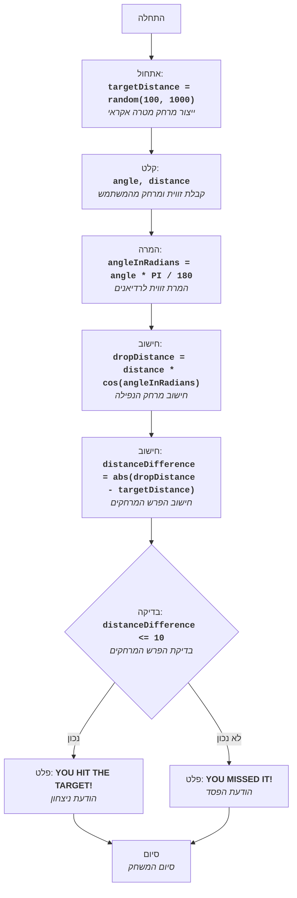

## ניתוח קוד המשחק "BOMBER"

### 1. <algorithm>

**תיאור תהליך העבודה של הקוד בתרשים זרימה צעד-אחר-צעד:**

1. **התחלה:** תחילת המשחק.
2. **אתחול מרחק מטרה:** המחשב מגריל מרחק אקראי בין 100 ל-1000 (לדוגמה, `targetDistance = 350`).
3. **קלט זווית ומרחק:** המשתמש מזין זווית זריקה (במעלות) ומרחק זריקה (לדוגמה, `angle = 45`, `distance = 200`).
4. **המרת זווית לרדיאנים:** הזווית מומרת מרדיאנים באמצעות הנוסחה `angleInRadians = angle * 3.14159 / 180` (לדוגמה, `angleInRadians = 45 * 3.14159 / 180 ≈ 0.785`).
5. **חישוב מרחק נפילה:** המרחק שאליו תיפול הפצצה מחושב באמצעות הנוסחה `dropDistance = distance * cos(angleInRadians)` (לדוגמה, `dropDistance = 200 * cos(0.785) ≈ 141.42`).
6. **חישוב הפרש מרחקים:** ההפרש בין מרחק הנפילה למרחק המטרה מחושב בערך מוחלט `distanceDifference = abs(dropDistance - targetDistance)` (לדוגמה, `distanceDifference = abs(141.42 - 350) ≈ 208.58`).
7. **בדיקת הפרש:** בודקים האם ההפרש בין מרחקים קטן או שווה ל-10.
8. **ניצחון:** אם ההפרש קטן או שווה ל-10, מוצגת הודעת ניצחון.
9. **הפסד:** אם ההפרש גדול מ-10, מוצגת הודעת הפסד.
10. **סיום:** סיום המשחק.

**זרימת נתונים:**
- הערך האקראי `targetDistance` נוצר ומשמש בחישוב ההפרש.
- ערכי הקלט `angle` ו-`distance` משמשים לחישוב `dropDistance`.
- הערכים `dropDistance` ו-`targetDistance` משמשים לחישוב `distanceDifference`.
- התוצאה של ההשוואה `distanceDifference <= 10` קובעת אם המשתמש ניצח או הפסיד.

### 2. <mermaid>

**ניתוח התלויות:**
- הדיאגרמה אינה משתמשת בתלויות חיצוניות (אין ייבוא). היא מתארת את הזרימה הפנימית של לוגיקת המשחק בלבד.

**הערה**: לא בוצע ייבוא של header.py ולכן לא נוסף תרשים זרימה עבורו.

### 3. <explanation>

**הסברים מפורטים:**

- **משתנים:**
    - `targetDistance`: מספר שלם אקראי שנוצר בין 100 ל-1000, מייצג את מרחק המטרה.
    - `angle`: מספר ממשי המייצג את זווית הזריקה שהמשתמש מזין (במעלות).
    - `distance`: מספר ממשי המייצג את מרחק הזריקה שהמשתמש מזין.
    - `angleInRadians`: מספר ממשי המייצג את זווית הזריקה ברדיאנים, המחושב מהזווית במעלות.
    - `dropDistance`: מספר ממשי המייצג את המרחק שאליו תיפול הפצצה, המחושב על בסיס הזווית והמרחק.
    - `distanceDifference`: מספר ממשי המייצג את ההפרש המוחלט בין מרחק הנפילה למרחק המטרה.

- **פונקציות:**
    - **אין פונקציות מוגדרות בקוד זה.** כל הלוגיקה מבוצעת באופן רציף.
  
- **אלגוריתם:**
    - הקוד מדמה משחק בו משתמש מנסה לפגוע במטרה באמצעות הטלת פצצה. המטרה היא לזרוק את הפצצה כך שהמרחק שאליו היא תיפול יהיה קרוב ככל הניתן למרחק המטרה שנקבע באופן אקראי על ידי המחשב. הקוד משתמש בנוסחאות טריגונומטריות בסיסיות על מנת לחשב את המרחק שאליו תגיע הפצצה לפי הזווית והמרחק שהמשתמש הזין. בסוף המשחק הקוד קובע אם המשתמש ניצח לפי ההפרש בין מרחק הפצצה למרחק המטרה, כאשר הפרש של 10 יחידות או פחות נחשב ניצחון.

**בעיות אפשריות ושיפורים:**
1. **דיוק:** חישוב `angleInRadians` יכול להיות יותר מדויק אם נשתמש בערך מדויק יותר של פאי, כמו `math.pi` במקום `3.14159`.
2. **קלט לא תקין:** הקוד לא מטפל במקרים בהם המשתמש מזין קלט לא חוקי (לדוגמה, אותיות במקום מספרים).
3. **הפרדה בין קלט, חישוב ופלט:** ניתן להפריד את הקוד לפונקציות נפרדות כדי לשפר את הקריאות והתחזוקה. לדוגמא: פונקציה לקבלת קלט מהמשתמש, פונקציה לחישוב המרחק ופונקציה לבדיקת התוצאה והצגת הפלט.
4. **ממשק משתמש:** הקוד הנוכחי הוא טקסטואלי בלבד. ניתן לשפר אותו על ידי הוספת ממשק משתמש גרפי או קלט אינטראקטיבי.
5. **יכולת משחק חוזר:** חסרה אפשרות לשחק שוב באופן אוטומטי לאחר משחק אחד, על מנת לשפר את חווית המשתמש.
6. **משוב:** הוספת משוב למשתמש (לדוגמה, להציג את מרחק הנפילה ואת מרחק המטרה) יכולה לעזור למשתמש להבין את המשחק.

**שרשרת קשרים עם חלקים אחרים בפרויקט:**
- קוד זה הוא חלק עצמאי במשחק, ולא מקיים קשר ישיר עם חלקים אחרים בפרויקט. עם זאת, הוא יכול לשמש כדוגמה למשחק בסיסי, ולכן ניתן יהיה להשתמש במבנה הכללי שלו במשחקים אחרים.