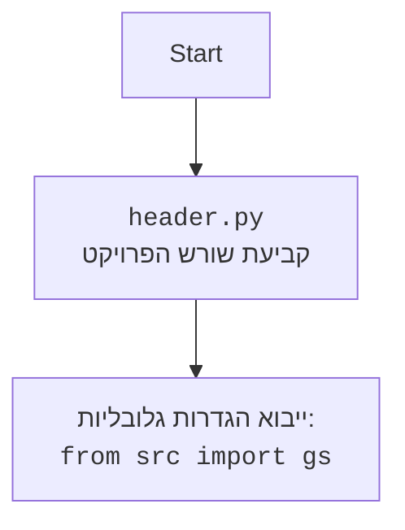

## <algorithm>

הקוד מדמה תנועה של כדור קופץ על ידי שינוי מיקומו האנכי בהתאם לפונקציית סינוס. להלן תיאור מפורט של תהליך העבודה של הקוד:

1.  **אתחול משתנים:**
    *   `Y`: מיקום אנכי התחלתי של הכדור (20).
    *   `T`: משתנה המשמש לחישוב פונקציית סינוס (0).
    *   `D`: קצב השינוי של המשתנה `T` (0.2).
    *   דוגמה: `Y = 20`, `T = 0`, `D = 0.2`.

2.  **לולאה אינסופית:**
    *   הלולאה רצה עד שלוחצים על מקש כלשהו.
    *   **חישוב מיקום חדש של `Y`**:
        *   `Y = 20 + 19 * sin(T)`: מיקום ה-Y מחושב באמצעות פונקציית סינוס כדי לדמות תנועה קופצת.
        *   דוגמה: אם `T = 0`, אז `Y = 20 + 19 * sin(0) = 20`.
    *   **ניקוי מסך**: מנקה את המסך לפני הצגת המיקום החדש של הכדור.
        *   דוגמה: המסך נמחק באמצעות הפונקציה `clear_screen()`.
    *   **הצגת מיקום ה-Y**:
        *   מדפיס את האות 'O' (הכדור) במיקום `Y`.
        *   דוגמה: אם `Y = 20`, אז יודפסו 20 רווחים לפני האות 'O'.
    *   **עדכון `T`**:
        *   `T = T + D`: מגדיל את הערך של `T` לקראת החישוב הבא.
        *   דוגמה: אם `T = 0`, אז `T` יהפוך ל-`0.2`.
    *   **השהיה**:
        *   השהיה קצרה באמצעות `time.sleep(0.1)` כדי להאט את האנימציה.
    *   **בדיקת לחיצת מקש**:
        *   בודק אם לוחצים על מקש באמצעות הפונקציה `get_keypress()`.
        *   אם כן, יוצא מהלולאה.
        *   דוגמה: אם משתמש לוחץ על מקש כלשהו, הלולאה מסתיימת.

## <mermaid>

```mermaid
flowchart TD
    Start[התחלה] --> InitializeVariables[אתחול משתנים:<br><code>Y = 20<br>T = 0<br>D = 0.2</code>]
    InitializeVariables --> InfiniteLoopStart[התחלת לולאה אינסופית]
    InfiniteLoopStart --> CalculateY[חישוב מיקום אנכי חדש: <code>Y = 20 + 19 * SIN(T)</code>]
    CalculateY --> ClearScreen[ניקוי מסך]
    ClearScreen --> PrintBall[הדפסת הכדור במיקום <code>Y</code>: <code>print(" " * int(Y) + "O")</code>]
    PrintBall --> UpdateT[עדכון ערך של <code>T</code>: <code>T = T + D</code>]
    UpdateT --> Pause[השהיה של 0.1 שניות]
    Pause --> CheckKeyPress[בדיקה אם מקש נלחץ]
    CheckKeyPress -- לא נלחץ --> InfiniteLoopStart
    CheckKeyPress -- נלחץ --> End[סיום]
    
    subgraph "פונקציה: clear_screen()"
    CSStart[התחלה] --> CSCheckOS[בדיקת מערכת הפעלה]
        CSCheckOS -- Windows --> CSWindows[הפעלת פקודה cls]
        CSCheckOS -- אחר --> CSUnix[הפעלת פקודה clear]
        CSWindows --> CSEnd[סיום]
        CSUnix --> CSEnd
    end

    subgraph "פונקציה: get_keypress()"
        GKStart[התחלה] --> GKCheckOS[בדיקת מערכת הפעלה]
        GKCheckOS -- Windows --> GKWindows[בדיקה ולכידת מקש באמצעות msvcrt]
        GKCheckOS -- אחר --> GKUnix[בדיקה ולכידת מקש באמצעות select]
        GKWindows --> GKReturn[החזרת True אם נלחץ מקש, אחרת False]
        GKUnix --> GKReturn
    end

```



**ניתוח תלויות יבוא:**

*   אין קובץ `header.py` בקוד הזה, ולכן תרשים הזרימה של `header.py` מיותר כאן.
*   הקוד משתמש ישירות במודולים סטנדרטיים של פייתון, ואינו מייבא תלויות מתוך החבילה `src.`.

## <explanation>

**ייבואים (Imports):**

*   `import math`: מאפשר שימוש בפונקציות מתמטיות כגון `math.sin()`, המשמשת לחישוב הסינוס של זווית, אשר הכרחית לצורך יצירת תנועת הכדור הקופץ.
*   `import time`: משמש להשהיית זמן קצרה באמצעות הפונקציה `time.sleep()`. ההשהיה יוצרת את האפקט של אנימציה.
*   `import os`: מספק גישה לפונקציות הקשורות למערכת ההפעלה, המשמשות כאן לניקוי המסך באמצעות `os.system()`. הפונקציה פועלת באופן שונה בהתאם למערכת ההפעלה.
*   `import sys`: מאפשר גישה למשתנים ופונקציות הקשורות למערכת, כמו קריאה מהקלט הסטנדרטי (stdin) ומשמש לבדיקה אם מקש נלחץ.

**פונקציות (Functions):**

*   `clear_screen()`:
    *   **תפקיד**: מנקה את המסך של הטרמינל.
    *   **היגיון**:
        *   בודק את מערכת ההפעלה (Windows, Linux/macOS) באמצעות `os.name`.
        *   אם מדובר ב-Windows, מריץ את הפקודה `cls`.
        *   אחרת (Linux/macOS) מריץ את הפקודה `clear`.
    *   **דוגמה לשימוש**: `clear_screen()` מנקה את המסך בכל איטרציה של הלולאה הראשית לפני הצגת מיקום הכדור החדש.
*   `get_keypress()`:
    *   **תפקיד**: בודקת אם לוחצים על מקש מבלי לחסום את המשך ריצת התוכנית.
    *   **היגיון**:
        *   עבור Windows, הוא משתמש במודול `msvcrt` לבדיקת לחיצות על מקש באמצעות `msvcrt.kbhit()`. אם מקש נלחץ, הוא קורא את התו באמצעות `msvcrt.getch()`.
        *   עבור מערכות הפעלה דמויות יוניקס, הוא משתמש ב-`select.select()` כדי לבדוק אם יש נתונים זמינים ב-stdin. הוא קורא תו אחד מ-stdin באמצעות `sys.stdin.read(1)`.
        *   מחזירה `True` אם נלחץ מקש, ו-`False` אחרת.
    *   **דוגמה לשימוש**: `if get_keypress(): break` משמשת בתוך הלולאה הראשית כדי לבדוק אם המשתמש לחץ על מקש, ואם כן, לעצור את הלולאה.

**משתנים (Variables):**

*   `Y` (integer):
    *   **תפקיד**: מייצג את המיקום האנכי של הכדור על המסך.
    *   **סוג**: מספר שלם.
    *   **שימוש**: הוא מתעדכן בכל איטרציה של הלולאה באמצעות פונקציית סינוס.
*   `T` (float):
    *   **תפקיד**: משמש כקלט לפונקציית הסינוס `math.sin()`. ערכו משתנה בכל איטרציה ויוצר את האפקט של תנועת הכדור.
    *   **סוג**: מספר עשרוני.
    *   **שימוש**: מגדיל בהדרגה במהלך האנימציה.
*   `D` (float):
    *   **תפקיד**: קובע את קצב השינוי של `T`.
    *   **סוג**: מספר עשרוני.
    *   **שימוש**: משפיע על מהירות האנימציה.

**בעיות אפשריות או תחומים לשיפור:**

*   **תלות במערכת ההפעלה:** הקוד משתמש במודולים ובפקודות ספציפיות למערכת ההפעלה לצורך ניקוי המסך וקריאת לחיצת מקש, מה שמגביל את הניידות שלו. ניתן להשתמש בספריות חוצות פלטפורמות כדי להקל על בעיה זו.
*   **אנימציה פשוטה:** האנימציה של הכדור מוגבלת לתנועה אנכית בלבד. אפשר להרחיב את המשחק עם תנועה אופקית, תאוצה, וכדומה.
*   **תגובת משתמש מוגבלת:** הקוד מזהה רק אם נלחץ מקש כלשהו, לא איזה מקש נלחץ. ניתן להוסיף פונקציונליות לקבלת קלט נוסף מהמשתמש.
*   **יציאת לולאה לא ברורה:** היציאה מהלולאה מתבצעת רק עם לחיצת מקש, דבר שאינו גלוי מיידית למשתמש. כדאי להוסיף הודעה למסך או לשפר את הבהירות של תהליך זה.

**שרשרת קשרים עם חלקים אחרים בפרויקט:**

*   הקוד הזה הוא משחק עצמאי, ואין לו תלות ישירה בחלקים אחרים של הפרויקט, מלבד השימוש בספריות סטנדרטיות של פייתון.
*   יתכן כי בעתיד הוא יתחבר לחלקים אחרים של הפרויקט, כמו ממשק משתמש גרפי, או מערכת ניקוד, אבל לא כך כעת.