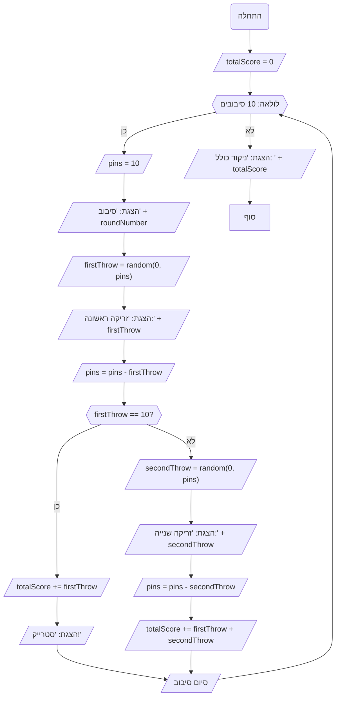

## ניתוח קוד המשחק באולינג

### <algorithm>

הקוד מממש סימולציית משחק באולינג פשוטה. הנה תהליך העבודה צעד אחר צעד:

1.  **אתחול:**
    *   `totalScore` = 0 (משתנה שמחזיק את סך הנקודות במשחק)
    *   **דוגמה:** `totalScore` מתחיל ב-0.
2.  **לולאת משחק (10 סיבובים):**
    *   לולאה רצה מ-1 עד 10 (כולל) עבור כל סיבוב במשחק.
    *   `pins` = 10 (מספר הפינים ההתחלתי בכל סיבוב)
        *   **דוגמה:** בתחילת כל סיבוב, יש 10 פינים.
    *   הדפסת מספר הסיבוב הנוכחי.
        *   **דוגמה:** "סיבוב 1", "סיבוב 2" וכו'.
    *   **זריקת כדור ראשונה:**
        *   `firstThrow` = מספר רנדומלי בין 0 ל-`pins` (כמות הפינים שהופלו בזריקה הראשונה).
            *   **דוגמה:** `firstThrow` יכול להיות 3, 7, 10, וכו'.
        *   הדפסת כמות הפינים שהופלו בזריקה הראשונה.
            *   **דוגמה:** "זריקה ראשונה: 3"
        *   `pins` = `pins` - `firstThrow` (עדכון מספר הפינים לאחר הזריקה הראשונה).
            *   **דוגמה:** אם `pins` היה 10 ו-`firstThrow` היה 3, `pins` יהפוך ל-7.
    *   **בדיקת סטרייק:**
        *   אם `firstThrow` שווה 10 (סטרייק):
            *   `totalScore` = `totalScore` + `firstThrow` (הוספת 10 נקודות לניקוד הכולל).
                *   **דוגמה:** אם `totalScore` היה 10 ו-`firstThrow` היה 10, `totalScore` יהפוך ל-20.
            *   הדפסת "סטרייק!".
            *   מעבר לסיבוב הבא (continue).
    *   **זריקת כדור שנייה (רק אם לא היה סטרייק):**
        *   `secondThrow` = מספר רנדומלי בין 0 ל-`pins` (כמות הפינים שהופלו בזריקה השנייה).
            *    **דוגמה:** `secondThrow` יכול להיות 0, 2, 5, וכו'.
        *   הדפסת כמות הפינים שהופלו בזריקה השנייה.
             *    **דוגמה:** "זריקה שנייה: 5".
        *   `pins` = `pins` - `secondThrow` (עדכון מספר הפינים לאחר הזריקה השנייה).
    *   **עדכון הניקוד הכולל:**
        *   `totalScore` = `totalScore` + `firstThrow` + `secondThrow`.
            *    **דוגמה:** אם `totalScore` היה 15, `firstThrow` היה 3 ו-`secondThrow` היה 2, `totalScore` יהפוך ל-20.
3.  **הדפסת הניקוד הכולל:**
    *   הדפסת "ניקוד כולל: " + `totalScore` לאחר שכל 10 הסיבובים הסתיימו.
        *   **דוגמה:** "ניקוד כולל: 100".

### <mermaid>

### <explanation>

*   **ייבוא (Imports):**
    *   `import random`: מייבא את המודול `random` שמספק פונקציות ליצירת מספרים רנדומליים, אשר משמשים בסימולציה כדי לדמות את כמות הפינים שנופלים בכל זריקה.
*   **משתנים (Variables):**
    *   `totalScore` (int): משמש לאחסון הניקוד הכולל של השחקן במהלך המשחק. מאותחל ל-0 בתחילת המשחק.
    *   `roundNumber` (int): משמש כמונה בתוך הלולאה, ומייצג את מספר הסיבוב הנוכחי.
    *   `pins` (int): מייצג את מספר הפינים שנותרו בכל סיבוב, מאותחל ל-10 בתחילת כל סיבוב.
    *   `firstThrow` (int): מאחסן את כמות הפינים שהופלו בזריקה הראשונה בכל סיבוב. הערך שלו מוגרל באופן רנדומלי.
    *   `secondThrow` (int): מאחסן את כמות הפינים שהופלו בזריקה השנייה בכל סיבוב, אם לא היה סטרייק. הערך שלו מוגרל באופן רנדומלי.
*   **פונקציות:**
    *   `random.randint(a, b)`: פונקציה ממודול `random` שמחזירה מספר שלם רנדומלי בטווח שבין `a` ל-`b` (כולל שניהם). משמשת לסימולציית הזריקות.
*   **לולאות:**
    *   `for roundNumber in range(1, 11):`: לולאה שרצה 10 פעמים, פעם אחת לכל סיבוב במשחק.
*   **בעיות אפשריות ותחומים לשיפור:**
    *   **פשטות:** הקוד פשוט מאוד ואינו כולל מנגנונים מתקדמים של משחק באולינג (כמו ספייר, בונוסים על סטרייקים וספיירים ברצף וכו').
    *   **הצגת מידע למשתמש:** הקוד מדפיס את מספר הסיבוב, כמות הפינים שהופלו בכל זריקה והניקוד הסופי, אבל ניתן לשפר את חווית המשתמש על ידי הוספת תיאורים ברורים יותר.
    *   **אין אינטראקציה עם המשתמש:** הקוד מריץ סימולציה באופן אוטומטי, אך ניתן להוסיף אינטראקציה עם המשתמש (למשל, אפשרות לבחור מספר בין 0 ל-10 במקום שהקוד יגריל אותו רנדומלית).

*   **שרשרת קשרים עם חלקים אחרים בפרויקט:**
    *   הקוד עומד בפני עצמו ואינו תלוי בחלקים אחרים של הפרויקט. עם זאת, אם רוצים להרחיב את הפרויקט, ניתן לשלב את הקוד הזה כחלק מממשק משתמש גרפי או מנוע משחקים.