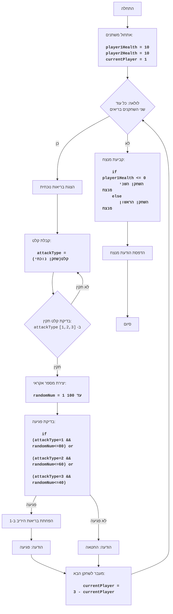

# ניתוח קוד: משחק איגרוף טקסטואלי

## <algorithm>

1.  **אתחול משחק**:
    *   אתחול בריאות השחקנים: `player1Health = 10`, `player2Health = 10`.
    *   קביעת שחקן תורן: `currentPlayer = 1`.
2.  **לולאה ראשית (כל עוד שני השחקנים בריאים)**:
    *   הדפסת מצב בריאות נוכחי של שני השחקנים: לדוגמה, "בריאות שחקן 1: 10, בריאות שחקן 2: 10".
    *   **לולאת קלט תורנית**:
        *   שואל את השחקן הנוכחי להכניס סוג תקיפה (1-חלש, 2-בינוני, 3-חזק).
        *   מבצע בדיקה של הקלט (שיהיה 1, 2 או 3), עם הודעות שגיאה מתאימות עבור קלט שגוי.
    *   **יצירת מספר אקראי**:
        *   יצירת מספר אקראי בין 1 ל-100 (`randomNum`).
    *   **בדיקת פגיעה**:
        *   אם סוג התקיפה הוא 1 ו-`randomNum` קטן או שווה ל-80, הפגיעה הצליחה.
        *   אם סוג התקיפה הוא 2 ו-`randomNum` קטן או שווה ל-60, הפגיעה הצליחה.
        *   אם סוג התקיפה הוא 3 ו-`randomNum` קטן או שווה ל-40, הפגיעה הצליחה.
        *   אחרת, הפגיעה נכשלה.
    *   **טיפול בפגיעה**:
        *   אם הפגיעה הצליחה, מפחית את בריאות היריב ב-1.
        *   הדפסה של הודעה על הצלחת פגיעה או כישלון פגיעה.
    *   **העברת תור**:
        *   מעבר לשחקן הבא (`currentPlayer = 3 - currentPlayer`).
3.  **הכרזת מנצח**:
    *   בדיקה האם בריאות שחקן 1 נמוכה או שווה ל-0.
    *   אם כן, שחקן 2 ניצח.
    *   אחרת, שחקן 1 ניצח.
    *   הדפסת הודעת המנצח.

## <mermaid>

## <explanation>

**ייבוא (Imports):**

*   `import random`: מייבא את המודול `random`, המשמש ליצירת מספרים אקראיים. המספרים האקראיים משמשים כדי לדמות את הסיכוי לפגיעה של כל סוג תקיפה (חלש, בינוני, חזק).

**משתנים (Variables):**

*   `player1Health`: משתנה מסוג int, המייצג את בריאותו של שחקן 1. מאותחל ל-10 בתחילת המשחק ופוחת בכל פגיעה.
*   `player2Health`: משתנה מסוג int, המייצג את בריאותו של שחקן 2. מאותחל ל-10 בתחילת המשחק ופוחת בכל פגיעה.
*   `currentPlayer`: משתנה מסוג int, המייצג את השחקן הנוכחי (1 או 2). משמש לקביעת תור השחקנים.
*   `attackType`: משתנה מסוג int, המייצג את סוג התקיפה שבחר השחקן הנוכחי (1, 2 או 3).
*   `randomNum`: משתנה מסוג int, המייצג מספר אקראי שנוצר בין 1 ל-100. משמש לקביעת הצלחת הפגיעה.
*   `hit`: משתנה מסוג boolean, המציין האם התקיפה פגעה או לא.

**פונקציות (Functions):**

*   `random.randint(1, 100)`: פונקציה מהמודול `random` שמחזירה מספר שלם אקראי בין 1 ל-100.

**הסברים מפורטים:**

1.  **אתחול:**
    *   המשחק מתחיל באתחול בריאותם של שני השחקנים ל-10.
    *   המשתנה `currentPlayer` מוגדר כשחקן 1 (תורו הראשון).
2.  **לולאת המשחק הראשית:**
    *   הלולאה `while player1Health > 0 and player2Health > 0:` רצה כל עוד שני השחקנים עדיין בחיים (בריאותם גדולה מ-0).
    *   בכל תור, מוצגת בריאות השחקנים.
    *   השחקן הנוכחי מתבקש לבחור סוג תקיפה.
    *   מנגנון מובנה לטיפול בשגיאות קלט - במקרה והקלט שגוי, תתבצע בקשה נוספת לקלט תקין.
    *   מספר אקראי בין 1 ל-100 נוצר באמצעות `random.randint(1, 100)`.
    *   הפגיעה נקבעת בהתאם לסוג התקיפה שנבחרה ולמספר האקראי (לדוגמא, תקיפה חלשה מצליחה אם המספר האקראי קטן או שווה ל-80).
    *   אם הפגיעה מצליחה, בריאות היריב פוחתת.
    *   התור עובר לשחקן הבא.
3.  **הכרזת מנצח:**
    *   לאחר שהלולאה הראשית מסתיימת (אחד מהשחקנים איבד את כל בריאותו), מוכרז המנצח על פי השחקן שנותר עם בריאות חיובית.

**בעיות אפשריות או תחומים לשיפור:**

*   **ממשק משתמש:** המשחק מבוסס על טקסט בלבד ואינו מציע גרפיקה.
*   **קלט שגוי:** המנגנון לטיפול בשגיאות קלט פשוט וניתן לשפר אותו. לדוגמה, לאפשר למשתמש לצאת מהמשחק על ידי הקלדת פקודה מסוימת.
*   **שיפור אקראיות:** ניתן לשפר את האופן בו האקראיות מיושמת.
*   **מורכבות המשחק:** המשחק מאוד בסיסי וניתן להוסיף לו אלמנטים נוספים כמו סוגי פגיעות נוספים או הגנות.
*   **הפרדה בין לוגיקה לבין תצוגה:** כדאי להפריד בין לוגיקת המשחק (חישובים, חוקים) לבין התצוגה (הדפסה לקונסולה) כדי לשפר את קריאות הקוד ולאפשר הרחבה קלה יותר בעתיד.
*    **ארגון קוד:** הקוד כתוב בצורה פרוצדורלית, ניתן לארגן אותו במחלקות ופונקציות נפרדות.

**שרשרת קשרים עם חלקים אחרים בפרויקט (אם רלוונטי):**
במקרה זה, הקוד אינו תלוי בחלקים אחרים של הפרויקט ומכיל את כל הלוגיקה שלו בתוך קובץ אחד.