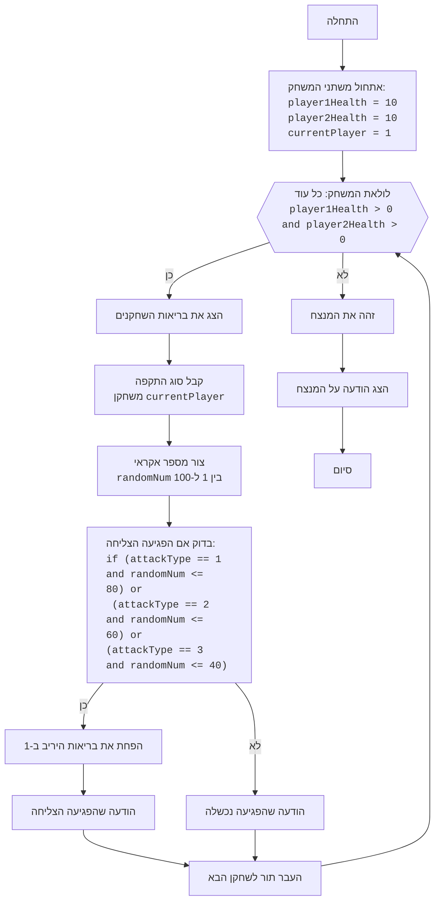

# ניתוח קוד משחק האיגרוף

## <algorithm>

1. **אתחול המשחק**:
   - הגדר את בריאות השחקנים (`player1Health`, `player2Health`) ל-10.
   - הגדר את השחקן הנוכחי (`currentPlayer`) כשחקן 1.

   *דוגמה:*
   ```python
   player1Health = 10
   player2Health = 10
   currentPlayer = 1
   ```

2. **לולאת המשחק**:
   - כל עוד לשני השחקנים יש בריאות מעל 0:
      - הצג את הבריאות הנוכחית של שני השחקנים.

        *דוגמה:*
        `print(f"Здоровье игрока 1: {player1Health}, Здоровье игрока 2: {player2Health}")`
      - בקש מהשחקן הנוכחי לבחור סוג התקפה (1-חלש, 2-בינוני, 3-חזק).
         - בדוק אם הקלט תקין (1, 2 או 3), חזור על הבקשה אם לא.

         *דוגמה:*
         ```python
         while True:
             try:
                 attackType = int(input(f"Игрок {currentPlayer}, выберите силу удара (1-слабый, 2-средний, 3-сильный): "))
                 if attackType in [1, 2, 3]:
                     break
                 else:
                    print("Некорректный ввод. Пожалуйста, выберите 1, 2 или 3.")
             except ValueError:
                 print("Некорректный ввод. Пожалуйста, введите число.")
        ```
      - הגרל מספר אקראי בין 1 ל-100 (`randomNum`).

        *דוגמה:*
        `randomNum = random.randint(1, 100)`
      - בדוק אם ההתקפה הצליחה בהתאם לסוג ההתקפה:
         - אם התקפה חלשה (`attackType` == 1) והמספר האקראי קטן או שווה ל-80.
         - אם התקפה בינונית (`attackType` == 2) והמספר האקראי קטן או שווה ל-60.
         - אם התקפה חזקה (`attackType` == 3) והמספר האקראי קטן או שווה ל-40.
         - אם ההתקפה הצליחה, הפחת את בריאות היריב ב-1.

        *דוגמה:*
        ```python
         hit = False
         if attackType == 1 and randomNum <= 80:
             hit = True
         elif attackType == 2 and randomNum <= 60:
             hit = True
         elif attackType == 3 and randomNum <= 40:
             hit = True

         if hit:
           print("Удар достиг цели!")
           if currentPlayer == 1:
               player2Health -= 1
           else:
               player1Health -= 1
         else:
             print("Удар не достиг цели.")
        ```
      - העבר את התור לשחקן הבא.
        *דוגמה:*
         `currentPlayer = 3 - currentPlayer`

3. **סיום המשחק**:
   - לאחר שהלולאה מסתיימת, זהה את השחקן שבריאותו גדולה מ-0 והכרז עליו כמנצח.

  *דוגמה:*
  ```python
  if player1Health <= 0:
      print("Игрок 2 победил!")
  else:
      print("Игрок 1 победил!")
  ```

## <mermaid>


## <explanation>

**ייבוא (Imports):**
- `import random`: מודול `random` משמש ליצירת מספרים אקראיים, שמשמשים לקבוע אם התקפה הצליחה או לא.

**משתנים (Variables):**
- `player1Health`, `player2Health`: משתנים שלמים המייצגים את כמות הבריאות של כל שחקן, כאשר הערך ההתחלתי הוא 10.
- `currentPlayer`: משתנה שלם ששומר את מספר השחקן הנוכחי (1 או 2).
- `attackType`: משתנה שלם ששומר את סוג ההתקפה שבחר השחקן הנוכחי (1, 2 או 3).
- `randomNum`: משתנה שלם ששומר מספר אקראי בין 1 ל-100 שנוצר כדי לקבוע אם ההתקפה מצליחה.
- `hit`: משתנה בוליאני שמציין האם ההתקפה הצליחה.

**לולאות (Loops):**
-  `while player1Health > 0 and player2Health > 0`: לולאה ראשית שרצה כל עוד לשני השחקנים יש בריאות מעל 0.
- `while True:` לולאה המשמשת לבקשת קלט מהמשתמש (סוג התקפה), חוזרת על הבקשה עד שמתקבל קלט תקין (1, 2 או 3).

**תנאים (Conditions):**
- `if attackType == 1 and randomNum <= 80`: בדיקה האם ההתקפה החלשה הצליחה.
- `elif attackType == 2 and randomNum <= 60`: בדיקה האם ההתקפה הבינונית הצליחה.
- `elif attackType == 3 and randomNum <= 40`: בדיקה האם ההתקפה החזקה הצליחה.
- `if hit`: בדיקה האם ההתקפה הצליחה.
- `if player1Health <= 0`: בדיקה מי ניצח את המשחק.

**פונקציות (Functions):**
- `print()`: משמשת להדפסת הודעות למסוף.
- `input()`: משמשת לקבלת קלט מהמשתמש.
- `int()`: משמשת להמרת קלט מחרוזתי למספר שלם.
- `random.randint(1, 100)`: משמשת ליצירת מספר שלם אקראי בין 1 ל-100.

**בעיות אפשריות או תחומים לשיפור:**
- **ממשק משתמש**: ממשק טקסטואלי בסיסי, ניתן לשפר אותו בעזרת ממשק גרפי.
- **בדיקת תקינות קלט**: ניתן להרחיב את הבדיקה של הקלט מהמשתמש ולטפל בקלט שאינו מספרים או מספרים מחוץ לטווח 1-3.
- **רמות קושי**: ניתן להוסיף רמות קושי שונות על ידי שינוי הסיכויים לפגיעה בהתאם לסוג ההתקפה.
- **הודעות משחק**: ניתן להוסיף הודעות משחק מפורטות יותר.

**שרשרת קשרים עם חלקים אחרים בפרויקט:**
- הקוד משתמש במודול `random`, שהוא חלק מספריית הפייתון הסטנדרטית, אבל הוא לא תלוי בחלקים אחרים של הפרויקט הספציפי הזה.