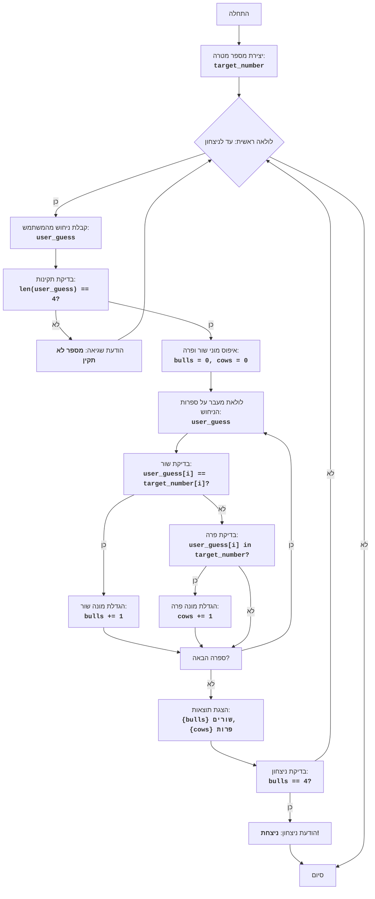

## ניתוח קוד: משחק "שור"

### <algorithm>
הקוד מיישם משחק לוגי בשם "שור" (BULL), שבו המחשב מגריל מספר בן ארבע ספרות שונות, והמשתמש מנסה לנחש אותו. לאחר כל ניחוש, המחשב מדווח כמה "שור" (ספרה במקום הנכון) ו"פרה" (ספרה קיימת אך לא במקום הנכון) קיימות בניחוש. המשחק נמשך עד שהמשתמש מנחש את המספר.

**תרשים זרימה:**
1. **התחלה:**
   - מתחילים את המשחק.
2. **יצירת מספר מטרה:**
   - המחשב מגריל מספר אקראי בן 4 ספרות שונות. לדוגמה, ייתכן שהמספר יהיה "1234".
3. **לולאה ראשית:**
   - מתחילים לולאה שתימשך עד שהמשתמש ינחש את המספר.
4. **קבלת ניחוש מהמשתמש:**
   - המשתמש מתבקש להזין מספר בן 4 ספרות. לדוגמה, המשתמש מזין "1567".
5. **בדיקת תקינות הניחוש:**
   - בודקים אם הניחוש הוא מספר בן 4 ספרות. אם לא, מציגים הודעת שגיאה וחוזרים לשלב 4.
   - לדוגמה, אם המשתמש מזין "123" או "abcd" תוצג הודעת שגיאה.
6. **איפוס מוני שור ופרה:**
   - מאפסים את המונים של "שור" ו"פרה" ל-0.
7. **מעבר על ספרות הניחוש:**
   - עוברים על כל ספרה בניחוש.
8. **בדיקת שור:**
   - בודקים אם הספרה בניחוש נמצאת באותו מיקום כמו ספרת המטרה.
   - לדוגמה, אם הניחוש הוא "1567" והמטרה היא "1234", הספרה '1' היא "שור".
9.  **הגדלת מונה שור:**
    - אם הספרה היא שור, מונה השור גדל ב-1.
10. **בדיקת פרה:**
    - אם הספרה היא לא שור, בודקים אם היא קיימת במספר המטרה (במיקום אחר).
    - לדוגמה, אם הניחוש הוא "5213" והמטרה היא "1234", הספרה '2' היא "שור" (מאחר ויש בדיקה קודמת שבודקת שור), הספרה '1' ו '3' הן "פרה".
11. **הגדלת מונה פרה:**
     - אם הספרה היא פרה, מונה הפרה גדל ב-1.
12. **מעבר לספרה הבאה:**
     - אם יש ספרות נוספות בניחוש, חוזרים לשלב 8.
13. **הצגת תוצאות:**
    - מציגים למשתמש את מספר השורים והפרות. לדוגמה: "1 שורים, 2 פרות".
14. **בדיקת ניצחון:**
    - בודקים אם מספר השורים שווה ל-4.
    - אם כן, מציגים הודעת ניצחון ומסיימים את המשחק.
15. **חזרה ללולאה הראשית:**
     - אם לא ניצחנו חוזרים לשלב 3.
16. **סיום:**
    - המשחק נגמר.

### <mermaid>

**הסבר תרשים Mermaid:**

- **flowchart TD**: מציין שזהו תרשים זרימה.
- **Start**: התחלת המשחק.
- **GenerateTargetNumber**: יצירת מספר המטרה באופן רנדומלי.
- **LoopStart**: תחילת הלולאה הראשית, שתימשך עד שהמשתמש ינצח.
- **InputGuess**: קבלת הניחוש מהמשתמש.
- **ValidateGuess**: בדיקה שהניחוש תקין.
- **OutputInvalid**: הדפסת הודעת שגיאה אם הניחוש לא תקין.
- **InitializeCounts**: איפוס מוני השורים והפרות לפני הבדיקה.
- **LoopDigits**: מעבר על כל ספרה בניחוש כדי לבדוק שור ופרה.
- **CheckBull**: בדיקה האם הספרה היא "שור".
- **IncreaseBulls**: הגדלת מונה השורים.
- **CheckCow**: בדיקה האם הספרה היא "פרה".
- **IncreaseCows**: הגדלת מונה הפרות.
- **CheckNextDigit**: בדיקה האם יש ספרה נוספת לבדוק.
- **OutputResult**: הצגת מספר השורים והפרות.
- **CheckWin**: בדיקה האם המשתמש ניצח.
- **OutputWin**: הצגת הודעת ניצחון.
- **End**: סיום המשחק.

### <explanation>
**ייבוא (Imports):**

-   `import random`: מייבא את המודול `random`, שמשמש ליצירת מספרים אקראיים. הוא משמש בפונקציה `generate_target_number` כדי ליצור רשימה אקראית של ספרות ולהבטיח שהמספר המטרה לא יתחיל ב-0.

**פונקציות (Functions):**

1.  **`generate_target_number()`:**
    -   **מטרה:** מייצרת מספר בן 4 ספרות אקראי, כאשר כל הספרות שונות.
    -   **תהליך:**
        -   יוצרת רשימה של הספרות 0 עד 9.
        -   מערבבת את הרשימה באופן רנדומלי.
        -   מוודאת שהספרה הראשונה אינה 0 על ידי ערבוב חוזר אם יש צורך.
        -   מחזירה את ארבע הספרות הראשונות כמחרוזת.
    -   **דוגמה:** אם הרשימה המעורבבת היא `[2, 8, 0, 5, 1, 9, 3, 7, 6, 4]`, הפונקציה תחזיר `"2805"`.
2.  **`get_bulls_and_cows(user_guess, target_number)`:**
    -   **מטרה:** מחשבת את מספר ה"שור" ו"פרה" בהתבסס על ניחוש המשתמש ומספר המטרה.
    -   **פרמטרים:**
        -   `user_guess`: מחרוזת המייצגת את ניחוש המשתמש.
        -   `target_number`: מחרוזת המייצגת את מספר המטרה.
    -   **תהליך:**
        -   עוברת על כל ספרה בניחוש של המשתמש.
        -   אם ספרה נמצאת באותו מיקום במספר המטרה, היא נספרת כ"שור".
        -   אם ספרה קיימת במספר המטרה אך במיקום אחר, היא נספרת כ"פרה".
    -   **דוגמה:** אם `user_guess` הוא `"1234"` ו`target_number` הוא `"1325"`, הפונקציה תחזיר `(1, 2)` (1 שור - הספרה 1 במקום הנכון, 2 פרות - הספרות 2 ו-3 נמצאות במקומות לא נכונים).

**משתנים (Variables):**

-   `target_number` (str): מחרוזת המייצגת את המספר האקראי שנוצר על ידי המחשב.
-   `user_guess` (str): מחרוזת המייצגת את הניחוש שהמשתמש הזין.
-   `bulls` (int): מספר השור בניחוש הנוכחי.
-   `cows` (int): מספר הפרות בניחוש הנוכחי.
- `digits` (list) : רשימה של מספרים בין 0-9
- `i` (int) : אינדקס שמשמש למעבר על הספרות.
- `digit` (str) : ספרה שמשמשת במעבר על הספרות.

**בעיות אפשריות ותחומים לשיפור:**

-   **התמודדות עם קלט לא תקין:** הקוד בודק רק שאורך הקלט הוא 4 ושהקלט הוא ספרות. הוא לא בודק אם הקלט מכיל ספרות שונות.
-   **ממשק משתמש:** הקוד פשוט ואינטראקטיבי. ניתן לשפר אותו על ידי הוספת ממשק משתמש גרפי.

**שרשרת קשרים עם חלקים אחרים בפרויקט:**

אין תלות מפורשת בחלקים אחרים בפרויקט. הקוד עומד בפני עצמו ואינו משתמש במודולים או הגדרות נוספות מחוץ למודול `random`.