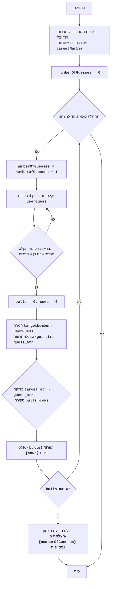

## ניתוח קוד: משחק "שורות ופרות"

### 1. <algorithm>
**תיאור תהליך העבודה של הקוד:**

1. **יצירת מספר מטרה:**
   - הקוד מתחיל ביצירת מספר בן 4 ספרות רנדומלי, כאשר כל הספרות שונות זו מזו.
   - לדוגמה, אם הרשימה המעורבבת היא `[1, 2, 3, 4, 5, 6, 7, 8, 9, 0]`, המספר יכול להיות `1234`.
   - אם הספרה הראשונה היא 0, המספר נוצר שוב.
   - הפונקציה `generate_target_number()` מבצעת זאת.

2. **אתחול מספר ניסיונות:**
   - משתנה `numberOfGuesses` מאותחל ל-0.

3. **לולאת משחק:**
   - מתחיל לולאה אינסופית ( `while True:`), עד שהמשתמש מנצח.
   - כל איטרציה מגדילה את מספר הניסיונות (`numberOfGuesses`).
   - המשתמש מתבקש להזין מספר בן 4 ספרות.

4. **בדיקת קלט המשתמש:**
   - אם הקלט אינו מספר שלם בן 4 ספרות, תודפס הודעת שגיאה, והלולאה תמשיך לאיטרציה הבאה.

5. **אתחול שורות ופרות:**
   - משתנים `bulls` (שורות) ו-`cows` (פרות) מאותחלים ל-0.

6. **השוואה בין מספר המטרה לקלט המשתמש:**
   -  המספרים מומרים למחרוזות כדי להקל על ההשוואה בין הספרות.
   -  הלולאה עוברת על כל ספרה במספר המטרה ובמספר הניחוש:
     - אם הספרות זהות ובאותה עמדה, `bulls` גדל ב-1.
     - אם הספרה מהניחוש קיימת במספר המטרה (אך לא באותה עמדה), `cows` גדל ב-1.

7. **הצגת תוצאות:**
   -  המספר הנוכחי של "שורות" ו"פרות" מוצג למשתמש.

8. **בדיקת ניצחון:**
   -  אם מספר ה"שורות" הוא 4, המשחק מסתיים, והמשתמש מוכרז כמנצח.
   - מוצג הודעה המכילה את מספר הניסיונות שנדרשו.
   - אחרת, הלולאה ממשיכה.

### 2. <mermaid>

**הסבר על התלויות:**
- **`random`**: המודול משמש ליצירת מספר רנדומלי וערבוב הרשימה. זה חיוני ליצירת המספר הסודי של המחשב.

### 3. <explanation>
**הסברים מפורטים:**

- **ייבוא `random`**:
   - `import random`: המודול `random` משמש ליצירת מספרים אקראיים ולערבוב רשימות.
    במקרה הזה הוא משמש ליצירת המספר הסודי שעל השחקן לנחש.
    
- **פונקציה `generate_target_number()`**:
   - מטרת הפונקציה היא ליצור מספר סודי בן 4 ספרות שבו כל הספרות שונות.
   - היא משתמשת בפונקציה `shuffle` כדי לערבב את הספרות 0 עד 9 בסדר אקראי, ויוצרת מהן מספר בן 4 ספרות.
   - אם הספרה הראשונה היא 0, הפונקציה קוראת לעצמה שוב ברקורסיה.
   - דוגמה: אם הרשימה המעורבבת היא `[6, 2, 9, 1, 3, 8, 0, 5, 7, 4]`, אז המספר שיוחזר הוא `6291`.
   - הערך המוחזר הוא מספר שלם.

- **משתנים:**
    - `targetNumber`: משתנה זה שומר את המספר הסודי שנוצר על ידי `generate_target_number()`.
    - `numberOfGuesses`: משתנה זה סופר את מספר הניסיונות שהמשתמש ניסה לנחש את המספר.
    - `userGuess`: משתנה זה שומר את המספר שהמשתמש מזין בניסיון לנחש את המספר.
    - `bulls`: משתנה זה סופר את מספר ה"שורות" (ספרות שנמצאות במקום הנכון).
    - `cows`: משתנה זה סופר את מספר ה"פרות" (ספרות שקיימות במספר, אבל לא במקום הנכון).
    - `target_str`, `guess_str`: מחרוזות שנוצרות מהמספרים כדי להקל על ההשוואה בין הספרות.
    
- **לולאת `while True`:**
   - לולאה אינסופית שרצה עד שהמשתמש מנצח.
   - מעלה את מספר הניסיונות, מקבלת קלט מהמשתמש, ובודקת אם הוא ניצח.
   - מטפלת בשגיאות אם המשתמש מכניס קלט שאינו מספר.
   - דוגמה: אם המשתמש מזין 1234, הקוד יחשב את מספר השורות והפרות.

- **בעיות אפשריות או תחומים לשיפור:**
   - ניתן לשפר את הקוד על ידי הוספת תנאי לוגי נוסף שימנע מהמשתמש להכניס מספר עם ספרות שחוזרות על עצמן.
   - ניתן להוסיף רמת קושי כך שמספר הספרות במספר הסודי יהיה דינאמי.

- **קשר עם חלקים אחרים בפרויקט:**
    - הקוד פועל כמשחק עצמאי. אין לו תלות בקבצים או מודולים אחרים בפרויקט, מלבד `random`.