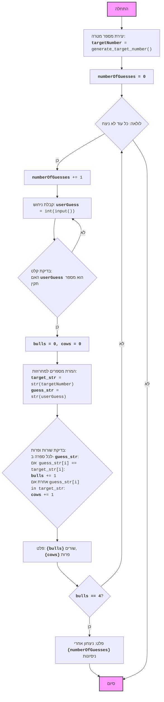

## ניתוח קוד: משחק "שור ופרה"

### 1. <algorithm>

הקוד מיישם את המשחק "שור ופרה" שבו המחשב בוחר מספר ארבע-ספרתי עם ספרות ייחודיות, והמשתמש מנסה לנחש אותו. לאחר כל ניחוש, המשתמש מקבל רמז בדמות מספר ה"שורות" (ספרות נכונות במיקום הנכון) ומספר ה"פרות" (ספרות נכונות במיקום הלא נכון).

**תרשים זרימה צעד אחר צעד:**

1.  **התחלה:**
    - התוכנית מתחילה את ריצתה.

2.  **יצירת מספר מטרה:**
    -   קוראת לפונקציה `generate_target_number()`.
    -   לדוגמה: הפונקציה יכולה לייצר את המספר `4815`.

    -   הפונקציה `generate_target_number()` יוצרת מספר בן 4 ספרות כאשר כל הספרות ייחודיות.
        - יוצרת רשימה של הספרות 0-9: `[0, 1, 2, 3, 4, 5, 6, 7, 8, 9]`.
        - מערבבת את הרשימה: לדוגמה, `[4, 8, 1, 5, 2, 3, 6, 7, 9, 0]`.
        - יוצרת מספר: `4 * 1000 + 8 * 100 + 1 * 10 + 5 = 4815`.
        - אם הספרה הראשונה היא 0, הפונקציה נקראת שוב באופן רקורסיבי עד שנוצר מספר תקין.

3.  **איתחול מספר ניסיונות:**
    -   המשתנה `numberOfGuesses` מאותחל ל-0.

4.  **תחילת לולאה ראשית:**
    -   מתחיל לולאת `while True` (לולאה אינסופית).

5.  **הגדלת מספר הניסיונות:**
    -   המשתנה `numberOfGuesses` גדל ב-1.

6.  **קבלת ניחוש מהמשתמש:**
    -   התוכנית מבקשת מהמשתמש להזין מספר ארבע-ספרתי.
    -   לדוגמה: המשתמש מזין `4158`.
    -   אם הקלט אינו מספר תקין בן 4 ספרות, הלולאה ממשיכה לניסיון הבא.

7.  **איתחול סופרי שורות ופרות:**
    -   המשתנים `bulls` ו-`cows` מאותחלים ל-0.

8.  **השוואת ניחוש למספר המטרה:**
    -   המספרים `targetNumber` ו- `userGuess` מומרים למחרוזות `target_str` ו- `guess_str`.
    -   לולאה שעוברת על כל ספרה.

    -  אם ספרות בשני המספרים זהות ובאותו מיקום, הערך של `bulls` גדל ב-1.
       - לדוגמה, אם הספרות הראשונות זהות, `bulls` גדל מ-0 ל-1.
    -  אם הספרה מהניחוש מופיעה במספר המטרה אך לא באותו מיקום, `cows` גדל ב-1.
        - לדוגמה, הספרה `1` נמצאת גם בניחוש וגם במספר המטרה, אך לא באותו מיקום ולכן `cows` גדל ב-1.

9.  **הצגת תוצאות:**
    -   התוכנית מדפיסה את מספר ה"שורות" (`bulls`) ומספר ה"פרות" (`cows`).
        - לדוגמה: `"1 שורים, 2 פרות"`

10. **בדיקת ניצחון:**
    -   אם מספר ה"שורות" שווה ל-4, המשתמש ניצח.
        -  הודעת ניצחון מוצגת.
        - הלולאה מסתיימת.

11. **המשך או סיום:**
     -   אם המשתמש לא ניצח, התוכנית חוזרת לשלב 4.
     -   אם המשתמש ניצח, התוכנית מסתיימת.

### 2. <mermaid>

**הסבר על התלויות:**

-   **אין תלויות חיצוניות:** הקוד לא תלוי בספריות חיצוניות מלבד `random`, שהיא חלק מהספרייה הסטנדרטית של פייתון.

### 3. <explanation>

**ייבואים (Imports):**

*   `import random`: מייבא את המודול `random`, המשמש ליצירת מספרים אקראיים וערבוב רשימות. אין תלות ישירה עם חבילות `src.`.

**פונקציות (Functions):**

*   `generate_target_number()`:
    *   **פרמטרים:** אין.
    *   **ערך מוחזר:** מחזירה מספר ארבע-ספרתי אקראי עם ספרות שונות.
    *   **מטרה:** יוצרת את מספר המטרה של המשחק.
    *   **דוגמה:** יכולה להחזיר `1234`, `9876`, `4567`, וכו'.
    *   **הערות:**
         * הפונקציה משתמשת ב `random.shuffle` לערבוב רשימת הספרות 0-9.
         *  הפונקציה קוראת לעצמה באופן רקורסיבי כדי לוודא שהספרה הראשונה אינה 0.
    *   **הקשר לפרויקט:** פונקציה עצמאית לחלוטין ואינה תלויה בחלקים אחרים בפרויקט.

**משתנים (Variables):**

*   `targetNumber`:
    *   **סוג:** מספר שלם (int).
    *   **שימוש:** מאחסן את המספר האקראי בן 4 הספרות שנוצר על ידי `generate_target_number()`.
    *   **הקשר לפרויקט:** משמש כקלט עבור הלוגיקה של המשחק.
*   `numberOfGuesses`:
    *   **סוג:** מספר שלם (int).
    *   **שימוש:** סופר את מספר הניסיונות שהמשתמש ביצע.
    *   **הקשר לפרויקט:** משמש כחלק מהתנאי לניצחון.
*   `userGuess`:
    *   **סוג:** מספר שלם (int).
    *   **שימוש:** מאחסן את הניחוש של המשתמש.
    *   **הקשר לפרויקט:** משמש כקלט לבדיקת "שורות" ו"פרות".
*   `bulls`:
    *   **סוג:** מספר שלם (int).
    *   **שימוש:** סופר את מספר ה"שורות" (ספרות נכונות במיקום הנכון).
    *   **הקשר לפרויקט:** משמש כחלק מהמשוב למשתמש ותנאי לניצחון.
*   `cows`:
    *   **סוג:** מספר שלם (int).
    *   **שימוש:** סופר את מספר ה"פרות" (ספרות נכונות במיקום לא נכון).
    *   **הקשר לפרויקט:** משמש כחלק מהמשוב למשתמש.
*   `target_str`:
    *   **סוג:** מחרוזת (string).
    *   **שימוש:** מחרוזת המייצגת את מספר המטרה, משמשת להשוואת ספרות.
    *   **הקשר לפרויקט:** מאפשר השוואה קלה של ספרות בין `targetNumber` ו- `userGuess`.
*   `guess_str`:
    *   **סוג:** מחרוזת (string).
    *   **שימוש:** מחרוזת המייצגת את הניחוש של המשתמש, משמשת להשוואת ספרות.
    *   **הקשר לפרויקט:** מאפשר השוואה קלה של ספרות בין `targetNumber` ו- `userGuess`.

**בעיות אפשריות ושיפורים:**

*   **טיפול בקלט לא תקין:** הקוד מטפל במקרי קצה כמו קלט שאינו מספר תקין או מספר שאינו 4 ספרות, אך ניתן להוסיף טיפול קפדני יותר למקרים אחרים.
*   **שיפור קריאות קוד:** ניתן להשתמש במשתנים עם שמות יותר משמעותיים, במיוחד עבור `i`.
*   **פירוק נוסף לפונקציות:** ניתן לפרק את הלוגיקה של בדיקת "שורות" ו"פרות" לפונקציה נפרדת לצורך שיפור הקריאות והארגון של הקוד.

**שרשרת קשרים עם חלקים אחרים בפרויקט:**

*   הקוד הנוכחי אינו תלוי בחלקים אחרים בפרויקט. הוא משחק עצמאי.
*   ניתן להפוך אותו למודול, כך שניתן יהיה לייבא אותו לחלקים אחרים של הפרויקט, אך במצבו הנוכחי הוא משחק שלם.