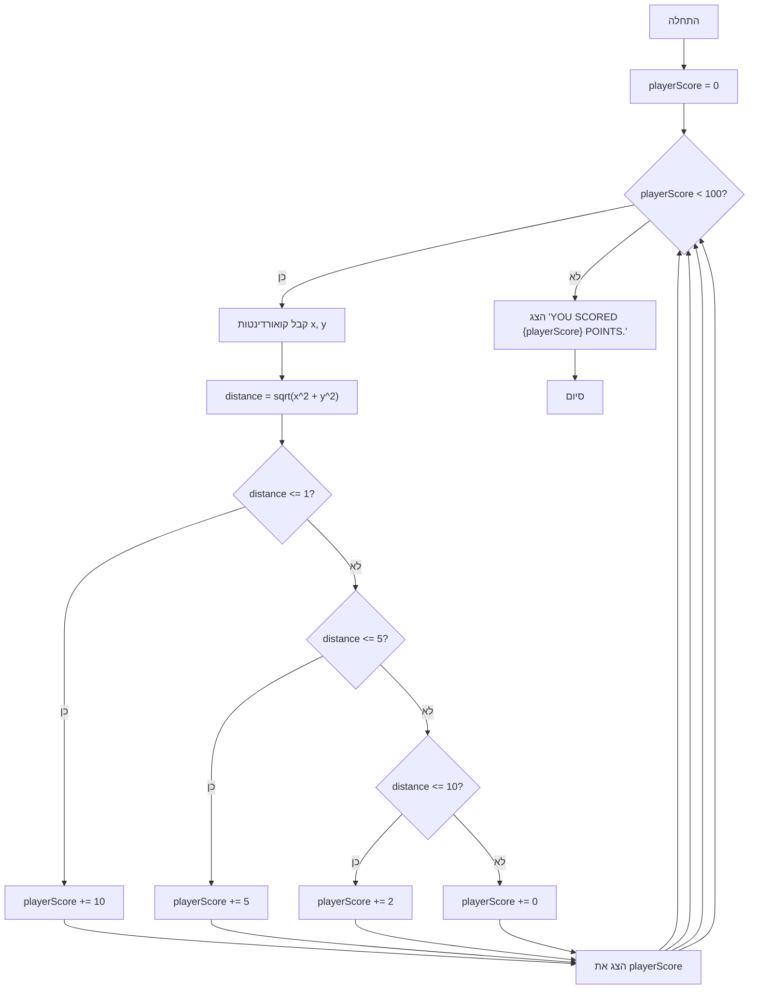

## <algorithm>

1. **התחלה:**
   - המשחק מתחיל עם `playerScore` מאותחל ל-0.

   דוגמה: `playerScore = 0`.

2. **לולאה ראשית:**
   - כל עוד `playerScore` קטן מ-100, המשחק ממשיך.
   - אם `playerScore` שווה ל-100 או גדול ממנו, הלולאה מסתיימת.

   דוגמה: אם `playerScore` הוא 50, הלולאה ממשיכה; אם `playerScore` הוא 100, הלולאה מסתיימת.

3. **קבלת קואורדינטות:**
   - מבקשים מהשחקן להזין את הקואורדינטות x ו-y.
   - קואורדינטות אלו נשמרות כערכים מסוג `float`.
   - אם הקלט אינו מספר, מוצגת הודעת שגיאה והלולאה ממשיכה לאיטרציה הבאה.

   דוגמה: שחקן מזין x=3, y=4.

4. **חישוב המרחק:**
   - מחשבים את המרחק מהנקודה (x, y) למרכז המעגל (0, 0) לפי הנוסחה: `distance = sqrt(x^2 + y^2)`.

   דוגמה: עבור x=3, y=4, `distance = sqrt(3^2 + 4^2) = sqrt(9 + 16) = sqrt(25) = 5`.

5. **חישוב נקודות:**
   - בדיקה לאיזה אזור במטרה הנקודה שייכת:
     - אם `distance <= 1`: השחקן מקבל 10 נקודות.
     - אם `1 < distance <= 5`: השחקן מקבל 5 נקודות.
     - אם `5 < distance <= 10`: השחקן מקבל 2 נקודות.
     - אחרת, השחקן מקבל 0 נקודות.

   דוגמאות:
     - אם `distance` הוא 0.8, השחקן מקבל 10 נקודות.
     - אם `distance` הוא 3, השחקן מקבל 5 נקודות.
     - אם `distance` הוא 8, השחקן מקבל 2 נקודות.
     - אם `distance` הוא 12, השחקן מקבל 0 נקודות.

6. **עדכון הניקוד:**
   - הניקוד הנוכחי של השחקן, `playerScore`, מעודכן בהתאם לנקודות שקיבל בשלב הקודם.

   דוגמה: אם `playerScore` היה 60 והשחקן הרוויח 5 נקודות, `playerScore` יהפוך ל-65.

7. **הצגת הניקוד הנוכחי:**
   - הניקוד הנוכחי מוצג למשתמש.

   דוגמה: "הניקוד הנוכחי: 65".

8. **חזרה ללולאה הראשית:**
   - לאחר הצגת הניקוד הנוכחי, חוזרים לתחילת הלולאה הראשית.

9. **סיום המשחק:**
   - כאשר `playerScore` שווה ל-100 או גדול ממנו, הלולאה מסתיימת.
   - מוצגת הודעת סיום עם הניקוד הסופי.

   דוגמה: "YOU SCORED 105 POINTS."

## <mermaid>

**ניתוח התלויות בייבוא:**
   - `import math`:
     - המודול `math` מיובא כדי להשתמש בפונקציה `math.sqrt()` לחישוב שורש ריבועי, שהוא חלק חיוני בחישוב המרחק.

## <explanation>

**ייבואים (Imports):**
   - `import math`: המודול `math` מספק פונקציות מתמטיות. במקרה זה, הוא משמש לחישוב שורש ריבועי של מרחק באמצעות הפונקציה `math.sqrt()`. אין תלות ישירה בחבילות `src.`.

**משתנים (Variables):**
   - `playerScore` (int): משתנה זה שומר את הניקוד הכולל של השחקן. הוא מתחיל מ-0 ומתעדכן במהלך המשחק.
   - `x` (float): משתנה זה שומר את קואורדינטת ה-x שהזין השחקן.
   - `y` (float): משתנה זה שומר את קואורדינטת ה-y שהזין השחקן.
   - `distance` (float): משתנה זה שומר את המרחק בין הנקודה שהזין השחקן לבין מרכז המטרה (0,0).

**פונקציות (Functions):**
   - אין פונקציות שהוגדרו על ידי המשתמש בקוד זה. הקוד משתמש בפונקציות מובנות כמו `input()`, `float()`, `print()`, `math.sqrt()`.

**הסברים מפורטים:**
   - הקוד מדמה משחק בו השחקן מנסה לפגוע במטרה. המטרה מורכבת מכמה אזורים שכל אחד מהם נותן ניקוד שונה.
   - המשחק ממשיך עד שהשחקן מגיע לניקוד של 100 ומעלה.
   - השחקן מזין קואורדינטות x ו-y, והקוד מחשב את המרחק ממרכז המטרה. בהתאם למרחק, מוענק ניקוד שונה.
   - הקוד משתמש בלולאת `while` כדי להמשיך את המשחק עד שהשחקן מגיע לניקוד הרצוי.
   - נעשה שימוש בבלוק `try-except` כדי לטפל במקרים שבהם המשתמש מזין קלט שאינו מספר.
   - הקוד ברור וקל להבנה, עם הערות טובות שמסבירות את הפעולות השונות.

**בעיות אפשריות או תחומים לשיפור:**
   - הקוד לא כולל אימות קלט מתקדם. ניתן להוסיף אימות קלט שיבטיח שהקואורדינטות הן בטווח מסוים.
   - ניתן להרחיב את המשחק על ידי הוספת רמות קושי, גרפיקה, או אופציות נוספות כמו מספר מוגבל של ניסיונות.
   - ניתן לפצל את הקוד לפונקציות קטנות יותר, מה שיכול לשפר את הקריאות והתחזוקה.
   - הניקוד ניתן לשינוי בקלות, אך אין אפשרות להגדיר אותו מחוץ לקוד (למשל, מקובץ הגדרות).

**שרשרת קשרים עם חלקים אחרים בפרויקט:**
   - קובץ זה פועל כמשחק עצמאי ואין לו תלות ישירה בקבצים אחרים בפרויקט הנוכחי.