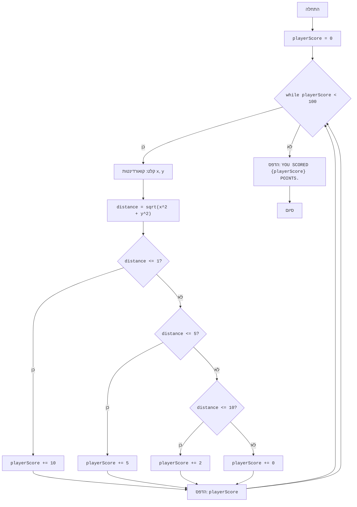

## <algorithm>

1. **התחלה:**
   - אתחול `playerScore` ל-0.
   - דוגמה: `playerScore = 0`

2. **לולאה ראשית (while playerScore < 100):**
   - כל עוד `playerScore` קטן מ-100, בצע את השלבים הבאים:
   - דוגמה: אם `playerScore` הוא 50, הלולאה תמשיך. אם `playerScore` הוא 100, הלולאה תסתיים.

3. **קבל קואורדינטות (x, y):**
   - קבל קואורדינטה `x` מהמשתמש.
   - קבל קואורדינטה `y` מהמשתמש.
   - דוגמה: המשתמש מזין `x = 3`, `y = 4`.

4. **חישוב מרחק:**
   - חשב את המרחק מהמרכז (0,0) לנקודה (x,y) באמצעות הנוסחה `distance = sqrt(x^2 + y^2)`.
   - דוגמה: עבור `x = 3`, `y = 4`, המרחק יהיה `distance = sqrt(3^2 + 4^2) = 5`.

5. **בדיקת איזור פגיעה והוספת ניקוד:**
   - **אם** `distance <= 1`:
       - הוסף 10 נקודות ל-`playerScore`.
       - דוגמה: אם `distance` הוא 0.5, `playerScore` יהפוך ל-`playerScore + 10`.
   - **אחרת אם** `distance <= 5`:
       - הוסף 5 נקודות ל-`playerScore`.
       - דוגמה: אם `distance` הוא 3, `playerScore` יהפוך ל-`playerScore + 5`.
   - **אחרת אם** `distance <= 10`:
       - הוסף 2 נקודות ל-`playerScore`.
       - דוגמה: אם `distance` הוא 7, `playerScore` יהפוך ל-`playerScore + 2`.
   - **אחרת**:
       - הוסף 0 נקודות ל-`playerScore`.
       - דוגמה: אם `distance` הוא 12, `playerScore` לא ישתנה.

6. **הצגת ניקוד:**
   - הדפס את ה-`playerScore` הנוכחי למשתמש.
   - דוגמה: "הניקוד הנוכחי: 55"

7. **חזרה ללולאה:**
   - חזור לשלב 2.

8. **סיום המשחק:**
   - כאשר `playerScore` שווה או גדול מ-100, צא מהלולאה.
   - הדפס הודעה סופית עם ה-`playerScore`.
   - דוגמה: "הגעת ל-105 נקודות."

## <mermaid>

**ניתוח תלויות:**

- אין תלויות מיובאות מלבד `math`, אשר משמש לחישוב שורש ריבועי.

## <explanation>

**ייבואים (Imports):**

-   `import math`: מייבא את מודול `math` שמספק פונקציות מתמטיות. במקרה הזה, משתמשים בפונקציה `math.sqrt()` לחישוב השורש הריבועי. זה נחוץ כדי לחשב את המרחק בין הנקודה למרכז המטרה.

**מחלקות (Classes):**
   - אין שימוש במחלקות בקוד זה.

**פונקציות (Functions):**

- אין פונקציות מוגדרות בקוד. נעשה שימוש בפונקציות מובנות כגון `input()`, `float()`, `print()`, ופונקציות מהמודול `math`.

**משתנים (Variables):**

-   `playerScore`: משתנה מסוג שלם (int) ששומר את סך הנקודות שהשחקן צבר במהלך המשחק. הוא מאותחל ל-0 בתחילת המשחק ומעודכן בכל סיבוב.
-   `x`: משתנה מסוג float ששומר את קואורדינטת ה-x של הנקודה שהזין השחקן.
-   `y`: משתנה מסוג float ששומר את קואורדינטת ה-y של הנקודה שהזין השחקן.
-   `distance`: משתנה מסוג float ששומר את המרחק בין הנקודה שהזין השחקן למרכז המטרה.

**הסברים מפורטים:**

-   הקוד מדמה משחק בו השחקן יורה חצים למטרה עגולה.
-   המשחק ממשיך עד שהשחקן מגיע ל-100 נקודות או יותר.
-   הקוד משתמש בלולאת `while` כדי לשמור על המשחק פעיל עד שהתנאי `playerScore < 100` לא מתקיים.
-   בכל סיבוב, השחקן מתבקש להזין קואורדינטות x ו-y.
-   המרחק מהמרכז מחושב, והניקוד נוסף בהתאם לאיזור הפגיעה:
    - מרחק קטן או שווה ל-1: 10 נקודות.
    - מרחק קטן או שווה ל-5: 5 נקודות.
    - מרחק קטן או שווה ל-10: 2 נקודות.
    - אחרת: 0 נקודות.
-   הניקוד מוצג לשחקן אחרי כל ניסיון.
-   כאשר השחקן מגיע ל-100 נקודות או יותר, מוצגת הודעת סיום עם הניקוד הסופי.

**בעיות אפשריות ותחומים לשיפור:**

-   **טיפול שגיאות:** הקוד מטפל בשגיאת `ValueError` אם השחקן מכניס קלט לא מספרי, אך ניתן להוסיף טיפול שגיאות נוסף כדי לוודא שהקלט הוא אכן מספר.
-   **ממשק משתמש:** הקוד משתמש בקלט טקסטואלי פשוט, אפשר לשפר את חוויית המשתמש על ידי הוספת ממשק גרפי.
-   **מודולריות:** ניתן לפצל את הקוד לפונקציות קטנות יותר כדי לשפר את הקריאות והתחזוקה. למשל, פונקציה נפרדת לחישוב המרחק, ופונקציה נוספת להוספת ניקוד.
-   **קלות קריאה:** אפשר להוסיף משתנים קבועים לערכים כמו רדיוסי המטרה ולערכי הנקודות כדי להקל על הבנת הקוד. לדוגמה `CENTER_RADIUS = 1`, `INNER_RADIUS = 5`, `OUTER_RADIUS = 10`.
-   **אבסטרקציה:** כדאי להפריד את לוגיקת המשחק מהקלט/פלט, כך ניתן יהיה להרחיב את המשחק או להשתמש בלוגיקה בחלקים אחרים בפרויקט.

**שרשרת קשרים עם חלקים אחרים בפרויקט:**
   - קוד זה הוא חלק מתוך משחקים פשוטים בתוך פרויקט גדול יותר, כרגע הוא עומד בפני עצמו ואין לו יחסי תלות עם חלקים אחרים בפרויקט, אך אפשר לשלב אותו עם מודולים אחרים בעתיד (כגון מודול ניהול שחקנים).